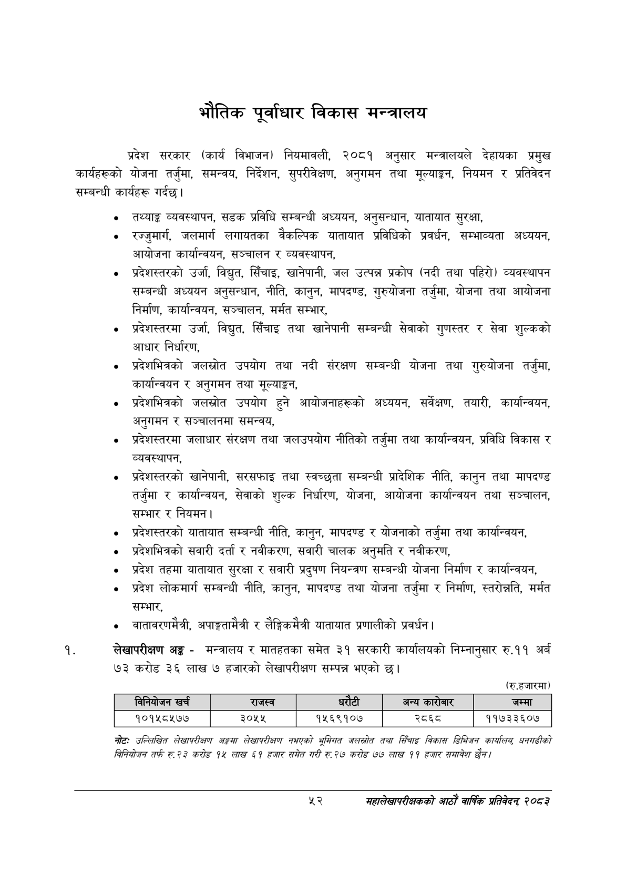

# Page 74 QA

## Rendered page


## Extracted text

```text
भौतिक पूर्वाधार विकास मन्त्रालय
प्रदेश सरकार (कार्य विभाजन) नियमावली, २०८१ अनुसार मन्त्रालयले देहायका प्रमुख कार्यहरूको योजना तर्जुमा, समन्वय, निर्देशन, सुपरीवेक्षण, अनुगमन तथा मूल्याङ्गन, नियमन र प्रतिवेदन सम्बन्धी कार्यहरू गर्दछ।
तथ्याङ्क व्यवस्थापन, सडक प्रविधि सम्बन्धी अध्ययन, अनुसन्धान, यातायात सुरक्षा,
रज्जुमार्ग, जलमार्ग लगायतका वैकल्पिक यातायात प्रविधिको प्रवर्धन, सम्भाव्यता अध्ययन, आयोजना कार्यान्वयन, सञ्चालन र व्यवस्थापन,
प्रदेशस्तरको उर्जा, विद्युत, सिँचाइ, खानेपानी, जल उत्पन्न प्रकोप (नदी तथा पहिरो) व्यवस्थापन सम्बन्धी अध्ययन अनुसन्धान, नीति, कानुन, मापदण्ड, गुरुयोजना तर्जुमा, योजना तथा आयोजना निर्माण, कार्यान्वयन, सञ्चालन, मर्मत सम्भार,
प्रदेशस्तरमा उर्जा, विद्युत, सिँचाइ तथा खानेपानी सम्बन्धी सेवाको गुणस्तर र सेवा शुल्कको आधार निर्धारण,
प्रदेशभित्रको जलस्रोत उपयोग तथा नदी संरक्षण सम्बन्धी योजना तथा गुरुयोजना तर्जुमा, कार्यान्वयन र अनुगमन तथा मूल्याङ्कन,
प्रदेशभित्रको जलस्रोत उपयोग हुने आयोजनाहरूको अध्ययन, सर्वेक्षण, तयारी, कार्यान्वयन, अनुगमन र सञ्चालनमा समन्वय,
प्रदेशस्तरमा जलाधार संरक्षण तथा जलउपयोग नीतिको तर्जुमा तथा कार्यान्वयन, प्रविधि विकास र व्यवस्थापन,
प्रदेशस्तरको खानेपानी, सरसफाइ तथा स्वच्छुता सम्बन्धी प्रादेशिक नीति, कानुन तथा मापदण्ड तर्जुमा र कार्यान्वयन, सेवाको शुल्क निर्धारण, योजना, आयोजना कार्यान्वयन तथा सञ्चालन, सम्भार र नियमन |
प्रदेशस्तरको यातायात सम्बन्धी नीति, कानुन, मापदण्ड र योजनाको तर्जुमा तथा कार्यान्वयन,
प्रदेशभित्रको सवारी दर्ता र नवीकरण, सवारी चालक अनुमति र नवीकरण,
प्रदेश तहमा यातायात सुरक्षा र सवारी प्रदुषण नियन्त्रण सम्बन्धी योजना निर्माण र कार्यान्वयन,
प्रदेश लोकमार्ग सम्बन्धी नीति, कानुन, मापदण्ड तथा योजना तर्जुमा र निर्माण, स्तरोन्नति, मर्मत सम्भार,
वातावरणमैत्री, अपाङ्गतामैत्री र लैङ्गिकमैत्री यातायात प्रणालीको प्रवर्धन |
लेखापरीक्षण अङ्ग -मन्त्रालय र मातहतका समेत ३१ सरकारी कार्यालयको निम्नानुसार रु.११ अर्ब ७३ करोड ३६ लाख ७ हजारको लेखापरीक्षण सम्पन्न भएको छ।
(रु.हजारमा)
नोटः उल्लिखित लेखापरीक्षण अङ्गमा लेखापरीक्षण नभएको भूमिगत जलस्रोत तथा सिँचाइ विकास डिमिजन कायलियु कनगढीको विनियोजन तर्फ रु २३ करोङ १४ लाख ५१ हजार समेत गरी रु २७ करोङ ७७ लाख ९९ हजार समावेश छैन।
५२
महालेखापरीक्षकको आठाँ वाषिकि प्रतिवेदन्‌ २०८२

|  |  | ननिकोजन खर्च | राजस्व |  |  | अन्य बररेजार | जम्मा |
| --- | --- | --- | --- | --- | --- | --- | --- |
|  |  | १०१५८५७४७ | ३०५५ | १५६९१०४ |  | र्व्ध्व | ११७३३६०७ |
```

## Flags
- table_page
- medium_quality_table
