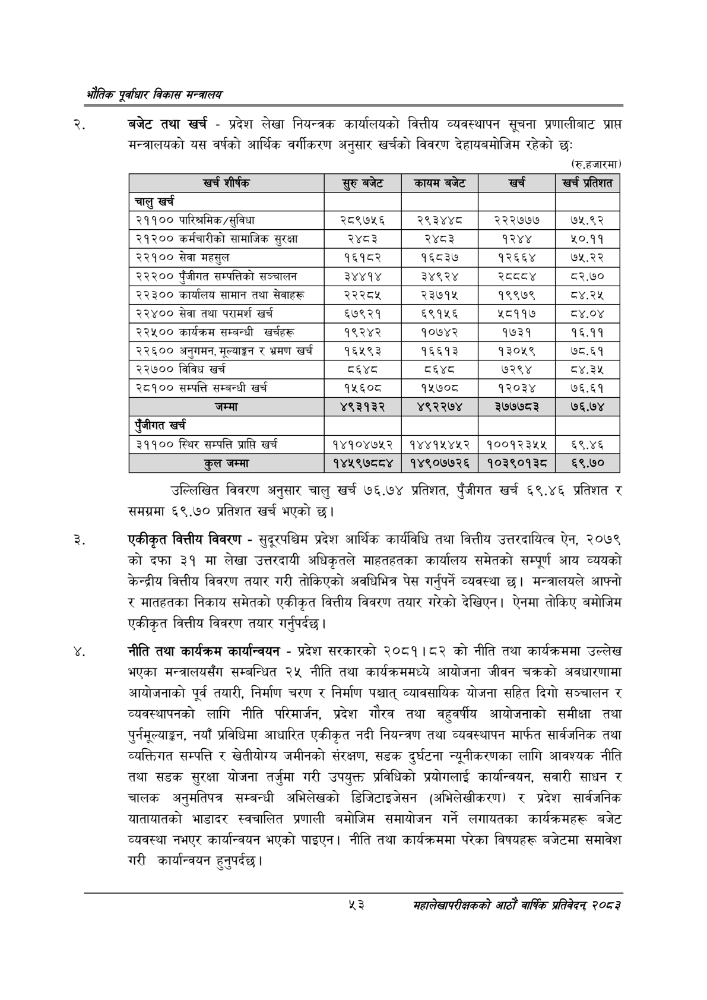

# Page 75 QA

## Rendered page


## Extracted text

```text
एवधार विकास मन्त्रालय
बजेट तथा खर्च -प्रदेश लेखा नियन्त्रक कार्यालयको वित्तीय व्यवस्थापन सूचना प्रणालीबाट प्राप्त मन्त्रालयको यस वर्षको आर्थिक वर्गीकरण अनुसार खर्चको विवरण देहायबमोजिम रहेको छः
(रु.हजारमा)
उल्लिखित विवरण अनुसार चालु खर्च १९५६.७४ प्रतिशत, पुँजीगत खर्च ६९.४६ प्रतिशत र समग्रमा ६९.७० प्रतिशत खर्च भएको छ।
एकीकृत वित्तीय विवरण -सुदूरपश्चिम प्रदेश आर्थिक कार्यविधि तथा वित्तीय उत्तरदायित्व ऐन, २०७९ को दफा ३१ मा लेखा उत्तरदायी अधिकृतले माहतहतका कार्यालय समेतको सम्पूर्ण आय व्ययको केन्द्रीय वित्तीय विवरण तयार गरी तोकिएको अवधिभित्र पेस गर्नुपर्ने व्यवस्था छ। मन्त्रालयले आफ्नो र मातहतका निकाय समेतको एकीकृत वित्तीय विवरण तयार गरेको देखिएन। ऐनमा तोकिए बमोजिम एकीकृत वित्तीय विवरण तयार गर्नुपर्दछ |
नीति तथा कार्यक्रम कार्यान्वयन -प्रदेश सरकारको २०८१।८२ को नीति तथा कार्यक्रममा उल्लेख भएका मन्त्रालयसँग सम्बन्धित २५ नीति तथा कार्यक्रममध्ये आयोजना जीवन चक्रको अवधारणामा आयोजनाको पूर्व तयारी, निर्माण चरण र निर्माण पश्चात्‌ व्यावसायिक योजना सहित दिगो सञ्चालन र व्यवस्थापनको लागि नीति परिमार्जन, प्रदेश गौरव तथा वहुवर्षीय आयोजनाको समीक्षा तथा पुर्नमूल्याङ्कन, नयाँ प्रविधिमा आधारित एकीकृत नदी नियन्त्रण तथा व्यवस्थापन मार्फत सार्वजनिक तथा व्यक्तिगत सम्पत्ति र खेतीयोग्य जमीनको संरक्षण, सडक दुर्घटना न्यूनीकरणका लागि आवश्यक नीति तथा सडक सुरक्षा योजना तर्जुमा गरी उपयुक्त प्रविधिको प्रयोगलाई कार्यान्वयन, सवारी साधन र चालक अनुमतिपत्र सम्बन्धी अभिलेखको डिजिटाइजेसन (अभिलेखीकरण) र प्रदेश सार्वजनिक यातायातको भाडादर स्वचालित प्रणाली बमोजिम समायोजन गर्ने लगायतका कार्यक्रमहरू बजेट व्यवस्था नभएर कार्यान्वयन भएको पाइएन। नीति तथा कार्यक्रममा परेका विषयहरू बजेटमा समावेश गरी कार्यान्वयन हुनुपर्दछ |
४३
महालेखापरीक्षकको आठाँ वाषिकि प्रतिवेदन्‌ २०८२

| खरी शीर्षक | सुरुबबेट | कायम बजेट |  | खर्च प्रतिशत |
| --- | --- | --- | --- | --- |
| चालु खर्च |  |  |  |  |
| २११०० पारिन्रमिक/सुविधा | २८९७५६ | २९३४४८ | २२२७७७ | ७५.९२ |
| २१२०० कर्मचारीको सामाजिक सुरक्षा | २४८३ | २४८३ | १२४४ | ५०.११ |
| २२१०० सेवा महसुल | १६१८२ | १६८३७ | १२६६४ | ७५.२२ |
| २२२०० पुँजीगत सन्चत्तिको सञ्चालन | ३४४१४ | ३४९२४ | स्व्वव४ | ८२.७० |
| २२३०० कार्यालय सामान तथा सेवाहरू | २२२८५ | २३७१५ | १९९७९ |  |
| २२४०० सेवा तथा परामर्श खर्च | ६७९२१ | ६९१५६ | ४५८११७ | ८४.०४ |
| २२५०० कार्यक्रम सम्बन्धी खर्चहरू | १९२४२ | १०७४२ | १७३१ | १६.११ |
| २२६०० अनुगमन, ूल्याङ्गन र भ्रमण खर्च | १६५९३ | १६६१३ | १३०५९ | ७८.६१ |
| २२७०० विविध खर्च | व्६श्द | ६४८ | ७२९४ | ८४.३४५ |
| २८१०० सम्पत्ति सम्बन्धी खर्च | १५६०८ | १५७०८ | १२०३४ | ७६.६१ |
| जम्मा | ४९३१३२ | ४९२२७४ | ३७७७८३ | ७६.७४ |
| रंजीगत खर्च |  |  |  |  |
| ३११०० स्थिर सम्पत्ति प्राप्ति खर्च | १४१०४७५२ | १४४१५४५२ | १००१२३५५ | ६९.४६ |
| हल जम्मा | १४५९७८८४ | १४९०७७२६ | १०३९०१३८ | ६९.७० |
```

## Flags
- table_page
- medium_quality_table
