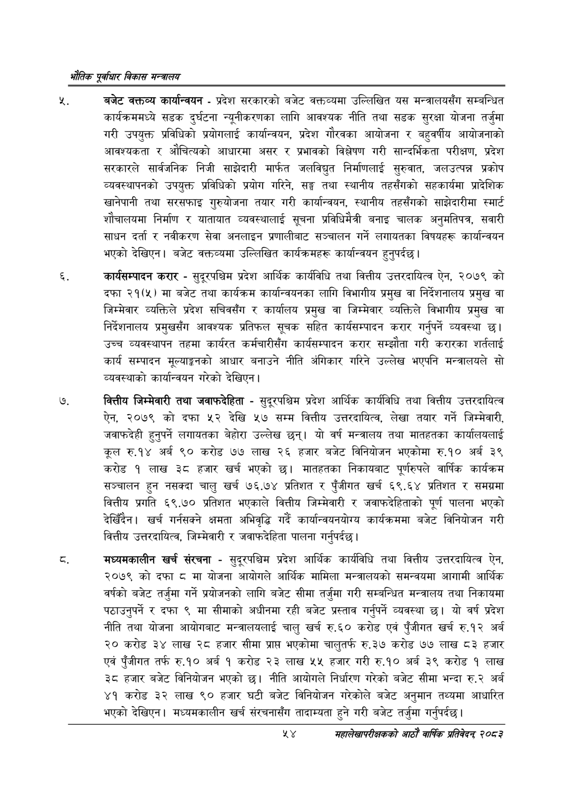

# Page 76 QA

## Rendered page


## Extracted text

```text
एवधार विकास मन्त्रालय
बजेट वक्तव्य कार्यान्वयन -प्रदेश सरकारको बजेट वक्तव्यमा उल्लिखित यस मन्त्रालयसँग सम्बन्धित कार्यक्रममध्ये सडक दुर्घटना न्यूनीकरणका लागि आवश्यक नीति तथा सडक सुरक्षा योजना तर्जुमा गरी उपयुक्त प्रविधिको प्रयोगलाई कार्यान्वयन, प्रदेश गौरवका आयोजना र बहुवर्षीय आयोजनाको आवश्यकता र औचित्यको आधारमा असर र प्रभावको विश्लेषण गरी सान्दर्भिकता परीक्षण, प्रदेश सरकारले सार्वजनिक निजी साझेदारी मार्फत जलविद्युत निर्माणलाई सुरुवात, जलउत्पन्न प्रकोप व्यवस्थापनको उपयुक्त प्रविधिको प्रयोग गरिने, सङ्घ तथा स्थानीय तहसँगको सहकार्यमा प्रादेशिक खानेपानी तथा सरसफाइ गुरुयोजना तयार गरी कार्यान्वयन, स्थानीय तहसँगको साझेदारीमा स्मार्ट शौचालयमा निर्माण र यातायात व्यवस्थालाई सूचना प्रविधिमैत्री बनाइ चालक अनुमतिपत्र, सवारी साधन दर्ता र नवीकरण सेवा अनलाइन प्रणालीबाट सञ्चालन गर्ने लगायतका विषयहरू कार्यान्वयन भएको देखिएन। बजेट वक्तव्यमा उल्लिखित कार्यक्रमहरू कार्यान्वयन हुनुपर्दछ |
कार्यसम्पादन करार -सुदूरपश्चिम प्रदेश आर्थिक कार्यविधि तथा वित्तीय उत्तरदायित्व ऐन, २०७९ को दफा २१(५) मा बजेट तथा कार्यक्रम कार्यान्वयनका लागि विभागीय प्रमुख वा निर्देशनालय प्रमुख वा जिम्मेवार व्यक्तिले प्रदेश सचिवसँग र कार्यालय प्रमुख वा जिम्मेवार व्यक्तिले विभागीय प्रमुख वा निर्देशनालय प्रमुखसँग आवश्यक प्रतिफल सूचक सहित कार्यसम्पादन करार गर्नुपर्ने व्यवस्था छ। उच्च व्यवस्थापन तहमा कार्यरत कर्मचारीसँग कार्यसम्पादन करार सम्झौता गरी करारका शर्तलाई कार्य सम्पादन मूल्याङ्गगको आधार बनाउने नीति अंगिकार गरिने उल्लेख भएपनि मन्त्रालयले सो व्यवस्थाको कार्यान्वयन गरेको देखिएन |
वित्तीय जिम्मेवारी तथा जवाफदेहिता -सुदूरपश्चिम प्रदेश आर्थिक कार्यविधि तथा वित्तीय उत्तरदायित्व ऐन, २०७९ को दफा ५२ देखि ५७ सम्म वित्तीय उत्तरदायित्व, लेखा तयार गर्ने जिम्मेवारी, जवाफदेही हुनुपर्ने लगायतका बेहोरा उल्लेख छन्‌। यो वर्ष मन्त्रालय तथा मातहतका कार्यालयलाई कूल रु.१४ अर्ब ९० करोड ७७ लाख २६ हजार बजेट विनियोजन भएकोमा रु.१० अर्ब ३९ करोड १ लाख ३८ हजार खर्च भएको छ। मातहतका निकायबाट पूर्णरुपले वार्षिक कार्यक्रम सञ्चालन हुन नसक्दा चालु खर्च ७६.७४ प्रतिशत र पुँजीगत खर्च ६९.६४ प्रतिशत र समग्रमा वित्तीय प्रगति ६९.७० प्रतिशत भएकाले वित्तीय जिम्मेवारी र जवाफदेहिताको पूर्ण पालना भएको देखिँदैन। खर्च गर्नसक्ने क्षमता अभिवृद्धि गर्दै कार्यान्वयनयोग्य कार्यक्रममा बजेट विनियोजन गरी वित्तीय उत्तरदायित्व, जिम्मेवारी र जवाफदेहिता पालना गर्नुपर्दछ।
मध्यमकालीन खर्च संरचना -सुदूरपश्चिम प्रदेश आर्थिक कार्यविधि तथा वित्तीय उत्तरदायित्व ऐन, २०७९ को दफा ८ मा योजना आयोगले आर्थिक मामिला मन्त्रालयको समन्वयमा आगामी आर्थिक वर्षको बजेट तर्जुमा गर्ने प्रयोजनको लागि बजेट सीमा तर्जुमा गरी सम्बन्धित मन्त्रालय तथा निकायमा पठाउनुपर्ने र दफा ९ मा सीमाको अधीनमा रही बजेट प्रस्ताव गर्नुपर्ने व्यवस्था छ। यो वर्ष प्रदेश नीति तथा योजना आयोगबाट मन्त्रालयलाई चालु खर्च रु.६० करोड एवं पुँजीगत खर्च रु.१२ अर्ब २० करोड ३४ लाख २८ हजार सीमा प्राप्त भएकोमा चालुतर्फ रु.३७ करोड ७७ लाख ८३ हजार एवं पुँजीगत तर्फ रु.१० अर्ब १ करोड २३ लाख ५५ हजार गरी रु.१० अर्ब ३९ करोड १ लाख ३८ हजार बजेट विनियोजन भएको छ। नीति आयोगले निर्धारण गरेको बजेट सीमा भन्दा रु.२ अर्ब ४१ करोड ३२ लाख ९० हजार घटी बजेट विनियोजन गरेकोले बजेट अनुमान तथ्यमा आधारित भएको देखिएन। मध्यमकालीन खर्च संरचनासँग तादाम्यता हुने गरी बजेट तर्जुमा गर्नुपर्दछ |
५४
महालेखापरीक्षकको आठाँ वाषिकि प्रतिवेदन्‌ २०८२
```

## Flags
- None
