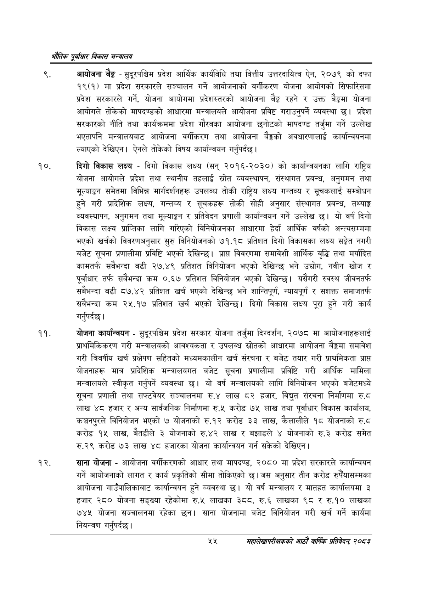

# Page 77 QA

## Rendered page


## Extracted text

```text
एवधार विकास मन्त्रालय
आयोजना बैङ्क -सुदूरपश्चिम प्रदेश आर्थिक कार्यविधि तथा वित्तीय उत्तरदायित्व ऐन, २०७९ को दफा १९(१) मा प्रदेश सरकारले सञ्चालन गर्ने आयोजनाको वर्गीकरण योजना आयोगको सिफारिसमा प्रदेश सरकारले गर्ने, योजना आयोगमा प्रदेशस्तरको आयोजना बेङ्ग रहने र उक्त बैङ्कमा योजना आयोगले तोकेको मापदण्डको आधारमा मन्त्रालयले आयोजना प्रविष्ट गराउनुपर्ने व्यवस्था छ। प्रदेश सरकारको नीति तथा कार्यक्रममा प्रदेश गौरवका आयोजना छनोटको मापदण्ड तर्जुमा गर्ने उल्लेख भएतापनि मन्त्रालयबाट आयोजना वर्गीकरण तथा आयोजना बैङ्कको अवधारणालाई कार्यान्वयनमा ल्याएको देखिएन। ऐनले तोकेको विषय कार्यान्वयन गर्नुपर्दछ |
दिगो विकास लक्ष्य -दिगो विकास लक्ष्य (सन्‌ २०१६-२०३०) को कार्यान्वयनका लागि राष्ट्रिय योजना आयोगले प्रदेश तथा स्थानीय तहलाई स्रोत व्यवस्थापन, संस्थागत प्रबन्ध, अनुगमन तथा मूल्याङ्कन समेतमा विभिन्न मार्गदर्शनहरू उपलब्ध तोकी राष्ट्रिय लक्ष्य गन्तव्य र सूचकलाई सम्बोधन हुने गरी प्रादेशिक लक्ष्य, गन्तव्य र सूचकहरू तोकी सोही अनुसार संस्थागत प्रबन्ध, तथ्याङ्क व्यवस्थापन, अनुगमन तथा मूल्याङ्कन र प्रतिवेदन प्रणाली कार्यान्वयन गर्ने उल्लेख छ। यो वर्ष दिगो विकास लक्ष्य प्राप्तिका लागि गरिएको विनियोजनका आधारमा हेर्दा आर्थिक वर्षको अन्त्यसम्ममा भएको खर्चको विवरणअनुसार सुरु विनियोजनको ७१.१८ प्रतिशत दिगो विकासका लक्ष्य सङ्ेत नगरी बजेट सूचना प्रणालीमा प्रविष्टि भएको देखिन्छ। प्राप्त विवरणमा समावेशी आर्थिक वृद्धि तथा मर्यादित कामतर्फ सबैभन्दा बढी २७.४९ प्रतिशत विनियोजन भएको देखिन्छ भने उद्योग, नवीन खोज र पूर्वाधार तर्फ सबैभन्दा कम ०.६७ प्रतिशत विनियोजन भएको देखिन्छ। यसैगरी स्वस्थ जीवनतर्फ सबैभन्दा बढी ८७.४२ प्रतिशत खर्च भएको देखिन्छ भने शान्तिपूर्ण, न्यायपूर्ण र सशक्त समाजतर्फ सबैभन्दा कम २५.१७ प्रतिशत खर्च भएको देखिन्छ। दिगो विकास लक्ष्य पूरा हुने गरी कार्य गर्नुपर्दछ |
योजना कार्यान्वयन -सुदूरपश्चिम प्रदेश सरकार योजना तर्जुमा दिग्दर्शन, २०७८ मा आयोजनाहरूलाई प्राथमिकिकरण गरी मन्त्रालयको आवश्यकता र उपलब्ध स्रोतको आधारमा आयोजना बैङ्कमा समावेश गरी त्रिवर्षीय खर्च प्रक्षेपण सहितको मध्यमकालीन खर्च संरचना र बजेट तयार गरी प्राथमिकता प्राप्त योजनाहरू मात्र प्रादेशिक मन्त्रालयगत बजेट सूचना प्रणालीमा प्रविष्टि गरी आर्थिक मामिला मन्त्रालयले स्वीकृत गर्नुपर्ने व्यवस्था छ। यो वर्ष मन्त्रालयको लागि विनियोजन भएको बजेटमध्ये सूचना प्रणाली तथा सफ्टवेयर सञ्चालनमा रु.४ लाख ८२ हजार, विद्युत संरचना निर्माणमा रु.८ लाख ४८ हजार र अन्य सार्वजनिक निर्माणमा रु.५ करोड ७५ लाख तथा पूर्वाधार विकास कार्यालय, कञ्चनपुरले विनियोजन भएको ७ योजनाको रु.१२ करोड ३३ लाख, कैलालीले १८ योजनाको रु.८ करोड १५ लाख, बैतडीले ३ योजनाको रु.४२ लाख र बझाङले ४ योजनाको रु.३ करोड समेत रु.२९ करोड ७३ लाख ४८ हजारका योजना कार्यान्वयन गर्न सकेको देखिएन |
साना योजना -आयोजना वर्गीकरणको आधार तथा मापदण्ड, २०८० मा प्रदेश सरकारले कार्यान्वयन गर्ने आयोजनाको लागत र कार्य प्रकृतिको सीमा तोकिएको छ। जस अनुसार तीन करोड रुपैंयासम्मका आयोजना गाउँपालिकाबाट कार्यान्वयन हुने व्यवस्था | यो वर्ष मन्त्रालय र मातहत कार्यालयमा ३ हजार २८० योजना सङ्ख्या रहेकोमा रु.५ लाखका ३८८, रु.६ लाखका ९८ र रु.१० लाखका ७४४ योजना सञ्चालनमा रहेका छन। साना योजनामा बजेट विनियोजन गरी खर्च गर्ने कार्यमा नियन्त्रण गर्नुपर्दछ |
महालेखापरीक्षकको आठाँ वाषिकि प्रतिवेदन्‌ २०८२
```

## Flags
- None
