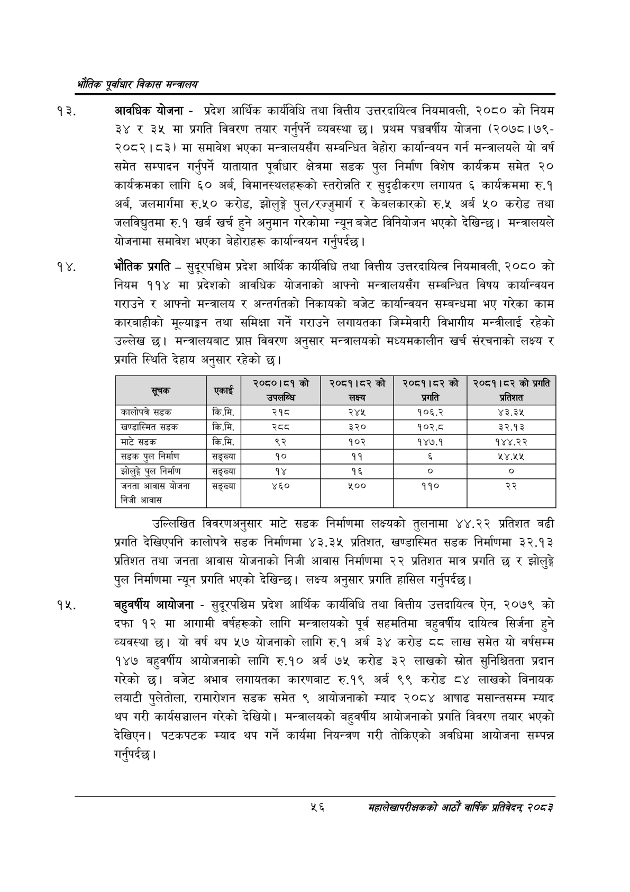

# Page 78 QA

## Rendered page


## Extracted text

```text
एवधार विकास मन्त्रालय
आवधिक योजना -प्रदेश आर्थिक कार्यविधि तथा वित्तीय उत्तरदायित्व नियमावली, २०८० को नियम ३४ र ३५ मा प्रगति विवरण तयार गर्नुपर्ने व्यवस्था छ। प्रथम पञ्चवर्षीय योजना (२०७८। ७९२०८२।८३) मा समावेश भएका मन्त्रालयसँग सम्बन्धित बेहोरा कार्यान्वयन गर्न मन्त्रालयले यो वर्ष समेत सम्पादन गर्नुपर्ने यातायात पूर्वाधार क्षेत्रमा सडक पुल निर्माण विशेष कार्यक्रम समेत २० कार्यक्रमका लागि ६० अर्ब, विमानस्थलहरूको स्तरोन्नति र सुदृढीकरण लगायत ६ कार्यक्रममा रु.१ अर्ब, जलमार्गमा रु.५० करोड, झोलुङ्गे पुल/रज्जुमार्ग र केबलकारको रु.५ अर्ब ५० करोड तथा जलविद्युतमा रु.१ खर्ब खर्च हुने अनुमान गरेकोमा न्यून बजेट विनियोजन भएको देखिन्छ। मन्त्रालयले योजनामा समावेश भएका बेहोराहरू कार्यान्वयन गर्नुपर्दछ |
१४, भौतिक प्रगति -सुदूरपश्चिम प्रदेश आर्थिक कार्यविधि तथा वित्तीय उत्तरदायित्व नियमावली, २०८० को नियम ११४ मा प्रदेशको आवधिक योजनाको आफ्नो मन्त्रालयसँग सम्बन्धित विषय कार्यान्वयन गराउने र आफ्नो मन्त्रालय र अन्तर्गतको निकायको बजेट कार्यान्वयन सम्बन्धमा भए गरेका काम कारबाहीको मूल्याङ्कन तथा समिक्षा गर्ने गराउने लगायतका जिम्मेवारी विभागीय मन्त्रीलाई रहेको उल्लेख छ। मन्त्रालयबाट प्राप्त विवरण अनुसार मन्त्रालयको मध्यमकालीन खर्च संरचनाको लक्ष्य र प्रगति स्थिति देहाय अनुसार रहेको छ।
उल्लिखित विवरणअनुसार माटे सडक निर्माणमा लक्ष्यको तुलनामा ४४.२२ प्रतिशत बढी प्रगति देखिएपनि कालोपत्रे सडक निर्माणमा ४३.३५ प्रतिशत, खण्डास्मित सडक निर्माणमा ३२.१३ प्रतिशत तथा जनता आवास योजनाको निजी आवास निर्माणमा २२ प्रतिशत मात्र प्रगति छ र झोलुङ्ग पुल निर्माणमा न्यून प्रगति भएको देखिन्छ। लक्ष्य अनुसार प्रगति हासिल गर्नुपर्दछ।
बहुवर्षीय आयोजना -सुदूरपश्चिम प्रदेश आर्थिक कार्यविधि तथा वित्तीय उत्तदायित्व ऐन, २०७९ को दफा १२ मा आगामी वर्षहरूको लागि मन्त्रालयको पूर्व सहमतिमा बहुवर्षीय दायित्व सिर्जना हुने व्यवस्था यो वर्ष थप ५७ योजनाको लागि रु.१ अर्ब ३४ करोड ६६ लाख समेत यो वर्षसम्म १४७ बहुवर्षीय आयोजनाको लागि रु.१० अर्ब ७५ करोड ३२ लाखको स्रोत सुनिश्चितता प्रदान गरेको | बजेट अभाव लगायतका कारणबाट रु.१९ अर्ब ९९ करोड ८४ लाखको बिनायक लयाटी पुलेतोला, रामारोशन सडक समेत ९ आयोजनाको म्याद २०८४ आषाढ मसान्तसम्म म्याद थप गरी कार्यसञ्चालन गरेको देखियो। मन्त्रालयको बहुवर्षीय आयोजनाको प्रगति विवरण तयार भएको देखिएन। पटकपटक म्याद थप गर्ने कार्यमा नियन्त्रण गरी तोकिएको अवधिमा आयोजना सम्पन्न गर्नुपर्दछ |
५६
महालेखापरीक्षकको आठाँ वाषिकि प्रतिवेदन्‌ २०८२

| सूचक |  | को उपलाग्न | २०८१।५२को लक्ष्य | २०८१।५२को प्रगति | २०८१।८२ को प्रगति प्रतिशत |
| --- | --- | --- | --- | --- | --- |
| कालोपत्र सडक | कि.मि. | २१८ | २४५ | १०६.२ | ४३.३५ |
| खण्डास्मित सडक | कि.मि. |  | ३२० | १०२.८ | ३२.१३ |
| माटे सडक | कि.मि. | ९२ | १०२ | १४७.१ | १४४.२२ |
| सडक पुल निर्माण | सङ्ख्या | १० | ११ | ३ | ५४,४५५ |
| झोलुङ्गे पुल निर्माण | सङ्ख्या | १४ | १६ | ० | ० |
| जनता आवास योजना निजी आवास | सङ्ख्या | ४६० |  | १९० | २२ |
```

## Flags
- table_page
- medium_quality_table
