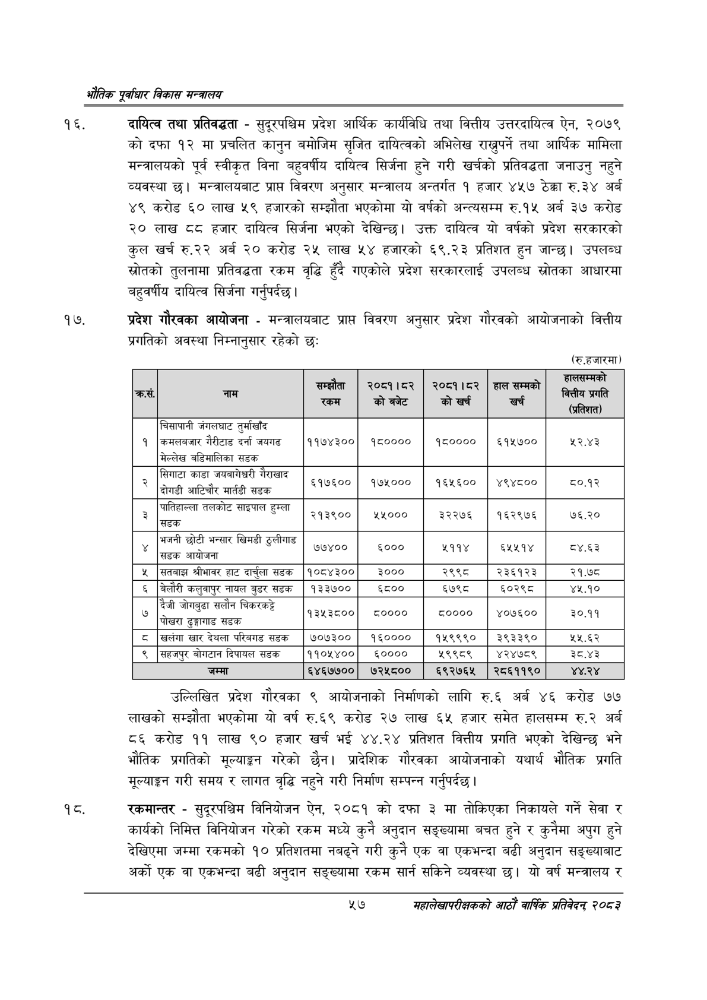

# Page 79 QA

## Rendered page


## Extracted text

```text
एवधार विकास मन्त्रालय
दायित्व तथा प्रतिवद्धता -सुदूरपश्चिम प्रदेश आर्थिक कार्यविधि तथा वित्तीय उत्तरदायित्व ऐन, २०७९ कोदफा १२ मा प्रचलित कानुन बमोजिम सृजित दायित्वको अभिलेख राख्नुपर्ने तथा आर्थिक मामिला मन्त्रालयको पूर्व स्वीकृत विना बहुवर्षीय दायित्व सिर्जना हुने गरी खर्चको प्रतिवद्धता जनाउनु नहुने व्यवस्था | मन्त्रालयबाट प्राप्त विवरण अनुसार मन्त्रालय अन्तर्गत १ हजार ४५७ ठेक्का रु.३४ अर्ब ४९ करोड ६० लाख ५९ हजारको सम्झौता भएकोमा यो वर्षको अन्त्यसम्म रु.१५ अर्ब ३७ करोड ० लाख हजार दायित्व सिर्जना भएको देखिन्छ। उक्त दायित्व यो वर्षको प्रदेश सरकारको कुल खर्च रु.२२ अर्ब २० करोड २५ लाख ५४ हजारको ६९.२३ प्रतिशत हुन जान्छ। उपलब्ध स्रोतको तुलनामा प्रतिवद्धता रकम वृद्धि हुँदै गएकोले प्रदेश सरकारलाई उपलब्ध स्रोतका आधारमा बहुवर्षीय दायित्व सिर्जना गर्नुपर्दछ |
प्रदेश गौरवका आयोजना -मन्त्रालयबाट प्रापत विवरण अनुसार प्रदेश गौरवको आयोजनाको वित्तीय प्रगतिको अवस्था निम्नानुसार रहेको छः
(रु.हजारमा)
उल्लिखित प्रदेश गौरवका ९ आयोजनाको निर्माणको लागि रु.६ अर्ब ४६ करोड ७७ लाखको सम्झौता भएकोमा यो वर्ष रु.६९ करोड २७ लाख ६५ हजार समेत हालसम्म रु.२ अर्ब ८६ करोड ११ लाख ९० हजार खर्च भई ४४.२४ प्रतिशत वित्तीय प्रगति भएको देखिन्छ भने भौतिक प्रगतिको मूल्याङ्कन गरेको छैन। प्रादेशिक गौरवका आयोजनाको यथार्थ भौतिक प्रगति मूल्याङ्गन गरी समय र लागत वृद्धि नहुने गरी निर्माण सम्पन्न गर्नुपर्दछ |
रकमान्तर -सुदूरपश्चिम विनियोजन ऐन, २०८१ को दफा ३ मा तोकिएका निकायले गर्ने सेवा र कार्यको निमित्त विनियोजन गरेको रकम मध्ये कुनै अनुदान सङ्ख्यामा बचत हुने र कुनैमा अपुग हुने देखिएमा जम्मा रकमको १० प्रतिशतमा नबढ्ने गरी कुनै एक वा एकभन्दा बढी अनुदान सङ्ख्याबाट अर्को एक वा एकभन्दा बढी अनुदान सङ्ख्यामा रकम सार्न सकिने व्यवस्था छ। यो वर्ष मन्त्रालय र
५७
महालेखापरीक्षकको आठाँ वाषिकि प्रतिवेदन्‌ २०८२

|  | जाम | सम्झौता 'रकम | २००१।२ 'को बजेट | २००१।८२ को खर्च | हालसम्मको खर्च | खिसी प्रगति (प्रतिशत) |
| --- | --- | --- | --- | --- | --- | --- |
| १ | जनलघाट तुर्माखाँद कमलनजार गैरीटाड दर्ता जयगढ मेल्लेख ५डिमालिका सडक | ११७४३०० | १८०००० | १८०००० | ६१५७०० | ५२.४३ |
| २ | सिगाटा काडा जवनागेधरी गैराखाद आटिचौर मार्तडी सडक | इ१७६०० | १७४००० | १६४६०० \| | ४९४८०० | ८०.१२ ही |
| ३ | तलकोट साइपाल हुम्ला ललल तलकाट साइमाल हु सडक | २१३९०० | ५००० | इ३२२७६ | १६२९७६ | ७६.२० |
| ४ | भजनी छोटी भन्सार खिमडी ठुलीगाड < 'सडक आयोजना |  | ६००० | २११४ |  | .६३ |
| ५ | सतबाझ श्रीभावर हाट क | १०८४३०० | ३००० | २९९८ | २३६१२३ | २१.७८ |
| ६ | बेलौरी कलुवा५९ नायल बुडर सडक | १३३७०० | ६८०० | ६७९८ | ६०२९८ | ४५.१० |
| ७ | दैजी जोगवुढा सलौन पोखरा ढुङ्गागाड सडक | १३५३८०० | ८०००० | ८०००० | ४०७६०० | ३०.११ |
| ८ | खलेगा देथला परिबाड सडक | ७०७३०० | १६०००० | १५९९९० | ३९३३९० | ५५.६२ |
| ९ | सहजपुर बोगटान दिपायल सडक | ११०५४०० | ६०००० | ५९९८९ | ४२४७८९ | ३८.४३ |
| १० | जम्मा | ६४६७७०० | ७२५८०० | ६९२७६५ | २८६११९० | ४४.२४ |
```

## Flags
- table_page
- medium_quality_table
