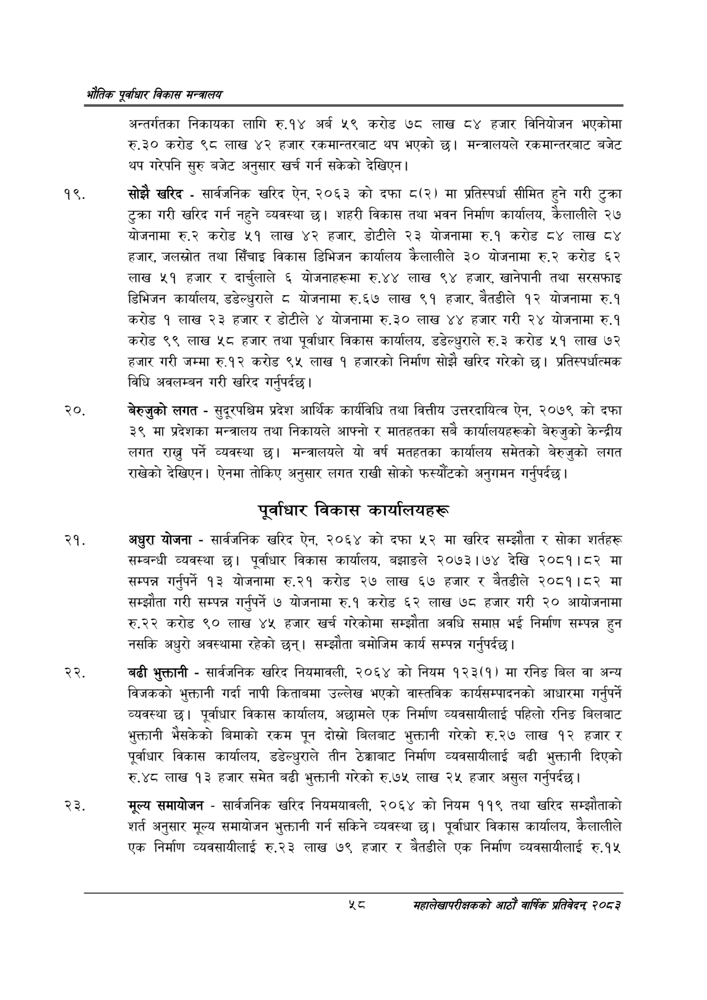

# Page 80 QA

## Rendered page


## Extracted text

```text
एवधार विकास मन्त्रालय
अन्तर्गतका निकायका लागि रु.१४ अर्ब ४९ करोड ७८ लाख ८४ हजार विनियोजन भएकोमा रु.३० करोड ९८ लाख ४२ हजार रकमान्तरबाट थप भएको छ। मन्त्रालयले रकमान्तरबाट बजेट थप गरेपनि सुरु बजेट अनुसार खर्च गर्न सकेको देखिएन |
सोझै खरिद -सार्वजनिक खरिद ऐन, २०६३ को दफा ८(२) मा प्रतिस्पर्धा सीमित हुने गरी टुक्रा टुक्रा गरी खरिद गर्न नहुने व्यवस्था छ। शहरी विकास तथा भवन निर्माण कार्यालय, कैलालीले २७ योजनामा रु.२ करोड ५१ लाख ४२ हजार, डोटीले २३ योजनामा रु.१ करोड ८४ लाख ८४ हजार, जलस्रोत तथा सिँचाइ विकास डिभिजन कार्यालय कैलालीले ३० योजनामा रु.२ करोड ६२ लाख ५१ हजार र दार्चुलाले ६ योजनाहरूमा रु.४४ लाख ९४ हजार, खानेपानी तथा सरसफाइ डिभिजन कार्यालय, डडेल्धुराले ८ योजनामा रु.६७ लाख ९१ हजार, बैतडीले १२ योजनामा रु.१ करोड १ लाख २३ हजार र डोटीले ४ योजनामा रु.३० लाख ४४ हजार गरी २४ योजनामा रु.१ करोड ९९ लाख ५८ हजार तथा पूर्वाधार विकास कार्यालय, डडेल्धुराले रु.३ करोड ५१ लाख ७२ हजार गरी जम्मा रु.१२ करोड ९५ लाख १ हजारको निर्माण सोझै खरिद गरेको छ। प्रतिस्पर्धात्मक विधि अवलम्बन गरी खरिद गर्नुपर्दछ |
२०, बेरुजुको लगत -सुदूरपश्चिम प्रदेश आर्थिक कार्यविधि तथा वित्तीय उत्तरदायित्व ऐन, २०७९ को दफा ३९ मा प्रदेशका मन्त्रालय तथा निकायले आफ्नो र मातहतका सबै कार्यालयहरूको बेरुजुको केन्द्रीय लगत राख्नु पर्ने व्यवस्था छ। मन्त्रालयले यो वर्ष मतहतका कार्यालय समेतको बेरुजुको लगत राखेको देखिएन। ऐनमा तोकिए अनुसार लगत राखी सोको फस्यौटको अनुगमन गर्नुपर्दछ |
पूर्वाधार विकास कार्यालयहरू
अधुरा योजना -सार्वजनिक खरिद ऐन, २०६४ को दफा ५२ मा खरिद सम्झौता र सोका शार्तहरू सम्बन्धी व्यवस्था छ। पूर्वाधार विकास कार्यालय, बझाङले २०७३।७४ देखि २०८१।८२ मा सम्पन्न गर्नुपर्ने १३ योजनामा रु.२१ करोड २७ लाख ६७ हजार र बैतडीले २०८१।८२ मा सम्झौता गरी सम्पन्न गर्नुपर्ने ७ योजनामा रु.१ करोड ६२ लाख ७८ हजार गरी २० आयोजनामा करोड ९० लाख ४५ हजार खर्च गरेकोमा सम्झौता अवधि समाप्त भई निर्माण सम्पन्न हुन नसकि अधुरो अवस्थामा रहेको छन्‌। सम्झौता बमोजिम कार्य सम्पन्न गर्नुपर्दछ।
बढी भुक्तानी -सार्वजनिक खरिद नियमावली, २०६४ को नियम १२३(१) मा रनिङ बिल वा अन्य विजकको भुक्तानी गर्दा नापी किताबमा उल्लेख भएको वास्तविक कार्यसम्पादनको आधारमा गर्नुपर्ने व्यवस्था छ। पूर्वाधार विकास कार्यालय, अछामले एक निर्माण व्यवसायीलाई पहिलो रनिङ बिलबाट भुक्तानी भैसकेको बिमाको रकम पून दोस्रो बिलबाट भुक्तानी गरेको रु.२७ लाख १२ हजार र पूर्वाधार विकास कार्यालय, डडेल्धुराले तीन ठेक्काबाट निर्माण व्यवसायीलाई बढी भुक्तानी दिएको रु.४८ लाख १३ हजार समेत बढी भुक्तानी गरेको रु.७५ लाख २५ हजार असुल गर्नुपर्दछ |
मूल्य समायोजन -सार्वजनिक खरिद नियमयावली, २०६४ को नियम ११९ तथा खरिद सम्झौताको शर्त अनुसार मूल्य समायोजन भुक्तानी गर्न सकिने व्यवस्था छ। पूर्वाधार विकास कार्यालय, कैलालीले एक निर्माण व्यवसायीलाई रु.२३ लाख ७९ हजार र बैतडीले एक निर्माण व्यवसायीलाई रु.१५
महालेखापरीक्षकको आठाँ वाषिकि प्रतिवेदन्‌ २०८२
```

## Flags
- None
