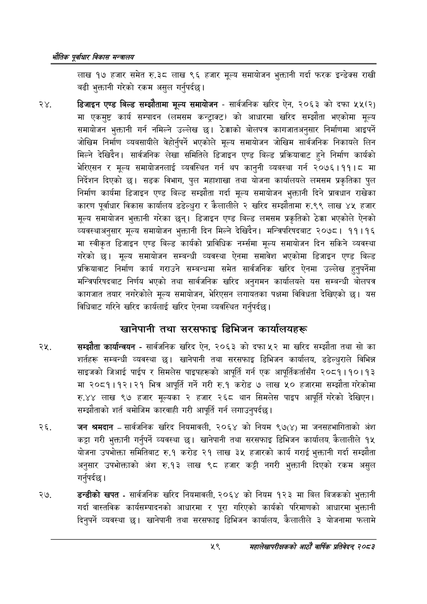

# Page 81 QA

## Rendered page


## Extracted text

```text
एवधार विकास मन्त्रालय
लाख १७ हजार समेत रु.३८ लाख ९६ हजार मूल्य समायोजन भुक्तानी गर्दा फरक इन्डेक्स राखी बढी भुक्तानी गरेको रकम असुल गर्नुपर्दछ।
डिजाइन एण्ड बिल्ड सम्झौतामा मूल्य समायोजन -सार्वजनिक खरिद ऐन, २०६३ को दफा ५४५(२) मा एकमुष्ट कार्य सम्पादन (लमसम कन्ट्राक्ट) को आधारमा खरिद सम्झौता भएकोमा मूल्य समायोजन भुक्तानी गर्न नमिल्ने उल्लेख छ। ठेक्काको बोलपत्र कागजातअनुसार निर्माणमा आइपर्ने जोखिम निर्माण व्यवसायीले वेहोर्नुपर्न भएकोले मूल्य समायोजन जोखिम सार्वजनिक निकायले लिन मिल्ने देखिदेन। सार्वजनिक लेखा समितिले डिजाइन एण्ड बिल्ड प्रक्रियावाट हुने निर्माण कार्यको भेरिएसन र मूल्य समायोजनलाई व्यवस्थित गर्न थप कानुनी व्यबस्था गर्न २०७६।११।८ मा निर्देशन दिएको छ। सड्क विभाग, पुल महाशाखा तथा योजना कार्यालयले लमसम प्रकृतिका पुल निर्माण कार्यमा डिजाइन एण्ड बिल्ड सम्झौता गर्दा मूल्य समायोजन भुक्तानी दिने प्रावधान राखेका कारण पूर्वाधार विकास कार्यालय डडेल्धुरा र कैलालीले २ खरिद सम्झौतामा रु.९९ लाख ४५ हजार मूल्य समायोजन भुक्तानी गरेका छन्‌। डिजाइन एण्ड बिल्ड लमसम प्रकृतिको ठेक्का भएकोले ऐनको व्यवस्थाअनुसार मूल्य समायोजन भुक्तानी दिन मिल्ने देखिदैन। मन्त्रिपरिषदबाट २०७८। ११।१६ मा स्वीकृत डिजाइन एण्ड बिल्ड कार्यको प्राविधिक नर्म्समा मूल्य समायोजन दिन सकिने व्यवस्था गरेको छ। मूल्य समायोजन सम्बन्धी व्यवस्था ऐनमा समावेश भएकोमा डिजाइन एण्ड बिल्ड प्रक्रियावाट निर्माण कार्य गराउने सम्बन्धमा समेत सार्वजनिक खरिद ऐनमा उल्लेख हुनुपर्नेमा मन्त्रिपरिषदबाट निर्णय भएको तथा सार्वजनिक खरिद अनुगमन कार्यालयले यस सम्बन्धी बोलपत्र कागजात तयार नगरेकोले मूल्य समायोजन, भेरिएसन लगायतका पक्षमा विविधता देखिएको छ। यस विधिबाट गरिने खरिद कार्यलाई खरिद ऐनमा व्यवस्थित गर्नुपर्दछ |
खानेपानी तथा सरसफाइ डिभिजन कार्यालयहरू
सम्झौता कार्यान्वयन -सार्वजनिक खरिद ऐन, २०६३ को दफा ५२ मा खरिद सम्झौता तथा सो का शर्तहरू सम्बन्धी व्यवस्था खानेपानी तथा सरसफाइ डिभिजन कार्यालय, डडेल्धुराले विभिन्न साइजको जिआई पाईप र सिमलेस पाइपहरूको आपूर्ति गर्न एक आपूर्तिकर्तासँग २०८१।१०।१३ मा २०८१।१२।२१ भित्र आपूर्ति गर्ने गरी रु.१ करोड ७ लाख ५० हजारमा सम्झौता गरेकोमा रु.४४ लाख ९७ हजार मूल्यका २ हजार २६८ थान सिमलेस पाइप आपूर्ति गरेको देखिएन | सम्झौताको शर्त बमोजिम कारवाही गरी आपूर्ति गर्न लगाउनुपर्दछ।
जन श्रमदान -सार्वजनिक खरिद नियमावली, २०६४ को नियम ९७(४) मा जनसहभागिताको अंश कट्टा गरी भुक्तानी गर्नुपर्ने व्यवस्था | खानेपानी तथा सरसफाइ डिभिजन कार्यालय, कैलालीले १५ योजना उपभोक्ता समितिबाट रु.१ करोड २१ लाख ३५ हजारको कार्य गराई भुक्तानी गर्दा सम्झौता अनुसार उपभोक्ताको अंश रु.१३ लाख ९८ हजार कट्टी नगरी भुक्तानी दिएको रकम असुल गर्नुपर्दछ |
डन्डीको खपत -सार्वजनिक खरिद नियमावली, २०६४ को नियम १२३ मा बिल बिजकको भुक्तानी गर्दा वास्तविक कार्यसम्पादनको आधारमा र पूरा गरिएको कार्यको परिमाणको आधारमा भुक्तानी दिनुपर्ने व्यवस्था छ। खानेपानी तथा सरसफाइ डिभिजन कार्यालय, कैलालीले ३ योजनामा फलामे
५९
महालेखापरीक्षकको आठाँ वाषिकि प्रतिवेदन्‌ २०८२
```

## Flags
- None
