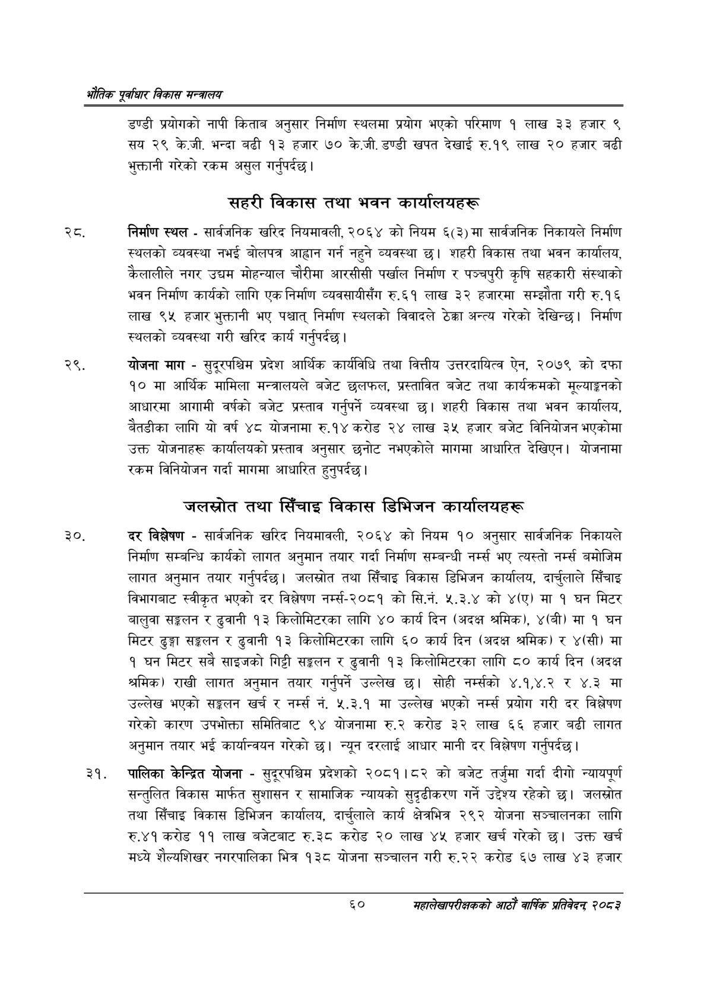

# Page 82 QA

## Rendered page


## Extracted text

```text
एवधार विकास मन्त्रालय
डण्डी प्रयोगको नापी किताब अनुसार निर्माण स्थलमा प्रयोग भएको परिमाण १ लाख ३३ हजार ९ सय २९ के.जी. भन्दा बढी १३ हजार ७० के.जी. डण्डी खपत देखाई रु.१९ लाख २० हजार बढी भुक्तानी गरेको रकम असुल गर्नुपर्दछ |
सहरी विकास तथा भवन कार्यालयहरू
रट. निर्माण स्थल -सार्वजनिक खरिद नियमावली, २०६४ को नियम ६(३) मा सार्वजनिक निकायले निर्माण स्थलको व्यवस्था नभई बोलपत्र आह्वान गर्न नहुने व्यवस्था छ। शहरी विकास तथा भवन कार्यालय, कैलालीले नगर उद्यम मोहन्याल चौरीमा आरसीसी पर्खाल निर्माण र पञ्चपुरी कृषि सहकारी संस्थाको भवन निर्माण कार्यको लागि एक निर्माण व्यवसायीसँग रु.६१ लाख ३२ हजारमा सम्झौता गरी रु.१६ लाख ९५ हजार भुक्तानी भए पश्चात्‌ निर्माण स्थलको विवादले ठेक्का अन्त्य गरेको देखिन्छ। निर्माण स्थलको व्यवस्था गरी खरिद कार्य गर्नुपर्दछ |
योजना माग -सुदूरपश्चिम प्रदेश आर्थिक कार्यविधि तथा वित्तीय उत्तरदायित्व ऐन, २०७९ को दफा १० मा आर्थिक मामिला मन्त्रालयले बजेट छलफल, प्रस्तावित बजेट तथा कार्यक्रमको मूल्याङ्गनको आधारमा आगामी वर्षको बजेट प्रस्ताव गर्नुपर्ने व्यवस्था छ। शहरी विकास तथा भवन कार्यालय, बैतडीका लागि यो वर्ष ४८ योजनामा रु.१४ करोड २४ लाख ३५ हजार बजेट विनियोजन भएकोमा उक्त योजनाहरू कार्यालयको प्रस्ताव अनुसार छनोट नभएकोले मागमा आधारित देखिएन। योजनामा रकम विनियोजन गर्दा मागमा आधारित हुनुपर्दछ |
जलस्रोत तथा सिँचाइ विकास डिभिजन कार्यालयहरू
दर विश्लेषण -सार्वजनिक खरिद नियमावली, २०६४ को नियम १० अनुसार सार्वजनिक निकायले निर्माण सम्बन्धि कार्यको लागत अनुमान तयार गर्दा निर्माण सम्बन्धी नर्म्स भए त्यस्तो बमोजिम लागत अनुमान तयार गर्नुपर्दछ। जलस्रोत तथा सिँचाइ विकास डिभिजन कार्यालय, दार्चुलाले सिँचाइ विभागबाट स्वीकृत भएको दर विश्लेषण नर्म्स-२०८१ को सि.नं. ५.३.४ को ४(ए) मा १ घन मिटर बालुवा सङ्कलन र ढुवानी १३ किलोमिटरका लागि ४० कार्य दिन (अदक्ष श्रमिक), ४(बी) मा १ घन मिटर ढुङ्गा सङ्लन र ढुवानी १३ किलोमिटरका लागि ६० कार्य दिन (अदक्ष श्रमिक) र ४(सी) मा १ घन मिटर सबै साइजको गिट्टी सङ्खलन र ढुवानी ९३ किलोमिटरका लागि ८० कार्य दिन (अदक्ष श्रमिक) राखी लागत अनुमान तयार गर्नुपर्ने उल्लेख छ। सोही नम्सको ४.१,४.२ र ४.३ मा उल्लेख भएको सङ्कलन खर्च र नर्म्स नं. ५.३.१ मा उल्लेख भएको नरग्म्स प्रयोग गरी दर विश्लेषण गरेको कारण उपभोक्ता समितिबाट ९४ योजनामा रु.२ करोड ३२ लाख ६६ हजार बढी लागत अनुमान तयार भई कार्यान्वयन गरेको छ। न्यून दरलाई आधार मानी दर विश्लेषण गर्नुपर्दछ |
पालिका केन्द्रित योजना -सुदूरपश्चिम प्रदेशको २०८१।८२ को बजेट तर्जुमा गर्दा दीगो न्यायपूर्ण सन्तुलित विकास मार्फत सुशासन र सामाजिक न्यायको सुदृढीकरण गर्ने उद्देश्य रहेको छ। जलस्रोत तथा सिँचाइ विकास डिभिजन कार्यालय, दार्चलाले कार्य क्षेत्रभित्र २९२ योजना सञ्चालनका लागि रु.४१ करोड ११ लाख बजेटबाट रु.३८ करोड २० लाख ४५ हजार खर्च गरेको छ। उक्त खर्च मध्ये शैल्यशिखर नगरपालिका भित्र १३८ योजना सञ्चालन गरी रु.२२ करोड ६७ लाख ४३ हजार
६०
महालेखापरीक्षकको आठाँ वाषिकि प्रतिवेदन्‌ २०८२
```

## Flags
- None
