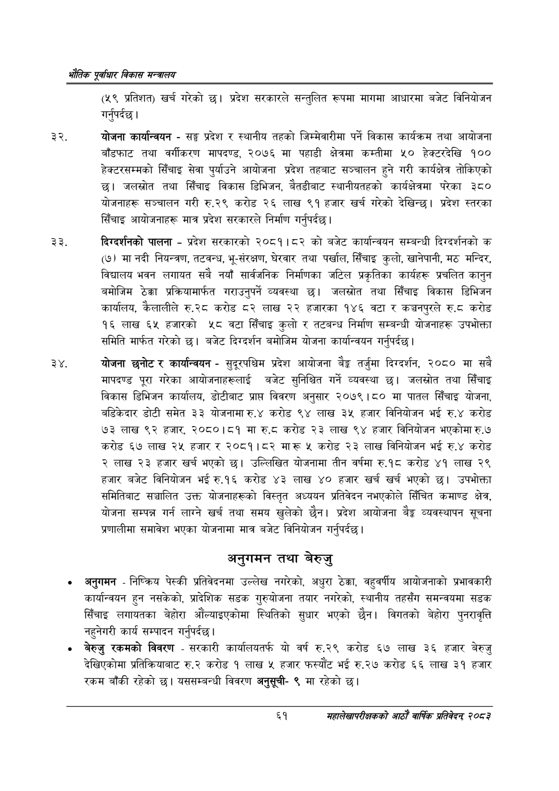

# Page 83 QA

## Rendered page


## Extracted text

```text
एवधार विकास मन्त्रालय
(५९ प्रतिशत) खर्च गरेको छ। प्रदेश सरकारले सन्तुलित रूपमा मागमा आधारमा बजेट विनियोजन गर्नुपर्दछ |
योजना कार्यान्वयन -सङ्घ प्रदेश र स्थानीय तहको जिम्मेवारीमा पर्ने विकास कार्यक्रम तथा आयोजना बाँडफाट तथा वर्गीकरण मापदण्ड, २०७६ मा पहाडी क्षेत्रमा कम्तीमा ५० हेक्टरदेखि १०० हेक्टरसम्मको सिँचाइ सेवा पुर्याउने आयोजना प्रदेश तहबाट सञ्चालन हुने गरी कार्यक्षेत्र तोकिएको जलस्रोत तथा सिँचाइ विकास डिभिजन, बैेतडीबाट स्थानीयतहको कार्यक्षेत्रमा परेका ३५० योजनाहरू सञ्चालन गरी रु.२९ करोड २६ लाख ९१ हजार खर्च गरेको देखिन्छ। प्रदेश स्तरका सिँचाइ आयोजनाहरू मात्र प्रदेश सरकारले निर्माण गर्नुपर्दछ |
दिग्दर्शनको पालना -प्रदेश सरकारको २०८१।८२ को बजेट कार्यान्वयन सम्बन्धी दिग्दर्शनको क (७) मा नदी नियन्त्रण, तटवन्ध, भू-संरक्षण, घेरवार तथा पर्खाल, सिँचाइ कुलो, खानेपानी, मठ मन्दिर, विद्यालय भवन लगायत सबै नयाँ सार्वजनिक निर्माणका जटिल प्रकृतिका कार्यहरू प्रचलित कानुन बमोजिम ठेक्का प्रक्रियामार्फत गराउनुपर्ने व्यवस्था जलस्रोत तथा सिँचाइ विकास डिभिजन कार्यालय, कैलालीले रु.२८ करोड ८२ लाख २२ हजारका १४६ वटा र कञ्चनपुरले €.६ करोड १६ लाख ६५ हजारको ५८ वटा सिँचाइ कुलो र तटबन्ध निर्माण सम्बन्धी योजनाहरू उपभोक्ता समिति मार्फत गरेको छ। बजेट दिग्दर्शन बमोजिम योजना कार्यान्वयन गर्नुपर्दछ |
२४, योजना छनोट र कार्यान्वयन -सुदूरपश्चिम प्रदेश आयोजना बैङ्क तर्जुमा दिग्दर्शन, २०८० मा सबै मापदण्ड पूरा गरेका आयोजनाहरूलाई बजेट सुनिश्चित गर्ने व्यवस्था छ। जलस्रोत तथा सिँचाइ विकास डिभिजन कार्यालय, डोटीबाट प्राप्त विवरण अनुसार २०७९।८० मा पातल सिँचाइ योजना, बडिकेदार डोटी समेत ३३ योजनामा रु.४ करोड ९४ लाख ३५ हजार विनियोजन भई रु.४ करोड ७३ लाख ९२ हजार, २०८०।८१ मा रु.८ करोड २३ लाख ९४ हजार विनियोजन भएकोमा रु.७ करोड ६७ लाख २५ हजार र २०८१।८२ मारू ५ करोड २३ लाख विनियोजन भई रु.४ करोड २ लाख २३ हजार खर्च भएको छ। उल्लिखित योजनामा तीन वर्षमा रु.१८ करोड ४१ लाख २९ हजार बजेट विनियोजन भई रु.१६ करोड ४३ लाख ४० हजार खर्च खर्च भएको छ। उपभोक्ता समितिबाट सञ्चालित उक्त योजनाहरूको विस्तृत अध्ययन प्रतिवेदन नभएकोले सिँचित कमाण्ड क्षेत्र, योजना सम्पन्न गर्न लाग्ने खर्च तथा समय खुलेको छैन। प्रदेश आयोजना बेङ्ग व्यवस्थापन सूचना प्रणालीमा समावेश भएका योजनामा मात्र बजेट विनियोजन गर्नुपर्दछ |
अनुगमन तथा बेरुजु
अनुगमन -निष्क्रिय पेस्की प्रतिवेदनमा उल्लेख नगरेको, अधुरा ठेक्का, वहुवर्षीय आयोजनाको प्रभावकारी कार्यान्वयन हुन नसकेको, प्रादेशिक सडक गुरुयोजना तयार नगरेको, स्थानीय तहसँग समन्वयमा सडक सिँचाइ लगायतका बेहोरा औंल्याइएकोमा स्थितिको सुधार भएको छैन। विगतको बेहोरा पुनरावृत्ति नहुनेगरी कार्य सम्पादन गर्नुपर्दछ |
बेरुजु रकमको विवरण -सरकारी कार्यालयतर्फ यो वर्ष रु२९ करोड ६७ लाख ३६ हजार बेरुजु देखिएकोमा प्रतिक्रियाबाट रु.२ करोड १ लाख ५ हजार फस्यौट भई रु.२७ करोड ६६ लाख ३१ हजार रकम बाँकी रहेको छ। यससम्बन्धी विवरण अनुसूची९ मा रहेको छ।
६१
महालेखापरीक्षकको आठाँ वाषिकि प्रतिवेदन्‌ २०८२
```

## Flags
- None
