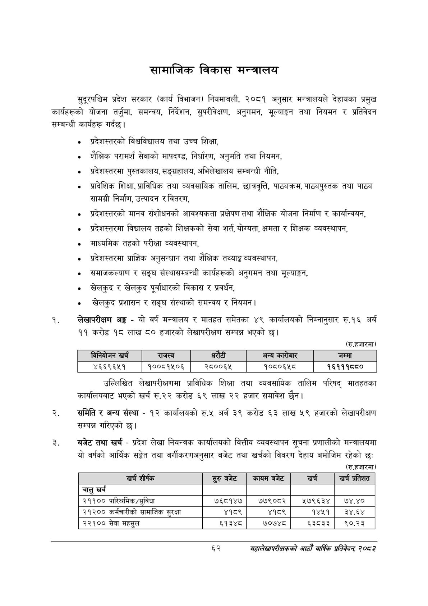

# Page 84 QA

## Rendered page


## Extracted text

```text
सामाजिक विकास मन्त्रालय
सुदूरपश्चिम प्रदेश सरकार (कार्य विभाजन) नियमावली, २०८१ अनुसार मन्त्रालयले देहायका प्रमुख कार्यहरूको योजना तर्जुमा, समन्वय, निर्देशन, सुपरीवेक्षण, अनुगमन, मूल्याङ्गग तथा नियमन र प्रतिवेदन सम्बन्धी कार्यहरू गर्दछ।
प्रदेशस्तरको विश्वविद्यालय तथा उच्च शिक्षा,
शैक्षिक परामर्श सेवाको मापदण्ड, निर्धारण, अनुमति तथा नियमन,
प्रदेशस्तरमा पुस्तकालय, सङ्ग्रहालय, अभिलेखालय सम्बन्धी नीति,
प्रादेशिक शिक्षा, प्राविधिक तथा व्यवसायिक तालिम, छात्रवृत्ति, पाठ्यक्रम, पाठ्यपुस्तक तथा पाठ्य सामग्री निर्माण, उत्पादन र वितरण,
प्रदेशस्तरको मानव संशोधनको आवश्यकता प्रक्षेपण तथा शैक्षिक योजना निर्माण र कार्यान्वयन,
प्रदेशस्तरमा विद्यालय तहको शिक्षकको सेवा शर्त, योग्यता, क्षमता र शिक्षक व्यवस्थापन,
माध्यमिक तहको परीक्षा व्यवस्थापन,
प्रदेशस्तरमा प्राज्ञिक अनुसन्धान तथा शैक्षिक तथ्याङ्क व्यवस्थापन,
समाजकल्याण र सङ्घ संस्थासम्बन्धी कार्यहरूको अनुगमन तथा मूल्याङ्कन,
खेलकुद र खेलकुद पूर्वाधारको विकास र प्रवर्धन,
खेलकुद प्रशासन र सङ्घ संस्थाको समन्वय र नियमन |
लेखापरीक्षण अङ्ग -यो वर्ष मन्त्रालय र मातहत समेतका ४९ कार्यालयको निम्नानुसार रु.१६ अर्ब ११ करोड १८ लाख ८० हजारको लेखापरीक्षण सम्पन्न भएको छ।
(रु.हजारमा)
उल्लिखित लेखापरीक्षणमा प्राविधिक शिक्षा तथा व्यवसायिक तालिम परिषद्‌ मातहतका कार्यालयबाट भएको खर्च रु.२२ करोड ६९ लाख २२ हजार समावेश छैन।
समिति र अन्य संस्था -१२ कार्यालयको रु.५ अर्ब ३९ करोड ६३ लाख ५९ हजारको लेखापरीक्षण सम्पन्न गरिएको छ।
बजेट तथा खर्च -प्रदेश लेखा नियन्त्रक कार्यालयको वित्तीय व्यवस्थापन सूचना प्रणालीको मन्त्रालयमा यो वर्षको आर्थिक सङ्गेत तथा वर्गीकरणअनुसार बजेट तथा खर्चको विवरण देहाय बमोजिम रहेको छः
(रु.हजारमा)
६२
महालेखापरीक्षकको आठ वार्षिक प्रतिवेदन्‌ २०५३

|  | विनिबोजन खर्च | राजस्व |  |  | अन्य कारोबार | जम्मा |
| --- | --- | --- | --- | --- | --- | --- |
|  | ४६६९६४५१ | १००८१५०६ | २८००६५ |  | १०८०६४५८ | १६१११८८० |

| खर्च शीर्षक | र्रुबबेट | कायम बजेट | खरी | खु प्रतेशत |
| --- | --- | --- | --- | --- |
| चालु खर्च |  |  |  |  |
| २११०० पारिश्रमिक/सुविधा | ७६८१४७ | ७७९०८२ | २१७९६३४ | ७४.४० |
| २१२०० कर्मचारीको सामाजिक सुरक्षा | ४१८९ | ४१८९ | १४५१ | उ३े४,६४ |
| २२१०० सेवा महसुल | ६१३४८ | ७०७४८ | ६३८३३ | ९०.२३ |
```

## Flags
- table_page
- medium_quality_table
