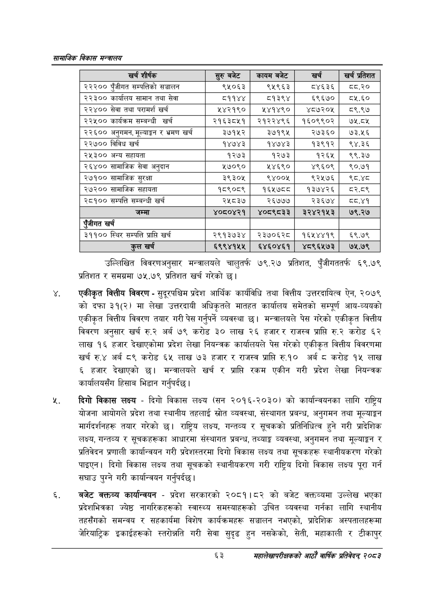

# Page 85 QA

## Rendered page


## Extracted text

```text
सायाजिक विकास
उल्लिखित विवरणअनुसार मन्त्रालयले चालुतर्फ ७७९.२७ प्रतिशत, पुँजीगततर्फ ६९.७९ प्रतिशत र समग्रमा ७५.७९ प्रतिशत खर्च गरेको छ।
एकीकृत वित्तीय विवरण -सुदूरपश्चिम प्रदेश आर्थिक कार्यविधि तथा वित्तीय उत्तरदायित्व ऐन, २०७९ को दफा ३१(२) मा लेखा उत्तरदायी अधिकृतले मातहत कार्यालय समेतको सम्पूर्ण आय-व्ययको एकीकृत वित्तीय विवरण तयार गरी पेस गर्नुपर्ने व्यवस्था छ। मन्त्रालयले पेस गरेको एकीकृत वित्तीय विवरण अनुसार खर्च रु.२ अर्ब ७९ करोड ३० लाख २६ हजार र राजस्व प्राप्ति करोड लाख १६ हजार देखाएकोमा प्रदेश लेखा नियन्त्रक कार्यालयले पेस गरेको एकीकृत वित्तीय विवरणमा खर्च रु.४ अर्ब ८९ करोड ६५ लाख ७३ हजार र राजस्व प्राप्ति रु.१० अर्ब ८ करोड १५ लाख ६ हजार देखाएको छ। मन्त्रालयले खर्च र प्राप्ति रकम एकीन गरी प्रदेश लेखा नियन्त्रक कार्यालयसँग हिसाब भिडान गर्नुपर्दछ |
दिगो विकास लक्ष्य -दिगो विकास लक्ष्य (सन २०१६-२०३०) को कार्यान्वयनका लागि राष्ट्रिय योजना आयोगले प्रदेश तथा स्थानीय तहलाई स्रोत व्यवस्था, संस्थागत प्रबन्ध, अनुगमन तथा मूल्याङ्कन मार्गदर्शनहरू तयार गरेको छ। राष्ट्रिय लक्ष्य, गन्तव्य र सूचकको प्रतिनिधित्व हुने गरी प्रादेशिक लक्ष्य, गन्तव्य र सूचकहरूका आधारमा संस्थागत प्रबन्ध, तथ्याङ्क व्यवस्था, अनुगमन तथा मूल्याङ्कन र प्रतिवेदन प्रणाली कार्यान्वयन गरी प्रदेशस्तरमा दिगो विकास लक्ष्य तथा सूचकहरू स्थानीयकरण गरेको पाइएन। दिगो विकास लक्ष्य तथा सूचकको स्थानीयकरण गरी राष्ट्रिय दिगो विकास लक्ष्य पूरा गर्न सघाउ पुग्ने गरी कार्यान्वयन गर्नुपर्दछ |
बजेट कक्तव्य कार्यान्वयन -प्रदेश सरकारको २०८१।८२ को बजेट वक्तव्यमा उल्लेख भएका प्रदेशभित्रका ज्येष्ठ नागरिकहरूको स्वास्थ्य समस्याहरूको उचित व्यवस्था गर्नका लागि स्थानीय तहसँगको समन्वय र सहकार्यमा विशेष कार्यक्रमहरू सञ्चालन नभएको, प्रादेशिक अस्पतालहरूमा जेरियाट्रिक इकाईहरूको स्तरोन्नति गरी सेवा सुदृढ हुन नसकेको, सेती, महाकाली र टीकापुर
६३
महालेखापरीक्षकको आठाँ वाषिकि प्रतिवेदन्‌ २०८२

| खर्च शीर्षक | र्रुबबेट | कायम बजेट | खरी | खु प्रतेशत |
| --- | --- | --- | --- | --- |
| २२२०० पुँजीगत सम्पत्तिको सञ्चालन | ९६५०६३ | ९५९६३ | ८४६३६ | व८.२० |
| २२३०० कार्ालष सामान तथा सेवा | ८११४४ | ८१३९४ | ६९६७० | .€० |
| २२४०० सेवा तथा परामर्श खर्च | ५४२१९० | ५४१४९० | ४८७२०५ | ८५९.९७ |
| २२५०० कार्यक्रम सम्बन्धी खर्च | २१६३८५१ | २१२२४९६ | १६०९९०२ | ७५.८५ |
| २२६०० अनुगमन, भूल्याङ्गग र भ्रमण खर्च | ३७१५२ | ३७१९५ | २७३६० | ७३.५६ |
| २२७०० विविध खर्च | १४७४३ | १४७४३ | १३९१२ | १९४.३६ |
| २५३०० अन्य सहावता | १२७३ | १२७३ | १२६५ | ९९.३७ |
| २६४०० सामाजिक सेवा अनुदान | ५७०९० | ५४६९० | ४९६०९ | ९०.७१ |
| २७१०० सामाजिक सुरक्षा | ३९३०४५ | ९४००५ | ९२५७६ | ९८.४८ |
| २७२०० सामाजिक सहायता | १८९०८९ | १६४१७८८ | १३७४२६ | व८२.८९ |
| २८१०० सम्पत्ति सम्बन्धी खर्च | २५८३७ | २६७७७ | २३६७४ | व८०.४१ |
| जम्मा | ४०८०४२१ | ४०८९८३३ | ३२४२१५३ | ७९.२७ |
| एंजीगत खर्च |  |  |  |  |
| ३११०० स्थिर सम्पत्ति प्राप्ति खर्च | २९१३७३४ | २३७०६२८ | १६५४४१९ | ६९.७९ |
| हल खर्च | ६९९४१५५ | ६४६०४६१ | ४८९६५७३ | ७५.७९ |
```

## Flags
- table_page
- medium_quality_table
