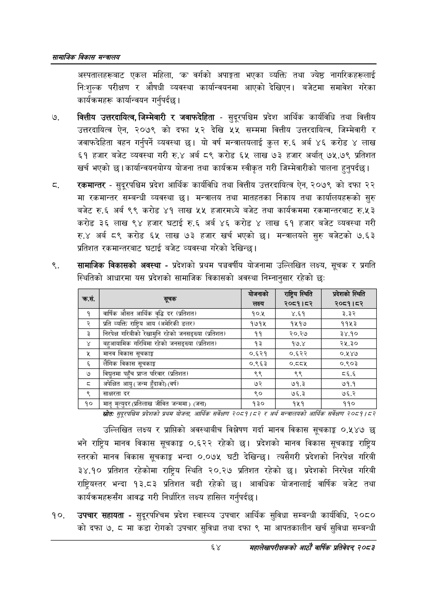

# Page 86 QA

## Rendered page


## Extracted text

```text
सायाजिक विकास
अस्पतालहरूबाट एकल महिला, वर्गको अपाङ्गता भएका व्यक्ति तथा ज्येष्ठ नागरिकहरूलाई निःशुल्क परीक्षण र औषधी व्यवस्था कार्यान्वयनमा आएको देखिएन। बजेटमा समावेश गरेका कार्यक्रमहरू कार्यान्वयन गर्नुपर्दछ |
वित्तीय उत्तरदायित्व, जिम्मेवारी र जवाफदेहिता -सुदूरपश्चिम प्रदेश आर्थिक कार्यविधि तथा वित्तीय उत्तरदायित्व ऐन, २०७९ को दफा ५२ देखि ५४ सम्ममा वित्तीय उत्तरदायित्व, जिम्मेवारी र जवाफदेहिता वहन गर्नुपर्ने व्यवस्था छ। यो वर्ष मन्त्रालयलाई कुल रु.६ अर्ब ४६ करोड लाख ६१ हजार बजेट व्यवस्था गरी रु.४ अर्ब ८९ करोड ६५ लाख ७३ हजार अर्थात्‌ ७५.७९ प्रतिशत खर्च भएको छ। कार्यान्वयनयोरय योजना तथा कार्यक्रम स्वीकृत गरी जिम्मेवारीको पालना हुनुपर्दछ |
रकमान्तर -सुदूरपश्चिम प्रदेश आर्थिक कार्यविधि तथा वित्तीय उत्तरदायित्व ऐन, २०७९ को दफा २२ मा रकमान्तर सम्बन्धी व्यवस्था | मन्त्रालय तथा मातहतका निकाय तथा कार्यालयहरूको सुरु बजेट रु.६ अर्ब ९९ करोड ४१ लाख ५५ हजारमध्ये बजेट तथा कार्यक्रममा रकमान्तरबाट रु.५३ करोड ३६ लाख ९४ हजार घटाई रु.६ अर्ब ४६ करोड ४ लाख ६१ हजार बजेट व्यवस्था गरी रु.४ अर्ब ८९ करोड ६५ लाख ७३ हजार खर्च भएको | मन्त्रालयले सुरु बजेटको ७.६३ प्रतिशत रकमान्तरबाट घटाई बजेट व्यवस्था गरेको देखिन्छ |
सामाजिक विकासको अवस्था -प्रदेशको प्रथम पञ्चवर्षीय योजनामा उल्लिखित लक्ष्य, सूचक र प्रगति स्थितिको आधारमा यस प्रदेशको सामाजिक विकासको अवस्था निम्नानुसार रहेको छ:
स्रोतः सुद्रपश्चिस प्रदेशको प्रथस योजना; आर्थिक सर्वेक्षण २०८१/८२ र अर्थ मन्बालयको आर्थिक सर्वेक्षण २००१/८२
उल्लिखित लक्ष्य र प्राप्तिको अवस्थाबीच विश्लेषण गर्दा मानव विकास सूचकाङ्क ०.५४७ छ भने राष्ट्रिय मानव विकास सूचकाङ्क ०.६२२ रहेको प्रदेशको मानव विकास सूचकाङ्क राष्ट्रिय स्तरको मानव विकास सूचकाङ्क भन्दा ०.०७५ घटी देखिन्छ। त्यसैगरी प्रदेशको निरपेक्ष गरिबी ३४.१० प्रतिशत रहेकोमा राष्ट्रिय स्थिति २०.२७ प्रतिशत रहेको छ। प्रदेशको निरपेक्ष गरिबी राष्ट्रियस्तर भन्दा १३.८३ प्रतिशत बढी रहेको छ। आवधिक योजनालाई वार्षिक बजेट तथा कार्यक्रमहरूसँग आवद्ध गरी निर्धारित लक्ष्य हासिल गर्नुपर्दछ।
उपचार सहायता -सुदूरपश्चिम प्रदेश स्वास्थ्य उपचार आर्थिक सुविधा सम्बन्धी कार्यविधि, २०८० को दफा ७, ८ मा कडा रोगको उपचार सुविधा तथा दफा ९ मा आपतकालीन खर्च सुविधा सम्बन्धी
६४
महालेखापरीक्षकको आठाँ वाषिकि प्रतिवेदन्‌ २०८२

| . कस, | सूचक | बोजनाको लक्ष्य | राष्ट्रिय स्थिति २०८१।८२ | प्रदेशको स्थिति २०८१।८२ |
| --- | --- | --- | --- | --- |
| १ | वचार्षिक औसत आर्थिक वृद्धि दर (प्रतिशत) | १०.५ | ४.६१ | ३ |
| २ | प्रति व्यक्ति राष्ट्रिय आय (अमेरिकी डलर) | १७१५ | १५१७ | ११५३ |
| ३ | निरपेक्ष भरिवीको रेखामुनि रहेको जनसङ्धय। (प्रतिशत) | ११ | २०.२४ | ३४.१० |
| ४ | बहुआयामिक गरिविमा रहेको जनसङ्«या (प्रतिशत) | १३ | १७.४ | २५.३० |
| ५ | मानव विकास सूचकाङ्क | ०.६२१ | ०.६२२ | ०.१४७ |
| ६ | लैंगिक विकास सूचकाङ्क | ०.९६३ | ०.५ | ०.९०३ |
| ७ | विद्युतमा पहुँच प्राप्त परिवार (प्रतिशत) | ९९ | ९९ | ८६.६ |
| ८ | अपेक्षित आयु ( जन्म हुँदाको) (वर्ष) | ७२ | ७१.३ | ७१.१ |
| ९ | साक्षरता दर | ९० | ७६.३ | ७६.२ |
| १० | मातृ मृत्युदर (क्रतिलाख जीवित जन्ममा ) (जना) | १३० | १५१ | ११० |
```

## Flags
- table_page
- medium_quality_table
