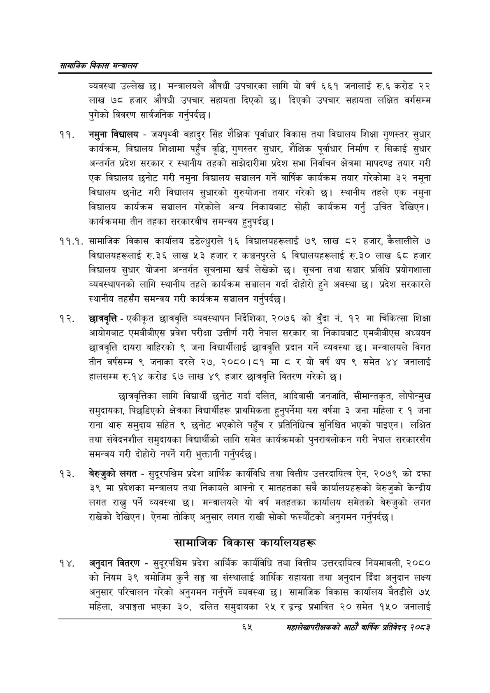

# Page 87 QA

## Rendered page


## Extracted text

```text
सायाजिक विकास
व्यवस्था उल्लेख छ। मन्त्रालयले औषधी उपचारका लागि यो वर्ष ६६१ जनालाई रु.६ करोड २२ लाख ७८ हजार औषधी उपचार सहायता दिएको छ। दिएको उपचार सहायता लक्षित वर्गसम्म पुगेको विवरण सार्वजनिक गर्नुपर्दछ।
नमुना विद्यालय -जयपृथ्वी बहादुर सिंह शैक्षिक पूर्वाधार विकास तथा विद्यालय शिक्षा गुणस्तर सुधार कार्यक्रम, विद्यालय शिक्षामा पहुँच वृद्धि, गुणस्तर सुधार, शैक्षिक पूर्वाधार निर्माण र सिकाई सुधार अन्तर्गत प्रदेश सरकार र स्थानीय तहको साझेदारीमा प्रदेश सभा निर्वाचन क्षेत्रमा मापदण्ड तयार गरी एक विद्यालय छनोट गरी नमुना विद्यालय सञ्चालन गर्ने वार्षिक कार्यक्रम तयार गरेकोमा ३२ नमूना विद्यालय छनोट गरी विद्यालय सुधारको गुरुयोजना तयार गरेको छ। स्थानीय तहले एक नमुना विद्यालय कार्यक्रम सञ्चालन गरेकोले अन्य निकायबाट सोही कार्यक्रम गर्नु उचित देखिएन। कार्यक्रममा तीन तहका सरकारबीच समन्वय हुनुपर्दछ |
११.१. सामाजिक विकास कार्यालय डडेल्धुराले १६ विद्यालयहरूलाई ७९ लाख ८२ हजार, कैलालीले ७ विद्यालयहरूलाई रु.३६ लाख ५३ हजार र कञ्चनपुरले विद्यालयहरूलाई रु.३० लाख ६८ हजार विद्यालय सुधार योजना अन्तर्गत सूचनामा खर्च लेखेको छ। सूचना तथा सञ्चार प्रविधि प्रयोगशाला व्यवस्थापनको लागि स्थानीय तहले कार्यक्रम सञ्चालन गर्दा दोहोरो हुने अवस्था छ। प्रदेश सरकारले स्थानीय तहसँग समन्वय गरी कार्यक्रम सञ्चालन गर्नुपर्दछ |
छात्रवृत्ति -एकीकृत छात्रवृत्ति व्यवस्थापन निर्देशिका, २०७६ को बुँदा नं. १२ मा चिकित्सा शिक्षा आयोगबाट एमबीबीएस प्रवेश परीक्षा उत्तीर्ण गरी नेपाल सरकार वा निकायबाट एमबीबीएस अध्ययन छात्रवृत्ति दायरा बाहिरको ९ जना विद्यार्थीलाई छात्रवृत्ति प्रदान गर्ने व्यवस्था | मन्त्रालयले विगत तीन वर्षसम्म ९ जनाका दरले २७, २०८०।८१ मा ८ रयो वर्ष थप ९ समेत ४४ जनालाई हालसम्म रु.१४ करोड ६७ लाख ४९ हजार छात्रवृत्ति वितरण गरेको छ।
छात्रवृत्तिका लागि विद्यार्थी छनोट गर्दा दलित, आदिवासी जनजाति, सीमान्तकृत, लोपोन्मुख समुदायका, पिछडिएको क्षेत्रका विद्यार्थीहरू प्राथमिकता हुनुपर्नेमा यस वर्षमा ३ जना महिला र १ जना राना थारु समुदाय सहित ९ छनोट भएकोले पहुँच र प्रतिनिधित्व सुनिश्चित भएको पाइएन। लक्षित तथा संवेदनशील समुदायका विद्यार्थीको लागि समेत कार्यक्रमको पुनरावलोकन गरी नेपाल सरकारसँग समन्वय गरी दोहोरी नपर्ने गरी भुक्तानी गर्नुपर्दछ |
बेरुजुको लगत -सुदूरपश्चिम प्रदेश आर्थिक कार्यविधि तथा वित्तीय उत्तरदायित्व ऐन, २०७९ को दफा ३९ मा प्रदेशका मन्त्रालय तथा निकायले आफ्नो र मातहतका सबै कार्यालयहरूको बेरुजुको केन्द्रीय लगत राख्नु पर्ने व्यवस्था छ। मन्त्रालयले यो वर्ष मतहतका कार्यालय समेतको बेरुजुको लगत राखेको देखिएन। ऐनमा तोकिए अनुसार लगत राखी सोको फस्यौटको अनुगमन गर्नुपर्दछ |
सामाजिक विकास कार्यालयहरू
अनुदान वितरण -सुदूरपश्चिम प्रदेश आर्थिक कार्यविधि तथा वित्तीय उत्तरदायित्व नियमावली, २०८० को नियम ३९ बमोजिम कुनै सङ्घ वा संस्थालाई आर्थिक सहायता तथा अनुदान दिँदा अनुदान लक्ष्य अनुसार परिचालन गरेको अनुगमन गर्नुपर्ने व्यवस्था छ। सामाजिक विकास कार्यालय बैतडीले ७५ महिला, अपाङ्गता भएका ३०, दलित समुदायका २५ र द्वन्द्व प्रभावित २० समेत १५० जनालाई
महालेखापरीक्षकको आठाँ वाषिकि प्रतिवेदन्‌ २०८२
```

## Flags
- None
