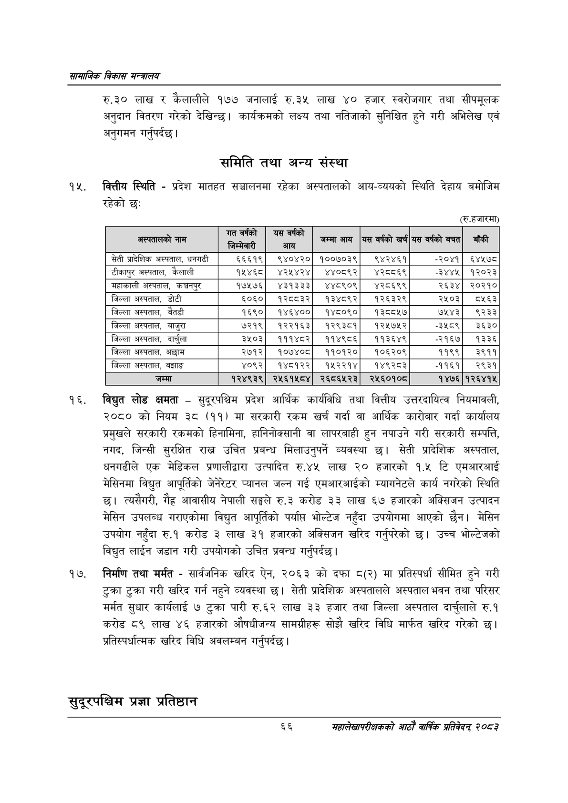

# Page 88 QA

## Rendered page


## Extracted text

```text
सायाजिक विकास
रु.३० लाख र कैलालीले १७७ जनालाई रु.३५ लाख ४० हजार स्वरोजगार तथा सीपमूलक अनुदान वितरण गरेको देखिन्छ। कार्यक्रमको लक्ष्य तथा नतिजाको सुनिश्चित हुने गरी अभिलेख एवं अनुगमन गर्नुपर्दछ।
समिति तथा अन्य संस्था
कित्तीय स्थिति -प्रदेश मातहत सञ्चालनमा रहेका अस्पतालको आय-व्ययको स्थिति देहाय बमोजिम रहेको छ:
(रू.हजारमा)
विद्युत लोड क्षमता -सुदूरपश्चिम प्रदेश आर्थिक कार्यविधि तथा वित्तीय उत्तरदायित्व नियमावली, २०८० को नियम ३८ (११) मा सरकारी रकम खर्च गर्दा वा आर्थिक कारोबार गर्दा कार्यालय प्रमुखले सरकारी रकमको हिनामिना, हानिनोक्सानी वा लापरबाही हुन नपाउने गरी सरकारी सम्पत्ति, नगद, जिन्सी सुरक्षित राख उचित प्रबन्ध मिलाउनुपर्ने व्यवस्था छ। सेती प्रादेशिक अस्पताल, धनगढीले एक मेडिकल प्रणालीद्वारा उत्पादित रु.४५ लाख २० हजारको १.५ टि एमआरआई मेसिनमा विद्युत आपूर्तिको जेनेरेटर प्यानल जल्न गई एमआरआईको म्यागनेटले कार्य नगरेको स्थिति छ। त्यसैगरी, गैह्र आवासीय नेपाली सङ्घले रु.३ करोड ३३ लाख ६७ हजारको अक्सिजन उत्पादन मेसिन उपलब्ध गराएकोमा विद्युत आपूर्तिको पर्यापत भोल्टेज नहुँदा उपयोगमा आएको छैन। मेसिन उपयोग नहुँदा रु.१ करोड ३ लाख ३१ हजारको अक्सिजन खरिद गर्नुपरेको छ। उच्च भोल्टेजको विद्युत लाईन जडान गरी उपयोगको उचित प्रवन्ध गर्नुपर्दछ |
निर्माण तथा मर्मत -सार्वजनिक खरिद ऐन, २०६३ को दफा ८(२) मा प्रतिस्पर्धा सीमित हुने गरी टुक्रा टुक्रा गरी खरिद गर्न नहुने व्यवस्था छ। सेती प्रादेशिक अस्पतालले अस्पताल भवन तथा परिसर मर्मत सुधार कार्यलाई ७ टुक्रा पारी रु.६२ लाख ३३ हजार तथा जिल्ला अस्पताल दार्चलाले रु.१ करोड ८९ लाख ४६ हजारको औषधीजन्य सामग्रीहरू सोझै खरिद विधि मार्फत खरिद गरेको छ। प्रतिस्पर्धात्मक खरिद विधि अवलम्बन गर्नुपर्दछ |
सुदूरपश्चिम प्रज्ञा प्रतिष्ठान
६६
महालेखापरीक्षकको आठाँ वाषिकि प्रतिवेदन्‌ २०८२

| अस्वतालको नाम | त पो जिन्मेनारी | आय | जम्मा आय | यस वर्षको खर्च | यस वर्षको बचत | बाँकी |
| --- | --- | --- | --- | --- | --- | --- |
| सेती प्रादेशिक अस्पताल, धनगढी | ६६६१९ | ९४०४२० | १००७०३९ | ९४२४६१ | -२०४१ | ६४१५७८ |
| टीकापुर अस्पताल, कैलाली | १५४६८ | ४२५४२४ | ४४०८९२ | ४२८८६९ | ३४४५ | १२०२३ |
| महाकाली अस्पताल, कञ्चनपुर | १७५२७६ | ४३१३३३ | ४४८९०९ | ४२८६९९ | २६३४ | २०२१० |
| जिल्ला अस्पताल, डोटी | ६०६० | १२८८३२ | १३४८९२ | १२६३२९ | २५०३ | ८५६३ |
| जिल्ला अस्पताल, बैतडी | १६९० | १४६४०० | १४८०९० | १३८८५७ | ७५४३ | ९२३३ |
| जिल्ला अस्पताल, बाजुरा | ७२१९ | १२२१६३ | १२९३८१ | १२५७५२ | -३१८९ | ३६३० |
| जिल्ला अस्पताल, दार्चुला | ३५०३ | १११४८२ | ११४९८६ | ११३६४९ | -२१६७ | १३३६ |
| जिल्ला अस्पताल, अछाम | २७१२ | १०७४०८ | ११०१२० | १०६२०९ | ११९९ | ३९११ |
| जिल्ला अस्पताल, बझाङ | ४०९२ | १४८१२२ | १५२२१४ | १४९२८३ | -११६१ | २९३१ |
| जम्मा | १२४९३९ | २५६१५८४ | २६८६५२३ | २४५६०१०८ | १४७६ | १२६४१५ |
```

## Flags
- table_page
- medium_quality_table
