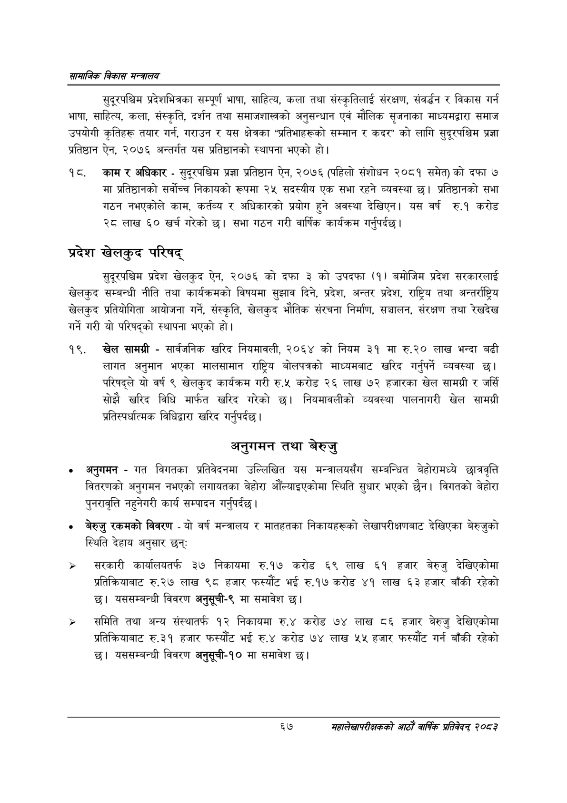

# Page 89 QA

## Rendered page


## Extracted text

```text
सायाजिक विकास
सुदूरपश्चिम प्रदेशभित्रका सम्पूर्ण भाषा, साहित्य, कला तथा संस्कृतिलाई संरक्षण, संवर्द्धन र विकास गर्न भाषा, साहित्य, कला, संस्कृति, दर्शन तथा समाजशास्त्रको अनुसन्धान एवं मौलिक सृजनाका माध्यमद्वारा समाज उपयोगी कृतिहरू तयार गर्न, गराउन र यस क्षेत्रका "प्रतिभाहरूको सम्मान र कदर" को लागि सुदूरपश्चिम प्रज्ञा प्रतिष्ठान ऐन, २०७६ अन्तर्गत यस प्रतिष्ठानको स्थापना भएको हो।
काम र अधिकार -सुदूरपश्चिम प्रज्ञा प्रतिष्ठान ऐन, २०७६ (पहिलो संशोधन २०८१ समेत) को दफा ७ मा प्रतिष्ठानको सर्वोच्च निकायको रूपमा २५ सदस्यीय एक सभा रहने व्यवस्था छ। प्रतिष्ठानको सभा गठन नभएकोले काम, कर्तव्य र अधिकारको प्रयोग हुने अवस्था देखिएन। यस वर्ष रु.१ करोड २८ लाख ६० खर्च गरेको | सभा गठन गरी वार्षिक कार्यक्रम गर्नुपर्दछ |
प्रदेश खेलकुद परिषद्‌
सुदूरपश्चिम प्रदेश खेलकुद ऐन, २०७६ को दफा ३ को उपदफा (१) बमोजिम प्रदेश सरकारलाई खेलकुद सम्बन्धी नीति तथा कार्यक्रमको विषयमा सुझाव दिने, प्रदेश, अन्तर प्रदेश, राष्ट्रिय तथा अन्तर्राष्ट्रिय खेलकुद प्रतियोगिता आयोजना गर्ने, संस्कृति, खेलकुद भौतिक संरचना निर्माण, सञ्चालन, संरक्षण तथा रेखदेख गर्ने गरी यो परिषद्को स्थापना भएको हो।
१९. खेल सामग्री -सार्वजनिक खरिद नियमावली, २०६४ को नियम ३९ मा रु.२० लाख भन्दा बढी लागत अनुमान भएका मालसामान राष्ट्रिय बोलपत्रको माध्यमबाट खरिद गर्नुपर्ने व्यवस्था छ। परिषद्ले यो वर्ष ९ खेलकुद कार्यक्रम गरी रु.५ करोड २६ लाख ७२ हजारका खेल सामग्री र जर्सि सोझै खरिद विधि मार्फत खरिद गरेको छ। नियमावलीको व्यवस्था पालनागरी खेल सामग्री प्रतिस्पर्धात्मक विधिद्वारा खरिद गर्नुपर्दछ |
अनुगमन तथा बेरुजु
अनुगमन -गत विगतका प्रतिवेदनमा उल्लिखित यस मन्त्रालयसँग सम्बन्धित बेहोरामध्ये छात्रवृत्ति वितरणको अनुगमन नभएको लगायतका बेहोरा औँल्याइएकोमा स्थिति सुधार भएको छैन। विगतको बेहोरा पुनरावृत्ति नहुनेगरी कार्य सम्पादन गर्नुपर्दछ |
बेरुजु रकमको विवरण -यो वर्ष मन्त्रालय र मातहतका निकायहरूको लेखापरीक्षणबाट देखिएका बेरुजुको स्थिति देहाय अनुसार छन्‌
सरकारी कार्यालयतर्फ ३७ निकायमा रु.१७ करोड ६९ लाख ६१ हजार बेरुजु देखिएकोमा प्रतिक्रियाबाट रु.२७ लाख ९८ हजार फस्यौट भई रु.१७ करोड ४१ लाख ६३ हजार बाँकी रहेको छ। यससम्बन्धी विवरण अनुसूची-९ मा समावेश |
समिति तथा अन्य संस्थातर्फ १२ निकायमा रु.४ करोड ७४ लाख ८६ हजार बेरुजु देखिएकोमा प्रतिक्रियाबाट रु.३१ हजार फस्यौट भई रु.४ करोड ७४ लाख ५५ हजार फस्यौट गर्न बाँकी रहेको छ। यससम्बन्धी विवरण अनुसूची-१० मा समावेश छ।
६७
महालेखापरीक्षकको आठाँ वाषिकि प्रतिवेदन्‌ २०८२
```

## Flags
- None
