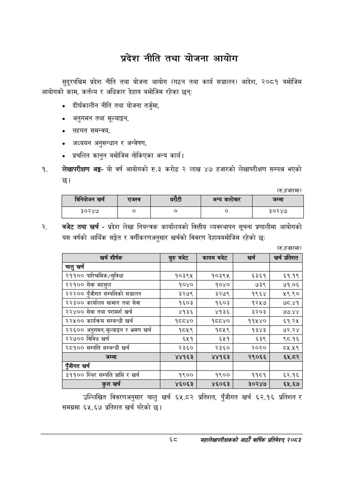

# Page 90 QA

## Rendered page


## Extracted text

```text
प्रदेश नीति तथा योजना आयोग
सुदूरपश्चिम प्रदेश नीति तथा योजना आयोग (गठन तथा कार्य सञ्चालन) आदेश, २०८१ बमोजिम आयोगको काम, कर्तव्य र अधिकार देहाय बमोजिम रहेका छन्‌
० दीर्घकालीन नीति तथा योजना तर्जुमा,
० अनुगमन तथा मूल्याङ्कन,
० तहगत समन्वय,
० अध्ययन अनुसन्धान र अन्वेषण,
० प्रचलित कानुन बमोजिम तोकिएका अन्य कार्य।
लेखापरीक्षण अङ्ग यो वर्ष आयोगको रु.३ करोड २ लाख ४७ हजारको लेखापरीक्षण सम्पन्न भएको छ।
(रु.हजारमा)
यस वर्षको आर्थिक सङ्गेत र वर्गीकरणअनुसार खर्चको विवरण देहायबमोजिम रहेको छः: बजेट तथा खर्च -प्रदेश लेखा नियन्त्रक कार्यालयको वित्तीय व्यवस्थापन सूचना प्रणालीमा आयोगको
(रु.हजारमा)
उल्लिखित विवरणअनुसार चालु खर्च ६५.८२ समग्रमा ६५.६७ प्रतिशत खर्च गरेको छ। प्रतिशत, पुँजीगत खर्च ६२.१६ प्रतिशत र
बट
महालेखापरीक्षकको आठाँ वाषिकि प्रतिवेदन्‌ २०८२

| निनेकोजन खर्च | राजस्व |  | धरेटी | अन्य | जम्मा |
| --- | --- | --- | --- | --- | --- |
| ३०२४४ | ० |  | ० | ० | ३०२४७ |

| खर्च शीर्षक | र्रुबबेट | कायम बजेट | खर्च | खर्च प्रतिशत |
| --- | --- | --- | --- | --- |
| चालु खर्च |  |  |  |  |
| २११०० पारिश्रमिक/सुविधा | १०३९४ | १०३९४ | ६३६१ | ६१.१९ |
| २२१०० सेवा महसुल | १०४० | १०४० | ७३९ | ७१.०६ |
| २२२०० पुँजीगत क्षम्पतिको सञ्चालन | ३२७९ | ३२७९ | १९६४ | ५९.९० |
| २२३०० कार्यालय सामान तथा सेवा | १६०३ | १६०३ | १२५७ | ७८.४१ |
| २२४०० सेवा तथा परामर्श खर्च | ४१३६ | ४१३६ | ३२०३ | ७७.४४ |
| २२५०० कार्यक्रम सम्बन्धी खर्च | १८८४० | १८४० | ११५४० | ९.३% |
| २२६०० अनुगमन, र भ्रमण खर्च | १८१९ | १८५९ | १३४३ | ७२.२४ |
| २२७०० विविध खर्च | ६५१ | ६५१ | ६३९ | ९८.१६ |
| २८१०० सम्पत्ति सम्बन्धी खर्च | २३६० | २३६० | २०२० | ८५.५९ |
| जम्मा | ४४१६३ | ४४१६३ | २९०६६ | ६५.ठर |
| पूँजीगत खर्च |  |  |  |  |
| ३११०० स्थिर सम्पत्ति प्राप्ति र खर्च | १९०० | १९०० | ११८१ | ६२.१६ |
| कुल खर्च | ४६०६३ | ४६०६३ | ३०२४७ | ६५.६७ |
```

## Flags
- table_page
- medium_quality_table
