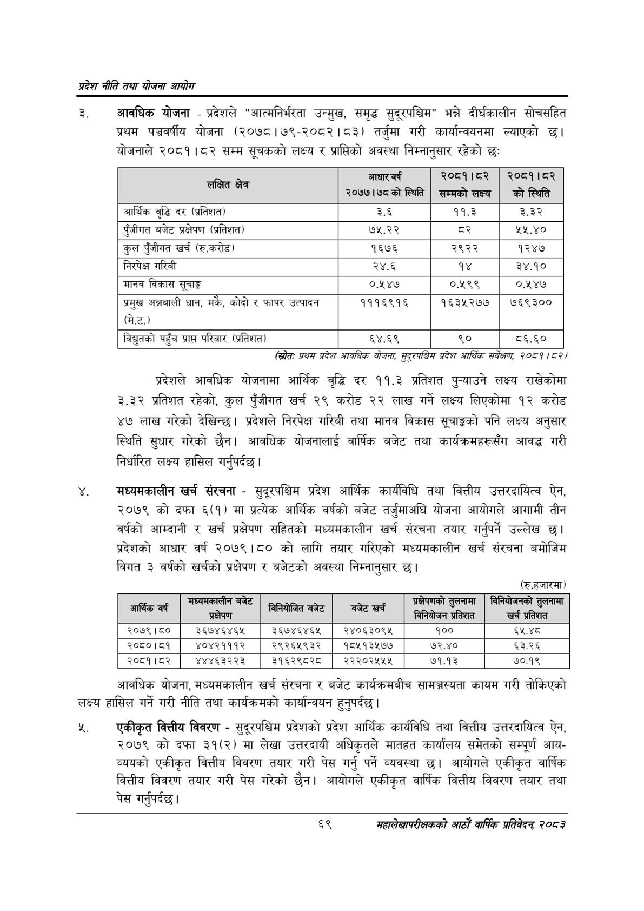

# Page 91 QA

## Rendered page


## Extracted text

```text
प्रदेश नीति तथा योजना आयोग
रे. आवधिक योजना -प्रदेशले "आत्मनिर्भरता उन्मुख, समृद्ध सुदूरपश्चिम" भन्ने दीर्घकालीन सोचसहित प्रथम पञ्चवर्षीय योजना (२०७८।७९-२०८२।८३) तर्जुमा गरी कार्यान्वयनमा ल्याएको छ। योजनाले २०८१।८२ सम्म सूचकको लक्ष्य र प्राप्तिको अवस्था निम्नानुसार रहेको छः
(सित: प्रथस प्रदेश आवधिक योजना, ठद्रपश्चिय प्रदेश आर्थिक सर्वेक्षण २०८१/८२/
प्रदेशले आवधिक योजनामा आर्थिक वृद्धि दर ११.३ प्रतिशत पुन्याउने लक्ष्य राखेकोमा ३.३२ प्रतिशत रहेको, कुल पुँजीगत खर्च २९ करोड २२ लाख गर्ने लक्ष्य लिएकोमा १२ करोड ४७ लाख गरेको देखिन्छ। प्रदेशले निरपेक्ष गरिबी तथा मानव विकास सूचाङ्कको पनि लक्ष्य अनुसार स्थिति सुधार गरेको छैन। आवधिक योजनालाई वार्षिक बजेट तथा कार्यक्रमहरूसँग आवद्ध गरी निर्धारित लक्ष्य हासिल गर्नुपर्दछ |
मध्यमकालीन खर्च संरचना -सुदूरपश्चिम प्रदेश आर्थिक कार्यविधि तथा वित्तीय उत्तरदायित्व ऐन, २०७९ को दफा ६(१) मा प्रत्येक आर्थिक वर्षको बजेट तर्जुमाअघि योजना आयोगले आगामी तीन वर्षको आम्दानी र खर्च प्रक्षेपण सहितको मध्यमकालीन खर्च संरचना तयार गर्नुपर्ने उल्लेख | प्रदेशको आधार वर्ष २०७९।८० को लागि तयार गरिएको मध्यमकालीन खर्च संरचना बमोजिम विगत ३ वर्षको खर्चको प्रक्षेपण र बजेटको अवस्था निम्नानुसार छ।
(रु.हजारमा)
आवधिक योजना, मध्यमकालीन खर्च संरचना र बजेट कार्यक्रमबीच सामञ्जस्यता कायम गरी तोकिएको लक्ष्य हासिल गर्ने गरी नीति तथा कार्यक्रमको कार्यान्वयन हुनुपर्दछ |
र्‌. एकीकृत वित्तीय विवरण -सुदूरपश्चिम प्रदेशको प्रदेश आर्थिक कार्यविधि तथा वित्तीय उत्तरदायित्व ऐन, २०७९ को दफा ३१(२) मा लेखा उत्तरदायी अधिकृतले मातहत कार्यालय समेतको सम्पूर्ण आयव्ययको एकीकृत वित्तीय विवरण तयार गरी पेस गर्नु पर्ने व्यवस्था छ। आयोगले एकीकृत वार्षिक वित्तीय विवरण तयार गरी पेस गरेको छैन। आयोगले एकीकृत वार्षिक वित्तीय विवरण तयार तथा पेस गर्नुपर्दछ |
६९
महालेखापरीक्षकको आठाँ वाषिकि प्रतिवेदन्‌ २०८२

| लक्षित क्षेत्र | आधार वर्ष २०७७।७८को स्थिति | २०८१।८२ सम्मका लक्ष्य | २०८१।८२ को स्थिति |
| --- | --- | --- | --- |
| आर्थिक वृद्धि दर (प्रतिशत) | ३.६ | ११.३ | ३.३२ |
| पुँजीगत बजेट प्रक्षेपण (प्रतिशत) | ७५.२२ | व्२ | २५,.४० |
| कुल पुँजीगत खर्च (रु.करोड) | १६७६ | २९२२ | १२४७ |
| निरपेक्ष गरिबी | २४.६ | १४ | ३४.१० |
| मानव विकास सूचाङ्क | ०.५४७४ | ०.१९९ | ०.५४७ |
| प्रमुख अज्ञनाली धान, मकै, कोदी र फापर ३त्यादन (मि.ट.) | १११६९१६ | १६३५२७७ | ७६९३०० |
| बिचुतको पहुँच प्राप्त परिवार (प्रतिशत) | ६४.६९ | ९० | ८६.६० |

| आर्थिक वर्ष | बजेट प्रक्षेपण | ८. २८ बजेट | बजेट खर्च | अकेषणको तुलनामा नियोजन प्रतिशत | निनिबाणनको तुलनामा खर्च प्रतिशत |
| --- | --- | --- | --- | --- | --- |
| २०७९।८० | ३६७४६४६५ | ३६७४६४६५ | र२४०६३०९५ | १०० | ६५.४८ |
| २०८०।८१ | ४०४२१११२ | २९२६५९३२ | १८४५१३५७७ | ७२.४० | ६३.२६ |
| २०८१।८२ | ४४४६३२२३ | ३१६२९८२८० | २२२०२४५५४५ | ७१.१३ | ७०.१९ |
```

## Flags
- table_page
- medium_quality_table
