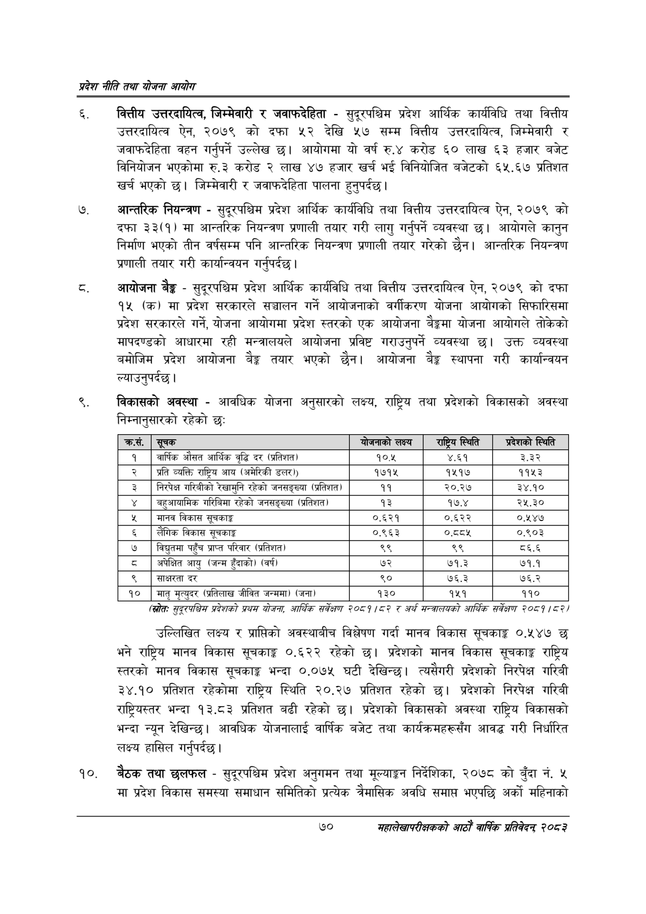

# Page 92 QA

## Rendered page


## Extracted text

```text
प्रदेश नीति तथा योजना आयोग
वित्तीय उत्तरदायित्व, जिम्मेवारी र जवाफदेहिता -सुदूरपश्चिम प्रदेश आर्थिक कार्यविधि तथा वित्तीय उत्तरदायित्व ऐन, २०७९ को दफा देखि ५७ सम्म वित्तीय उत्तरदायित्व, जिम्मेवारी र जवाफदेहिता वहन गर्नुपर्ने उल्लेख छ। आयोगमा यो वर्ष रु.४ करोड ६० लाख ३ हजार बजेट विनियोजन भएकोमा रु.३ करोड २ लाख ४७ हजार खर्च भई विनियोजित बजेटको ६५.६७ प्रतिशत खर्च भएको छ। जिम्मेवारी र जवाफदेहिता पालना हुनुपर्दछ |
आन्तरिक नियन्त्रण -सुदूरपश्चिम प्रदेश आर्थिक कार्यविधि तथा वित्तीय उत्तरदायित्व ऐन, २०७९ को दफा ३३(१) मा आन्तरिक नियन्त्रण प्रणाली तयार गरी लागु गर्नुपर्ने व्यवस्था छ। आयोगले कानुन निर्माण भएको तीन वर्षसम्म पनि आन्तरिक नियन्त्रण प्रणाली तयार गरेको छैन। आन्तरिक नियन्त्रण प्रणाली तयार गरी कार्यान्वयन गर्नुपर्दछ |
आयोजना बेङ्ग -सुदूरपश्चिम प्रदेश आर्थिक कार्यविधि तथा वित्तीय उत्तरदायित्व ऐन, २०७९ को दफा १५ (क) मा प्रदेश सरकारले सञ्चालन गर्ने आयोजनाको वर्गीकरण योजना आयोगको सिफारिसमा प्रदेश सरकारले गर्ने, योजना आयोगमा प्रदेश स्तरको एक आयोजना बेङ्कमा योजना आयोगले तोकेको मापदण्डको आधारमा रही मन्त्रालयले आयोजना प्रविष्ट गराउनुपर्ने व्यवस्था छ। उक्त व्यवस्था बमोजिम प्रदेश आयोजना बैङ्क तयार भएको छैन। आयोजना बेङ्ग स्थापना गरी कार्यान्वयन ल्याउनुपर्दछ।
विकासको अवस्था -आवधिक योजना अनुसारको लक्ष्य, राष्ट्रिय तथा प्रदेशको विकासको अवस्था निम्नानुसारको रहेको छः
(स्रोतः सुट्रपश्चिस प्रदेशको प्रथस योजना, आर्थिक सर्वेक्षण २०५९ |५२ र अर्थ सन्वबालयको आर्थिक सर्वेक्षण २०८१/८२/
उल्लिखित लक्ष्य र प्राप्तिको अवस्थाबीच विश्लेषण गर्दा मानव विकास सूचकाङ्क ०.५४७ छ भने राष्ट्रिय मानव विकास सूचकाङ्क ०.६२२ रहेको प्रदेशको मानव विकास सूचकाङ्क राष्ट्रिय स्तरको मानव विकास सूचकाङ्क भन्दा ०.०७५ घटी देखिन्छ। त्यसैगरी प्रदेशको निरपेक्ष गरिबी ३४.१० प्रतिशत रहेकोमा राष्ट्रिय स्थिति २०.२७ प्रतिशत रहेको छ। प्रदेशको निरपेक्ष गरिबी राष्ट्रियस्तर भन्दा १३.८३ प्रतिशत बढी रहेको छ। प्रदेशको विकासको अवस्था राष्ट्रिय विकासको भन्दा न्यून देखिन्छ। आवधिक योजनालाई वार्षिक बजेट तथा कार्यक्रमहरूसँग आवद्ध गरी निर्धारित लक्ष्य हासिल गर्नुपर्दछ |
बैठक तथा छलफल -सुदूरपश्चिम प्रदेश अनुगमन तथा मूल्याङ्कन निर्देशिका, २०७८ को बुँदा नं. ५ मा प्रदेश विकास समस्या समाधान समितिको प्रत्येक चैमासिक अवधि समाप्त भएपछि अर्को महिनाको
७०
महालेखापरीक्षकको आठाँ वाषिकि प्रतिवेदन्‌ २०८२

| क्रस. | सूचक | बोणनाको लक्ष्य | राष्ट्रिय स्थिति | प्रदेशको स्थिति |
| --- | --- | --- | --- | --- |
| १ | वार्षिक औसत आर्थिक वृद्धि दर (प्रतिशत) | १०.५ | ४.६१ | ३.३२ |
| २ | प्रति व्यक्ति राष्ट्रिय आय (अमेरिकी डलर)) | १७१५ | १५१७ | ११५३ |
| ३ | निरपेक्ष गरिवीको रेखामुनि रहेको जनसङ्«व। (प्रतिशत) | ११ | २०.२७ | ३४.१० |
| ४ | बहुआयामिक गरिविमा रहेको जनसङ्ख्या (प्रतिशत) | १३ | १७.४ | २५.३० |
| ५ | मानव विकास सूचकाङ्क | ०.६२१ | ०.६२२ | ०,१४७ |
| ६ | लैंगिक विकास सूचकाङ्क | ०.९६३ | ०.ददश | ०.९०३ |
| ७ | विद्युतमा पहुँच प्राप्त परिवार (प्रतिशत) | ९९ | ९९ | ८६.६ |
| ८ | अपेक्षित आयु (जन्म हुँदाको) (वर्ष | ७२ | ७१.३ | ७१.१ |
| ९ | साक्षरता दर | ९० | ७६.३ | ७६.२ |
| १० | मातृ मृत्युदर (प्रतिलाख जीवित जन्ममा) (जना) | १३० | १५१ | ११० |
```

## Flags
- table_page
- medium_quality_table
