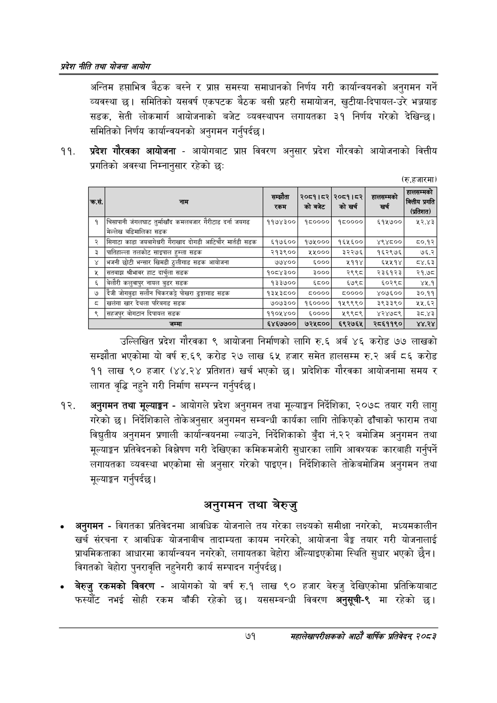

# Page 93 QA

## Rendered page


## Extracted text

```text
प्रदेश नीति तथा योजना आयोग
अन्तिम हप्ताभित्र बैठक बस्ने र प्राप्त समस्या समाधानको निर्णय गरी कार्यान्वयनको अनुगमन गर्ने व्यवस्था छ। समितिको यसवर्ष एकपटक बैठक बसी प्रहरी समायोजन, खुटीया-दिपायल-उरे भञ्जयाङ सडक, सेती लोकमार्ग आयोजनाको बजेट व्यवस्थापन लगायतका ३१ निर्णय गरेको देखिन्छ। समितिको निर्णय कार्यान्वयनको अनुगमन गर्नुपर्दछ |
प्रदेश गौरवका आयोजना -आयोगबाट प्राप्त विवरण अनुसार प्रदेश गौरवको आयोजनाको वित्तीय प्रगतिको अवस्था निम्नानुसार रहेको छः
(रु.हजारमा)
उल्लिखित प्रदेश गौरवका ९ आयोजना निर्माणको लागि रु.६ अर्ब ४६ करोड ७७ लाखको सम्झौता भएकोमा यो वर्ष रु.६९ करोड २७ लाख ६५ हजार समेत हालसम्म रु.२ अर्ब ८६ करोड ११ लाख ९० हजार (४४.२४ प्रतिशत) खर्च भएको छ। प्रादेशिक गौरवका आयोजनामा समय र लागत वृद्धि नहुने गरी निर्माण सम्पन्न गर्नुपर्दछ |
अनुगमन तथा मूल्याङ्कन -आयोगले प्रदेश अनुगमन तथा मूल्याङ्कन निर्देशिका, २०७८ तयार गरी लागु गरेको छ। निर्देशिकाले तोकेअनुसार अनुगमन सम्बन्धी कार्यका लागि तोकिएको ढाँचाको फाराम तथा विद्युतीय अनुगमन प्रणाली कार्यान्वयनमा ल्याउने, निर्देशिकाको बुँदा नं.२२ बमोजिम अनुगमन तथा मूल्याङ्कन प्रतिवेदनको विशेषण गरी देखिएका कमिकमजोरी सुधारका लागि आवश्यक कारबाही गर्नुपर्ने लगायतका व्यवस्था भएकोमा सो अनुसार गरेको पाइएन। निर्देशिकाले तोकेबमोजिम अनुगमन तथा मूल्याङ्कन गर्नुपर्दछ |
अनुगमन तथा बेरुजु
अनुगमन -विगतका प्रतिवेदनमा आवधिक योजनाले तय गरेका लक्ष्यको समीक्षा नगरेको, मध्यमकालीन खर्च संरचना र आवधिक योजनाबीच तादाम्यता कायम नगरेको, आयोजना बैङ्ग तयार गरी योजनालाई प्राथमिकताका आधारमा कार्यान्वयन नगरेको, लगायतका बेहोरा औँल्याइएकोमा स्थिति सुधार भएको छैन। विगतको बेहोरा पुनरावृत्ति नहुनेगरी कार्य सम्पादन गर्नुपर्दछ |
बेरुजु रकमको विवरण -आयोगको यो वर्ष रु.१ लाख ९० हजार बेरुजु देखिएकोमा प्रतिक्रियाबाट फस्योट नभई सोही रकम बाँकी रहेको छ। यससम्बन्धी विवरण अनुसूची-९ मा रहेको छ।
७१
महालेखापरीक्षकको आठाँ वाषिकि प्रतिवेदन्‌ २०८२

|  | जाम | सम्झौता 'रकम | २०८१।५२ कोबजेट | २०८१।८२ को खर्च | छालण्भको खर्च |  |
| --- | --- | --- | --- | --- | --- | --- |
| १ | चिसापानी जंगलघाट तुर्माखाँद क१०१७९ गैरीटाड दर्ना जयगढ मेल्लेख ५५भालिका सडक | ११७४३०० | १८०००० | १८०००० | ६१५७०० | २२.४३ |
| २ | सिगाटा काडा जवबानेचरी गैराखाद दोगडी आटिचौर मार्तती क | ६१७६०० | १७५००० | १६५६०० | ४९४८०० | ८०.१२ |
| ३ | चातिलाल्ला तलकोट साइपाल हुम्ला सडक | २१३९०० | २५००० | ३२२७६५ | १६२९७६ | ७६.२ |
| ४ | भजनी छोटी भन्सार खिमडी ठुलीगाड सडक आयोजना | ७७४०० | ६००० | ५११४ | ६५५१४ | ८४६३ |
| ५ | सतबाझ श्रीभावर हाट दार्चुला सडक | १०८४३०० | ३००० | २९९८ | २३६१२३ | २१.७८ |
| ६ | बेलौरी कलुवापुर नायल बुडर सडक | १३३७०० | ६८०० | ६७९८ | ६०२९८ | ४५.१ |
| ७ | दैजी जोगबुढा सलौन चिकरकट्टै पोखरा ढुङ्गागाड सडक | १३५३८०० | ८०००० | ८०००० | ४०७६०० | ३०.११ |
| ८ | खलेगा खार देला परिबगड सडक | ७०७३०० | १६०००० | १५९९९० | ३९३३९० | २१५.६२ |
| ९ | सहजपुर बोगटान दिपायल सडक | ११०५४०० | ६०००० | ९९८९ | ४२४७८९ | ३८.४३ |
| १० | जम्मा | ६४६७७०० | ७२५८०० | ६९२७६५ | २८६११९० | ४४.२४ |
```

## Flags
- table_page
- medium_quality_table
