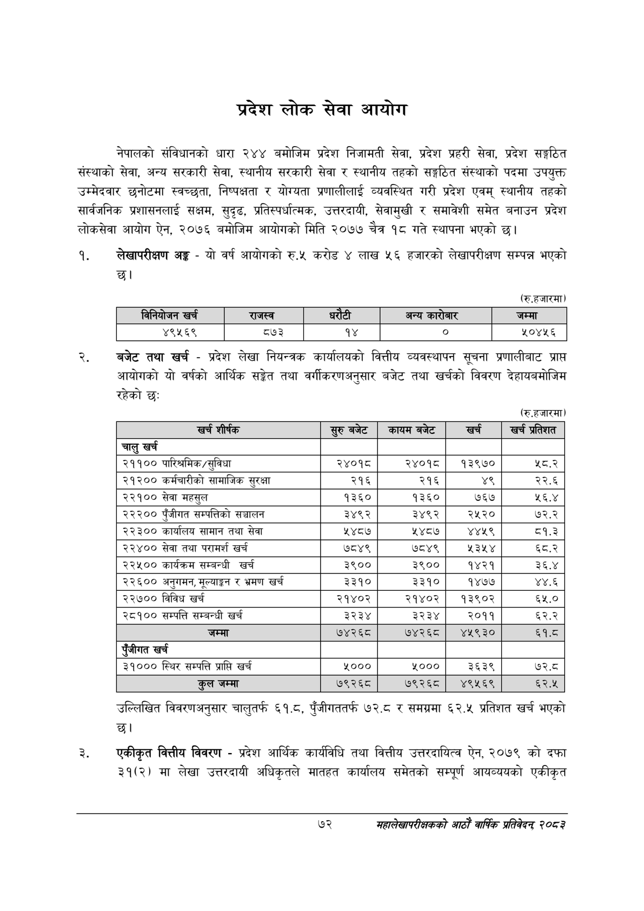

# Page 94 QA

## Rendered page


## Extracted text

```text
प्रदेश लोक सेवा आयोग
नेपालको संविधानको धारा २४४ बमोजिम प्रदेश निजामती सेवा, प्रदेश प्रहरी सेवा, प्रदेश सङ्गठित संस्थाको सेवा, अन्य सरकारी सेवा, स्थानीय सरकारी सेवा र स्थानीय तहको सङ्गठित संस्थाको पदमा उपयुक्त उम्मेदवार छनोटमा स्वच्छता, निष्पक्षता र योग्यता प्रणालीलाई व्यवस्थित गरी प्रदेश एवम्‌ स्थानीय तहको सार्वजनिक प्रशासनलाई सक्षम, सुदृढ, प्रतिस्पर्धात्मक, उत्तरदायी, सेवामुखी र समावेशी समेत बनाउन प्रदेश लोकसेवा आयोग ऐन, २०७६ बमोजिम आयोगको मिति २०७७ चैत्र १८ गते स्थापना भएको छ।
लेखापरीक्षण अङ्ग -यो वर्ष आयोगको रु.५ करोड लाख ५६ हजारको लेखापरीक्षण सम्पन्न भएको छ।
(रु.हजारमा)
बजेट तथा खर्च -प्रदेश लेखा नियन्त्रक कार्यालयको वित्तीय व्यवस्थापन सूचना प्रणालीबाट प्राप्त आयोगको यो वर्षको आर्थिक सङ्ेत तथा वर्गीकरणअनुसार बजेट तथा खर्चको विवरण देहायबमोजिम रहेको छ:
(रु.हजारमा)
उल्लिखित विवरणअनुसार चालुतर्फ ६१.८, पुँजीगततर्फ ७२.८ र समग्रमा ६२.५ प्रतिशत खर्च भएको छ।
एकीकृत वित्तीय विवरण -प्रदेश आर्थिक कार्यविधि तथा वित्तीय उत्तरदायित्व ऐन, २०७९ को दफा ३१(२) मा लेखा उत्तरदायी अधिकृतले मातहत कार्यालय समेतको सम्पूर्ण आयव्ययको एकीकृत
७२
महालेखापरीक्षकको आठाँ वाषिकि प्रतिवेदन्‌ २०८२

|  | खर्च | राजस्व | धरटी |  | अन्य कारोबार | जम्मा |
| --- | --- | --- | --- | --- | --- | --- |
|  | ४९५६९ | ८७३ |  | १४ | ० | १०४५६ |

| खर्च शीर्षक | रुरुबबेट | कायम बजेट | खरी | = प्रतिशत |
| --- | --- | --- | --- | --- |
| चालु खर्च |  |  |  |  |
| २११०० पारिश्रमिक/सुविधा | २४०१८ | २४०१८ | १३९७० | ५८.२ |
| २१२०० कर्मचारीको सामाजिक सुरक्षा | २१६ | २१६ | ४९ | २२.६ |
| २२१०० सेवा महसुल | १३६० | १३६० | ७६७ | ५६.४ |
| २२२०० पुँजीगत सम्पत्तिको सञ्चालन | ३४९२ | ३४९२ | २५२० | ७२.२ |
| २२३०० कार्यालय सामान तथा सेवा | १४८७ | ५४८७ | ४४५९ | ८१.३ |
| २२४०० सेवा तथा परामर्श खर्च | ७८४९ | ७८४९ | २३५४ | ६८.२ |
| २२५०० कार्यक्रम सम्बन्धी खर्च | ३९०० | ३९०० | १४२१ | ३६.४ |
| २२६०० अनुभभन, मूल्याङ्कन र भ्रमण खर्च | ३३१० | ३३१० | १४७७ | ४४.६ |
| २२७०० विविध खर्च | २१४०२ | २१४०२ | १३९०२ | ६४५.० |
| २८१०० सम्पत्ति सम्बन्धी खर्च | ३२३४ | ३२३४ | २०११ | ६२.२ |
| जम्मा | ७४२६८ | ७४२६८ | ४१९३० | ६१.८ |
| पूँजीगत खर्च |  |  |  |  |
| ३१००० स्थिर सम्पत्ति प्राप्ति खर्च | ५००० | ५००० | ३६३९ | ७२.८ |
| तल जम्मा | ७९२६८ | ७९२६८ | ४९५६९ | ६२.४५ |
```

## Flags
- table_page
- medium_quality_table
