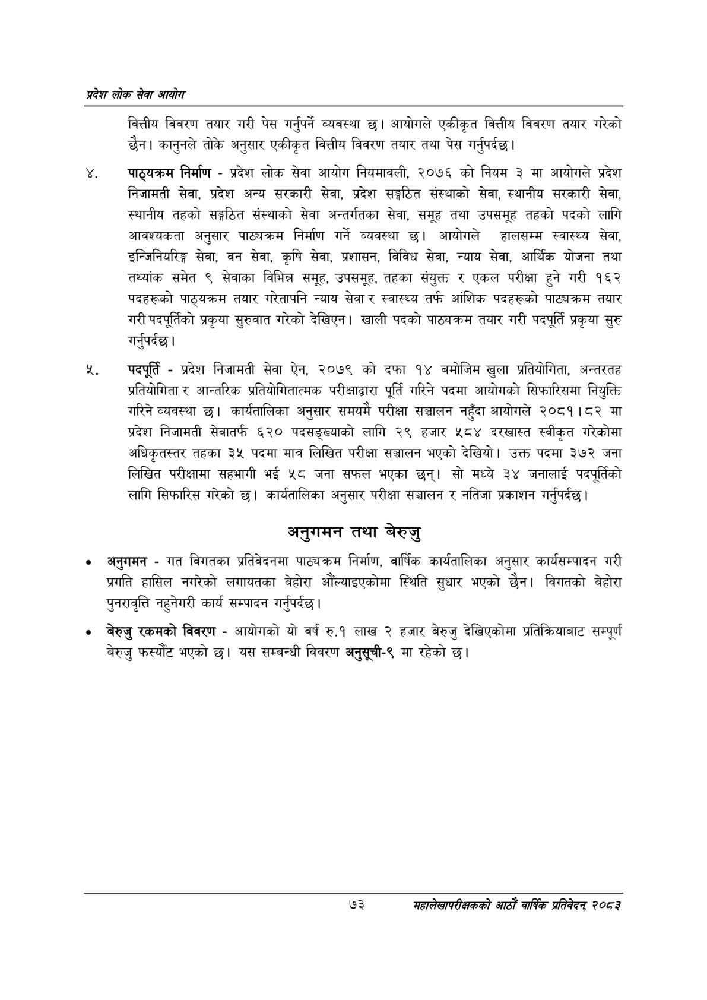

# Page 95 QA

## Rendered page


## Extracted text

```text
प्रदेश लोक सेवा आयोग
वित्तीय विवरण तयार गरी पेस गर्नुपर्ने व्यवस्था छ। आयोगले एकीकृत वित्तीय विवरण तयार गरेको छैन। कानुनले तोके अनुसार एकीकृत वित्तीय विवरण तयार तथा पेस गर्नुपर्दछ |
पाठ्यक्रम निर्माण -प्रदेश लोक सेवा आयोग नियमावली, २०७६ को नियम ३ मा आयोगले प्रदेश निजामती सेवा, प्रदेश अन्य सरकारी सेवा, प्रदेश सङ्गठित संस्थाको सेवा, स्थानीय सरकारी सेवा, स्थानीय तहको सङ्गठित संस्थाको सेवा अन्तर्गतका सेवा, समूह तथा उपसमूह तहको पदको लागि आवश्यकता अनुसार पाठ्यक्रम निर्माण गर्ने व्यवस्था छ। आयोगले हालसम्म स्वास्थ्य सेवा, इन्जिनियरिङ्ग सेवा, वन सेवा, कृषि सेवा, प्रशासन, विविध सेवा, न्याय सेवा, आर्थिक योजना तथा तथ्यांक समेत ९ सेवाका विभिन्न समूह, उपसमूह, तहका संयुक्त र एकल परीक्षा हुने गरी १६२ पदहरूको पाठ्यक्रम तयार गरेतापनि न्याय सेवा र स्वास्थ्य तर्फ आंशिक पदहरूको पाठ्यक्रम तयार गरी पदपूर्तिको प्रकृया सुरुवात गरेको देखिएन। खाली पदको पाठ्यक्रम तयार गरी पदपूर्ति प्रकृया सुरु गर्नुपर्दछ |
पदपूर्ति -प्रदेश निजामती सेवा ऐन, २०७९ को दफा १४ बमोजिम खुला प्रतियोगिता, अन्तरतह प्रतियोगिता र आन्तरिक प्रतियोगितात्मक परीक्षाद्वारा पूर्ति गरिने पदमा आयोगको सिफारिसमा नियुक्ति गरिने व्यवस्था छ। कार्यतालिका अनुसार समयमै परीक्षा सञ्चालन नहुँदा आयोगले २०८१।८२ मा प्रदेश निजामती सेवातर्फ ६२० पदसङ्ख्याको लागि २९ हजार ५८४ दरखास्त स्वीकृत गरेकोमा अधिकृतस्तर तहका २५ पदमा मात्र लिखित परीक्षा सञ्चालन भएको देखियो। उक्त पदमा ३७२ जना लिखित परीक्षामा सहभागी भई ५८ जना सफल भएका छन्‌। सो मध्ये ३४ जनालाई पदपूर्तिको लागि सिफारिस गरेको छ। कार्यतालिका अनुसार परीक्षा सञ्चालन र नतिजा प्रकाशन गर्नुपर्दछ।
अनुगमन तथा बेरुजु
० अनुगमन -गत विगतका प्रतिवेदनमा पाठ्यक्रम निर्माण, वार्षिक कार्यतालिका अनुसार कार्यसम्पादन गरी प्रगति हासिल नगरेको लगायतका बेहोरा औंँल्याइएकोमा स्थिति सुधार भएको छैन। विगतको बेहोरा पुनरावृत्ति नहुनेगरी कार्य सम्पादन गर्नुपर्दछ |
बेरुजु रकमको विवरण -आयोगको यो वर्ष रु.१ लाख २ हजार बेरुजु देखिएकोमा प्रतिक्रियाबाट सम्पूर्ण बेरुजु फस्यौट भएको छ। यस सम्बन्धी विवरण अनुसूची-९ मा रहेको |
७३
महालेखापरीक्षकको आठाँ वाषिकि प्रतिवेदन्‌ २०८२
```

## Flags
- None
