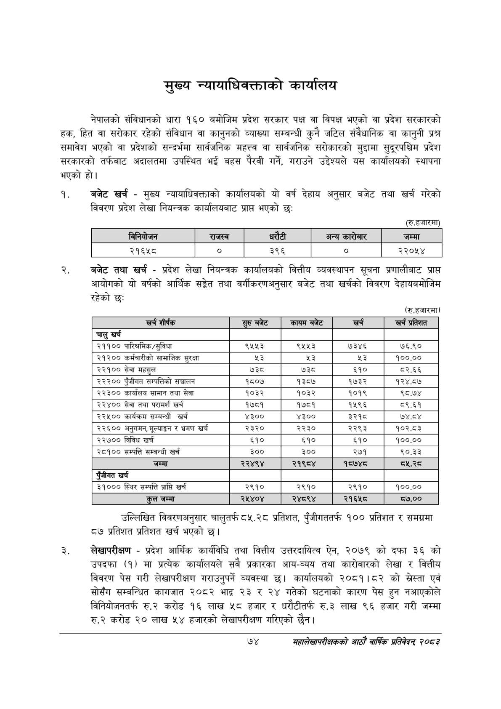

# Page 96 QA

## Rendered page


## Extracted text

```text
मुख्य न्यायाधिवक्ताको कार्यालय
नेपालको संविधानको धारा १६० बमोजिम प्रदेश सरकार पक्ष वा विपक्ष भएको वा प्रदेश सरकारको हक, हित वा सरोकार रहेको संविधान वा कानुनको व्याख्या सम्बन्धी कुनै जटिल संवैधानिक वा कानुनी प्रश्न समावेश भएको वा प्रदेशको सन्दर्भमा सार्वजनिक महत्त्व वा सार्वजनिक सरोकारको मुद्दामा सुदूरपश्चिम प्रदेश सरकारको तर्फबाट अदालतमा उपस्थित भई बहस पैरवी गर्ने, गराउने उद्देश्यले यस कार्यालयको स्थापना भएको हो।
बजेट खर्च -मुख्य न्यायाधिवक्ताको कार्यालयको यो वर्ष देहाय अनुसार बजेट तथा खर्च गरेको विवरण प्रदेश लेखा नियन्त्रक कार्यालयबाट प्राप भएको छ:
(रु.हजारमा)
।
बजेट तथा खर्च -प्रदेश लेखा नियन्त्रक कार्यालयको वित्तीय व्यवस्थापन सूचना प्रणालीबाट प्राप्त आयोगको यो वर्षको आर्थिक सङ्गेत तथा वर्गीकरणअनुसार बजेट तथा खर्चको विवरण देहायबमोजिम रहेको छः
(रु.हजारमा)
उल्लिखित विवरणअनुसार चालुतर्फ ८५.२८ प्रतिशत, पुँजीगततर्फ १०० प्रतिशत र समग्रमा ८७ प्रतिशत प्रतिशत खर्च भएको छ।
लेखापरीक्षण -प्रदेश आर्थिक कार्यविधि तथा वित्तीय उत्तरदायित्व ऐन, २०७९ को दफा ३६ को उपदफा (१) मा प्रत्येक कार्यालयले सबै प्रकारका आय-व्यय तथा कारोबारको लेखा र वित्तीय विवरण पेस गरी लेखापरीक्षण गराउनुपर्ने व्यवस्था छ। कार्यालयको २०८१।८२ को स्रेस्ता एवं सोसँग सम्बन्धित कागजात २०८२ भाद्र २३ र २४ गतेको घटनाको कारण पेस हुन नआएकोले विनियोजनतर्फ रु.२ करोड १६ लाख ५८ हजार र धरौटीतर्फ रु.३ लाख ९६ हजार गरी जम्मा रु.२ करोड २० लाख ५४ हजारको लेखापरीक्षण गरिएको छैन |
७४
महालेखापरीक्षकको आठाँ वाषिकि प्रतिवेदन्‌ २०८२

|  |  | बिनियोजन | राजस्व |  | धरटी | अन्य | जम्मा |
| --- | --- | --- | --- | --- | --- | --- | --- |

| खर्च शीर्षक | सुरु बजेट | 'कायम बजेट | खर्च | खर्च प्रतिशत |
| --- | --- | --- | --- | --- |
| चालु खर्च |  |  |  |  |
| २११०० पारित्रमिक/सुविधा | ९५५३ | ९५५३ | ७३४६ | ७६.९० |
| २१२०० कर्मचारीको सामाजिक सुरक्षा | %३ | ®३ | थे | १००.०० |
| २२१०० सेवा महसुल | ७३८ | ७३८ | ६१० | ८२.६६ |
| २२२०० पुँजीगत सम्पत्तिको सञ्चालन | १८०७ | १३८७ | १७३२ | १२४.८७ |
| २२३०० कार्वालव सामान तथा सेवा | १०३२ | १०३२ | १०१९ | ९८.७४ |
| २२४०० सेवा तथा परामर्श खर्च | १७८१ | १७८१ | १५९६ | ८९.६१ |
| २२५०० कार्यक्रम सम्बन्धी खर्च | ४३०० | ४३०० | ३२१८ | ७४.८४ |
| २२६०० अनुगमन, मूल्याङ्कन र भ्रमण खर्च | २३२० | २२३० | २२९३ | १०२.८३ |
| २२७०० विविध खर्च | ६१० | ६१० | ६१० | १००.०० |
| २८१०० सम्पत्ति सम्बन्धी खर्च | ३०० | ३०० | २७१ | ९०.३३ |
| जम्मा | २२४९४ | २१९८४ | १८७४८ |  |
| खर्च |  |  |  |  |
| २९००० स्थिर सम्पत्ति प्राप्ति खर्च | २९१० | २९१० | २९१० | १००.०० |
| कुल जम्मा | २५४०४ | २४८९४ | २१६५८ | ८७.०० |
```

## Flags
- table_page
- medium_quality_table
