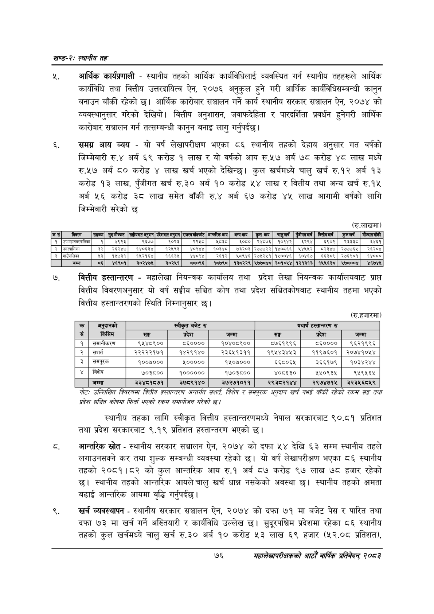

# Page 100 QA

## Rendered page


## Extracted text

```text
खण्ड-२स्थानीय तह
आर्थिक कार्यप्रणाली -स्थानीय तहको आर्थिक कार्यविधिलाई व्यवस्थित गर्न स्थानीय तहहरूले आर्थिक कार्यविधि तथा वित्तीय उत्तरदायित्व ऐन, २०७६ अनुकुल हुने गरी आर्थिक कार्यविधिसम्बन्धी कानुन बनाउन बाँकी रहेको छ। आर्थिक कारोबार सञ्चालन गर्ने कार्य स्थानीय सरकार सञ्चालन ऐन, २०७४ को व्यवस्थानुसार गरेको देखियो। वित्तीय अनुशासन, जवाफदेहिता र पारदर्शिता प्रवर्धन हुनेगरी आर्थिक कारोबार सञ्चालन गर्न तत्सम्बन्धी कानुन बनाइ लागु गर्नुपर्दछ।
समग्न आय व्यय -यो वर्ष लेखापरीक्षण भएका ८६ स्थानीय तहको देहाय अनुसार गत वर्षको जिम्मेवारी रु.४ अर्ब ६९ करोड १ लाख र यो वर्षको आय रु.५७ अर्ब ७८ करोड ४८ लाख मध्ये रु.५७ अर्ब ८० करोड लाख खर्च भएको देखिन्छ। कुल खर्चमध्ये चालु खर्च रु.१२ अर्ब १३ करोड १३ लाख, पुँजीगत खर्च रु.३० अर्ब १० करोड ५४ लाख र वित्तीय तथा अन्य खर्च रु.१५ अर्ब ५६ करोड ३८ लाख समेत बाँकी रु.४ अर्ब ६७ करोड ४५ लाख आगामी वर्षको लागि जिम्मेवारी सरको छ
वित्तीय हस्तान्तरण -महालेखा नियन्त्रक कार्यालय तथा प्रदेश लेखा नियन्त्रक कार्यालयबाट प्राप्त वित्तीय विवरणअनुसार यो वर्ष सङ्घीय सञ्चित कोष तथा प्रदेश सञ्चितकोषबाट स्थानीय तहमा भएको वित्तीय हस्तान्तरणको स्थिति निम्नानुसार छ।
(रु.लाखमा)
(रु.हजारमा)
नोटः उल्लिखित विवरणमा बित्तीय हस्तान्तरण अन्तर्गत सशर्त बिशेष र समपरक अनृदान खर्च नभई बाँकी रहेको रकम सङ्घ तथा प्रदेश सञ्चित कोक्मा फिर्ता भएको रकस समायोजन गरेको छ।
स्थानीय तहका लागि स्वीकृत वित्तीय हस्तान्तरणमध्ये नेपाल सरकारबाट ९०.८१ प्रतिशत तथा प्रदेश सरकारबाट ९.१९ प्रतिशत हस्तान्तरण भएको छ।
आन्तरिक स्रोत -स्थानीय सरकार सञ्चालन ऐन, २०७४ को दफा ५४ देखि ६३ सम्म स्थानीय तहले लगाउनसक्ने कर तथा शुल्क सम्बन्धी व्यवस्था रहेको छ। यो वर्ष लेखापरीक्षण भएका ८६ स्थानीय तहको २०८१।८२ को कुल आन्तरिक आय रु.१ अर्ब ८७ करोड ९७ लाख ७८ हजार रहेको छ। स्थानीय तहको आन्तरिक आयले चालु खर्च धान्न नसकेको अवस्था छ। स्थानीय तहको क्षमता बढाई आन्तरिक आयमा वृद्धि गर्नुपर्दछ |
खर्च व्यवस्थापन -स्थानीय सरकार सञ्चालन ऐन, २०७४ को दफा ७१ मा बजेट पेस र पारित तथा दफा ७३ मा खर्च गर्ने अख्तियारी र कार्यविधि उल्लेख छ। सुदूरपश्चिम प्रदेशमा रहेका ८६ स्थानीय तहको कुल खर्चमध्ये चालु खर्च रु.३० अर्ब १० करोड ५३ लाख ६९ हजार (५२.०८ प्रतिशत),
७६
सहालेखापरीक्षकको आठौँ वार्षिक प्रतिवेदन २०८२

| कसै | बिवरण | सङ्ख्या | सुरुमोज्दात | उीयकाट नुन | प्रदेशबाट अनुदान | पण०५फङफो० | आन्तरिक आय | बन्यआय | कुल आय | चालुखर्च | पुँजीगतखर्च | वित्तीयखर्थ | कुलखर्च | मोज्दातबाँकी |
| --- | --- | --- | --- | --- | --- | --- | --- | --- | --- | --- | --- | --- | --- | --- |
| १ | उप नहाननर्कालिका | १ | ४९२३ | ९६७७ | १०२३ | २२५८ | श्ब्स्य | ६०८० | २४८७६ | १०१४२ | ६२९४ | ६९०२ | २३३३८ | ६४६१ |
| २ | नगरपालिका | ३२ | २६२४७ | १४०६३४ | १२५९३ | ४०९४४ | ०३४८ | ७३२०३ | २७७७२२ | १४०८६६ | १५४५५२ | ८२३४७ | २७७७६५ | २६२०४ |
| ३ | गाउँपालिका | २३ | १५७३१ | १५२१६४ | १६६३४५ | ११०१ | २६१२ | ५८९४६ | २७४५२५१ | १५००४६ | ६०४६७ | ६६३८९ | २७६९०१ |  |
| ४ | जम्मा | ८६ | ४६९०१ | ३०२४७४५ | ३०२५१ | ८०९६ | १८७९८ | १३८२२९ | ५७७८४८ | ३०१०५४ | १२१३१३ | १५५६३८ | १७८००४ | ४६७४४५ |

| कक | अनुदानको |  | स्वीकृत बजेट रु |  |  | यथार्थ हस्तान्तरण रु |  |
| --- | --- | --- | --- | --- | --- | --- | --- |
| सं | किसिम | सङ्घ | प्रदेश | जम्मा | सङ्घ | प्रदेश | जम्मा |
| १ | समानीकरण | ९५४८९०० | ५५०००० | १०४०८९०० | ५७६१९९६ | ५६०००० | ९६२१९९६ |
| २ | सशर्त | २२२२२१७१ | १४२९१४० | २३६५१३११ | १९५४३४५३ | ११९७६०१ | २०७४१०५४ |
| ३ | समपूरक | १००७००० | ५००००० | १५०७००० | ६६८०६४ | ३६६१७९ | १०३४२४४ |
| ४ | विशेष | ७०३८०० | १०००००० | १७०३८०० | ४०८६३० | १५०९३५ | ९५९५६५ |
|  | जम्मा | ३३४८१८७१ | ३७८९१४० | ३७२७१०११ | २९३८२१४४ | २९७४७१५ | ३२३५६८५९ |
```

## Flags
- table_page
- medium_quality_table
