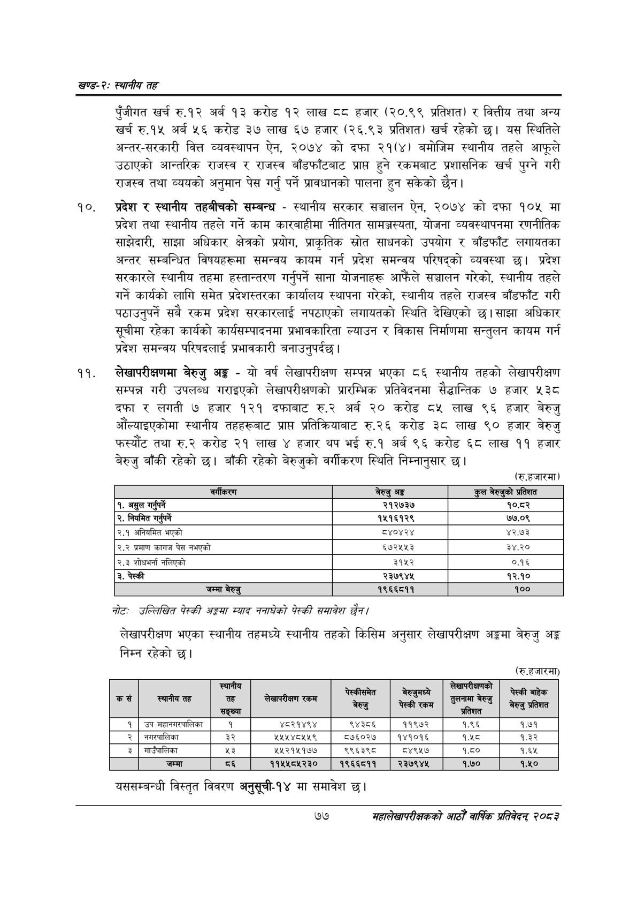

# Page 101 QA

## Rendered page


## Extracted text

```text
खण्ड-२स्थानीय तह
पुँजीगत खर्च रु.१२ अर्ब ९३ करोड १२ लाख ठव हजार (२०.९९ प्रतिशत) र वित्तीय तथा अन्य खर्च रु.१५ अर्ब ५६ करोड ३७ लाख ६७ हजार (२६.९३ प्रतिशत) खर्च रहेको छ। यस स्थितिले अन्तर-सरकारी वित्त व्यवस्थापन ऐन, २०७४ को दफा २१(४) बमोजिम स्थानीय तहले आफूले उठाएको आन्तरिक राजस्व र राजस्व बाँडफाँटबाट प्राप्त हुने रकमबाट प्रशासनिक खर्च पुग्ने गरी राजस्व तथा व्ययको अनुमान पेस गर्नु पर्ने प्रावधानको पालना हुन सकेको |
१०, प्रदेश र स्थानीय तहबीचको सम्बन्ध -स्थानीय सरकार सञ्चालन ऐन, २०७४ को दफा १०४५ मा प्रदेश तथा स्थानीय तहले गर्ने काम कारबाहीमा नीतिगत सामञ्जस्यता, योजना व्यवस्थापनमा रणनीतिक साझेदारी, साझा अधिकार क्षेत्रको प्रयोग, प्राकृतिक स्रोत साधनको उपयोग र बाँडफाँट लगायतका अन्तर सम्बन्धित विषयहरूमा समन्वय कायम गर्न प्रदेश समन्वय परिषद्को व्यवस्था छ। प्रदेश सरकारले स्थानीय तहमा हस्तान्तरण गर्नुपर्ने साना योजनाहरू आफैंले सञ्चालन गरेको, स्थानीय तहले गर्ने कार्यको लागि समेत प्रदेशस्तरका कार्यालय स्थापना गरेको, स्थानीय तहले राजस्व बाँडफाँट गरी पठाउनुपर्ने सबै रकम प्रदेश सरकारलाई नपठाएको लगायतको स्थिति देखिएको छ। साझा अधिकार सूचीमा रहेका कार्यको कार्यसम्पादनमा प्रभावकारिता ल्याउन र विकास निर्माणमा सन्तुलन कायम गर्न प्रदेश समन्वय परिषदलाई प्रभावकारी बनाउनुपर्दछ |
लेखापरीक्षणमा बेरुजु अङ्ग -यो वर्ष लेखापरीक्षण सम्पन्न भएका ८६ स्थानीय तहको लेखापरीक्षण सम्पन्न गरी उपलब्ध गराइएको लेखापरीक्षणको प्रारम्भिक प्रतिवेदनमा सैद्धान्तिक ७ हजार ५३८ दफा र लगती ७ हजार १२१ दफाबाट रु.२ अर्ब २० करोड ८५ लाख ९६ हजार बेरुजु औंल्याइएकोमा स्थानीय तहहरूबाट प्राप्त प्रतिक्रियाबाट रु.२६ करोड ३८ लाख ९० हजार बेरुजु फस्यौट तथा रु.२ करोड २१ लाख ४ हजार थप भई रु.१ अर्ब ९६ करोड ६८ लाख ११ हजार बेरुजु बाँकी रहेको छ। बाँकी रहेको बेरुजुको वर्गीकरण स्थिति निम्नानुसार छ।
(रु.हजारमा)
नोटः उल्लिखित पेस्की अङ्टमा स्याद ननाघेको पेस्की समावेश छैन।
लेखापरीक्षण भएका स्थानीय तहमध्ये स्थानीय तहको किसिम अनुसार लेखापरीक्षण अङ्गमा बेरुजु अङ्ग निम्न रहेको छ।
(रु.हजारमा)
यससम्बन्धी विस्तृत विवरण अनुसूची-१४ मा समावेश
७७
सहालेखापरीक्षकको आठौँ वार्षिक प्रतिवेदन २०८२

| वर्गीकरण | बेरुजु अङ्ग | कुल बेरुजुको प्रतिशत |
| --- | --- | --- |
| १. असुल गर्नुपर्ने | २१२७३७ | १०.८२ |
| २. नियमित गर्नुपर्ने | १५१६१२९ | ७७.०९ |
| २.९ अनियमित भएको | ८४०४२४ | ४२.७३ |
| २.२ प्रमाण कागज पेस नभएको | ६५७२५५३ | ३४.२० |
| २.३ शोधभर्ना नलिएको | ३१५२ | ०.१६ |
| ३. पेस्की | २३७९४४५ | १२.१० |
| जम्मा बेरुजु | १९६६८११ | १०० |

| \| क | = स्थानीय तह | तह ] | रकम | = \| बेरुजु | == पेस्की रकम | रद तुलनामा ३ सा डि | चेस्की बाहेक बेरुजु प्रतिशत |
| --- | --- | --- | --- | --- | --- | --- | --- |
| १ | उप भहाननर्पालिका | १ | ४८२१४९४ | ९४३८६ | ११९७२ | १.६६ | १.७१ |
| २ |  | ३२ | २४५४५४८५५९ | ५७६०२७ | १४१०१६ | ९४५ | १.३२ |
| ३ | गाउँपालिका | ५३ | २५२१५१७७ | ९९६३९८ | ८४९५७ | १.६० | १.६५ |
| ४ | जम्मा | ११ | ११५५८५२३० | १९६६८११ | २३७९४५ | १.७० | १.५० |
```

## Flags
- table_page
- medium_quality_table
