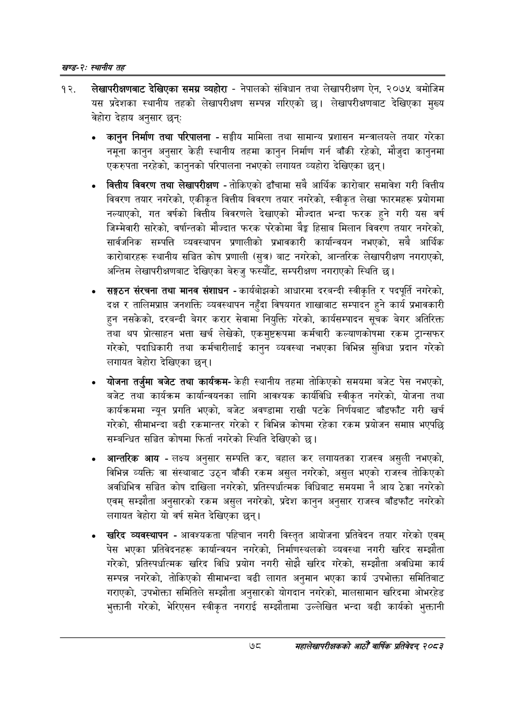

# Page 102 QA

## Rendered page


## Extracted text

```text
खण्ड-२स्थानीय तह
लेखापरीक्षणबाट देखिएका समग्र व्यहोरा -नेपालको संविधान तथा लेखापरीक्षण ऐन, २०७५ बमोजिम यस प्रदेशका स्थानीय तहको लेखापरीक्षण सम्पन्न गरिएको छ। लेखापरीक्षणबाट देखिएका मुख्य वेहोरा देहाय अनुसार छन्‌,
कानुन निर्माण तथा परिपालना -सङ्घीय मामिला तथा सामान्य प्रशासन मन्त्रालयले तयार गरेका नमूना कानुन अनुसार केही स्थानीय तहमा कानुन निर्माण गर्न बाँकी रहेको, मौजुदा कानुनमा एकरुपता नरहेको, कानुनको परिपालना नभएको लगायत व्यहोरा देखिएका छन्‌।
वित्तीय विवरण तथा लेखापरीक्षण -तोकिएको ढाँचामा सबै आर्थिक कारोबार समावेश गरी वित्तीय विवरण तयार नगरेको, एकीकृत वित्तीय विवरण तयार नगरेको, स्वीकृत लेखा फारमहरू प्रयोगमा नल्याएको, गत वर्षको वित्तीय विवरणले देखाएको मौज्दात भन्दा फरक हुने गरी यस वर्ष जिम्मेवारी सारेको, वर्षान्तको मौज्दात फरक परेकोमा बैङ्क हिसाब मिलान विवरण तयार नगरेको, सार्वजनिक सम्पत्ति व्यवस्थापन प्रणालीको प्रभावकारी कार्यान्वयन नभएको, सबै आर्थिक कारोबारहरू स्थानीय सञ्चित कोष प्रणाली (सुत्र) बाट नगरेको, आन्तरिक लेखापरीक्षण नगराएको, अन्तिम लेखापरीक्षणबाट देखिएका बेरुजु फस्यौट, सम्परीक्षण नगराएको स्थिति छ।
सङ्गठन संरचना तथा मानव संशाधन -कार्यबोझको आधारमा दरबन्दी स्वीकृति र पदपूर्ति नगरेको, दक्ष र तालिमप्राप्त जनशक्ति व्यवस्थापन नहुँदा विषयगत शाखाबाट सम्पादन हुने कार्य प्रभावकारी हुन नसकेको, दरबन्दी बेगर करार सेवामा नियुक्ति गरेको, कार्यसम्पादन सूचक बेगर अतिरिक्त तथा थप प्रोत्साहन भत्ता खर्च लेखेको, एकमुष्टरूपमा कर्मचारी कल्याणकोषमा रकम ट्रान्सफर गरेको, पदाधिकारी तथा कर्मचारीलाई कानुन व्यवस्था नभएका विभिन्न सुविधा प्रदान गरेको लगायत वेहोरा देखिएका छन्‌।
योजना तर्जुमा बजेट तथा कार्यक्रमकेही स्थानीय तहमा तोकिएको समयमा बजेट पेस नभएको, बजेट तथा कार्यक्रम कार्यान्वयनका लागि आवश्यक कार्यविधि स्वीकृत नगरेको, योजना तथा कार्यक्रममा न्यून प्रगति भएको, बजेट अवण्डामा राखी पटके निर्णयबाट बाँडफाँट गरी खर्च गरेको, सीमाभन्दा बढी रकमान्तर गरेको र विभिन्न कोषमा रहेका रकम प्रयोजन समाप्त भएपछि सम्बन्धित सञ्चित कोषमा फिर्ता नगरेको स्थिति देखिएको छ।
आन्तरिक आय -लक्ष्य अनुसार सम्पत्ति कर, बहाल कर लगायतका राजस्व असुली नभएको, विभिन्न व्यक्ति वा संस्थाबाट उठ्न बाँकी रकम असुल नगरेको, असुल भएको राजस्व तोकिएको अवधिभित्र सञ्चित कोष दाखिला नगरेको, प्रतिस्पर्धात्मक विधिबाट समयमा नै आय ठेक्का नगरेको एवम्‌ सम्झौता अनुसारको रकम असुल नगरेको, प्रदेश कानुन अनुसार राजस्व बाँडफाँट नगरेको लगायत वेहोरा यो वर्ष समेत देखिएका छन्‌।
खरिद व्यवस्थापन -आवश्यकता पहिचान नगरी विस्तृत आयोजना प्रतिवेदन तयार गरेको एवम्‌ पेस भएका प्रतिवेदनहरू कार्यान्वयन नगरेको, निर्माणस्थलको व्यवस्था नगरी खरिद सम्झौता गरेको, प्रतिस्पर्धात्मक खरिद विधि प्रयोग नगरी सोझै खरिद गरेको, सम्झौता अवधिमा कार्य सम्पन्न नगरेको, तोकिएको सीमाभन्दा बढी लागत अनुमान भएका कार्य उपभोक्ता समितिबाट गराएको, उपभोक्ता समितिले सम्झौता अनुसारको योगदान नगरेको, मालसामान खरिदमा ओभरहेड भुक्तानी गरेको, भेरिएसन स्वीकृत नगराई सम्झौतामा उल्लेखित भन्दा बढी कार्यको भुक्तानी
७८
सहालेखापरीक्षकको आठौँ वार्षिक प्रतिवेदन २०८२
```

## Flags
- None
