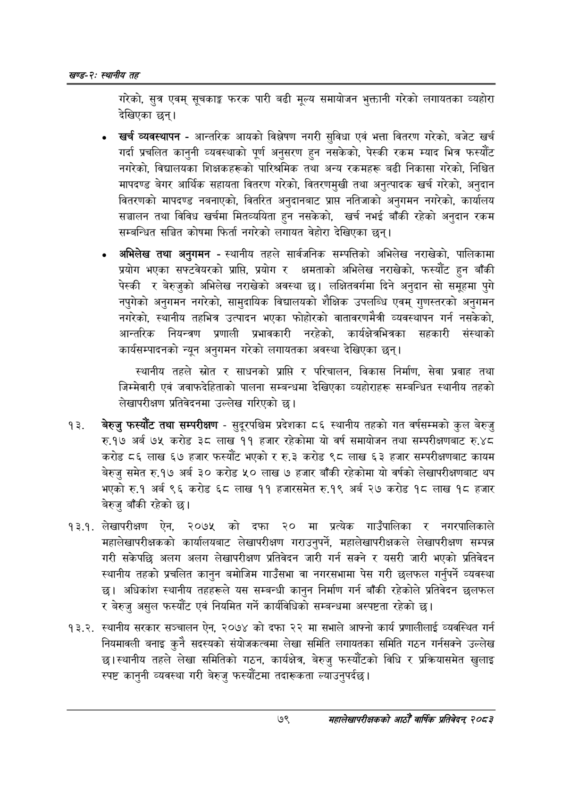

# Page 103 QA

## Rendered page


## Extracted text

```text
खण्ड-२स्थानीय तह
गरेको, सुत्र एवम्‌ सूचकाङ्क फरक पारी बढी मूल्य समायोजन भुक्तानी गरेको लगायतका व्यहोरा देखिएका छन्‌।
खर्च व्यवस्थापन -आन्तरिक आयको विश्लेषण नगरी सुविधा एवं भत्ता वितरण गरेको, बजेट खर्च गर्दा प्रचलित कानुनी व्यवस्थाको पूर्ण अनुसरण हुन नसकेको, पेस्की रकम म्याद भित्र फस्यौंट नगरेको, विद्यालयका शिक्षकहरूको पारिश्रमिक तथा अन्य रकमहरू बढी निकासा गरेको, निश्चित मापदण्ड बेगर आर्थिक सहायता वितरण गरेको, वितरणमुखी तथा अनुत्पादक खर्च गरेको, अनुदान वितरणको मापदण्ड नबनाएको, वितरित अनुदानबाट प्राप्त नतिजाको अनुगमन नगरेको, कार्यालय सञ्चालन तथा विविध खर्चमा मितव्ययिता हुन नसकेको, खर्च नभई बाँकी रहेको अनुदान रकम सम्बन्धित सञ्चित कोषमा फिर्ता नगरेको लगायत वेहोरा देखिएका छन्‌।
अभिलेख तथा अनुगमन -स्थानीय तहले सार्वजनिक सम्पत्तिको अभिलेख नराखेको, पालिकामा प्रयोग भएका सफ्टवेयरको प्राप्ति, प्रयोग र क्षमताको अभिलेख नराखेको, फस्यौट हुन बाँकी पेस्की र बेरुजुको अभिलेख नराखेको अवस्था छ। लक्षितवर्गमा दिने अनुदान सो समूहमा पुगे नपुगेको अनुगमन नगरेको, सामुदायिक विद्यालयको शैक्षिक उपलब्धि एवम्‌ गुणस्तरको अनुगमन नगरेको, स्थानीय तहभित्र उत्पादन भएका फोहोरको वातावरणमैत्री व्यवस्थापन गर्न नसकेको, आन्तरिक नियन्त्रण प्रणाली प्रभावकारी नरहेको, कार्यक्षेत्रभित्रका सहकारी संस्थाको कार्यसम्पादनको न्यून अनुगमन गरेको लगायतका अवस्था देखिएका छन्‌।
स्थानीय तहले स्रोत र साधनको प्राप्ति र परिचालन, विकास निर्माण, सेवा प्रवाह तथा जिम्मेवारी एवं जवाफदेहिताको पालना सम्बन्धमा देखिएका व्यहोराहरू सम्बन्धित स्थानीय तहको लेखापरीक्षण प्रतिवेदनमा उल्लेख गरिएको छ।
बेरुजु फस्यौट तथा सम्परीक्षण -सुदूरपश्चिम प्रदेशका ८६ स्थानीय तहको गत वर्षसम्मको कुल बेरुजु रु.१७ अर्ब ७५ करोड ३८ लाख ११ हजार रहेकोमा यो वर्ष समायोजन तथा सम्परीक्षणबाट रु.४८ करोड ८६ लाख ६७ हजार फस्यौट भएको र रु.३ करोड ९८ लाख ६३ हजार सम्परीक्षणबाट कायम बेरुजु समेत रु.१७ अर्ब ३० करोड ५० लाख ७ हजार बाँकी रहेकोमा यो वर्षको लेखापरीक्षणबाट थप भएको रु.१ अर्ब ९६ करोड ६८ लाख ११ हजारसमेत रु.१९ अर्ब २७ करोड १८ लाख १८ हजार बेरुजु बाँकी रहेको छ।
१३.१. लेखापरीक्षण ऐन, २०७५ को दफा २० मा प्रत्येक गाउँपालिका र नगरपालिकाले महालेखापरीक्षकको कार्यालयबाट लेखापरीक्षण गराउनुपर्ने, महालेखापरीक्षकले लेखापरीक्षण सम्पन्न गरी सकेपछि अलग अलग लेखापरीक्षण प्रतिवेदन जारी गर्न सक्ने र यसरी जारी भएको प्रतिवेदन स्थानीय तहको प्रचलित कानुन बमोजिम गाउँसभा वा नगरसभामा पेस गरी छलफल गर्नुपर्ने व्यवस्था छ। अधिकांश स्थानीय तहहरूले यस सम्बन्धी कानुन निर्माण गर्न बाँकी रहेकोले प्रतिवेदन छलफल र बेरुजु असुल फस्यौंट एवं नियमित गर्ने कार्यविधिको सम्बन्धमा अस्पष्टता रहेको छ।
१३.२. स्थानीय सरकार सञ्चालन ऐन, २०७४ को दफा २२ मा सभाले आफ्नो कार्य प्रणालीलाई व्यवस्थित गर्न नियमावली बनाइ कुनै सदस्यको संयोजकत्वमा लेखा समिति लगायतका समिति गठन गर्नसक्ने उल्लेख छ। स्थानीय तहले लेखा समितिको गठन, कार्यक्षेत्र, बेरुजु फस्यौटको विधि र प्रक्रियासमेत खुलाइ स्पष्ट कानुनी व्यवस्था गरी बेरुजु फस्यौटमा तदारूकता ल्याउनुपर्दछ।
७९
सहालेखापरीक्षकको आठौँ वार्षिक प्रतिवेदन २०८२
```

## Flags
- None
