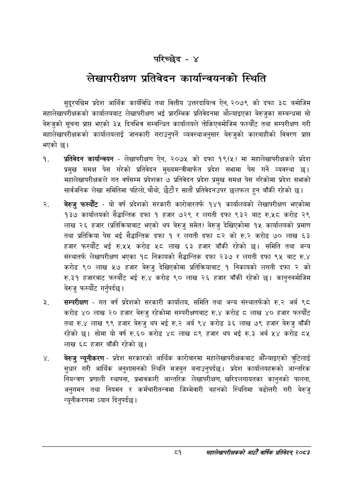

# Page 107 QA

## Rendered page


## Extracted text

```text
परिच्छेद -४
लेखापरीक्षण प्रतिवेदन कार्यान्वयनको स्थिति
सुदूरपश्चिम प्रदेश आर्थिक कार्यविधि तथा वित्तीय उत्तरदायित्व ऐन, २०७९ को दफा ३८ बमोजिम महालेखापरीक्षकको कार्यालयबाट लेखापरीक्षण भई प्रारम्भिक प्रतिवेदनमा औल्याइएका बेरुजुका सम्बन्धमा सो बेरुजुको सूचना प्रापत भएको ३५ दिनभित्र सम्बन्धित कार्यालयले तोकिएबमोजिम फस्यौट तथा सम्परीक्षण गरी महालेखापरीक्षकको कार्यालयलाई जानकारी गराउनुपर्ने व्यवस्थाअनुसार बेरुजुको कारबाहीको विवरण प्राप्त भएको छ।
प्रतिवेदन कार्यान्वयन -लेखापरीक्षण ऐन, २०७५ को दफा १९(५) मा महालेखापरीक्षकले प्रदेश प्रमुख समक्ष पेस गरेको प्रतिवेदन मुख्यमन्त्रीमार्फत प्रदेश सभामा पेस गर्ने व्यवस्था छ। महालेखापरीक्षकले गत वर्षसम्म प्रदेशका ७ प्रतिवेदन प्रदेश प्रमुख समक्ष पेस गरेकोमा प्रदेश सभाको सार्वजनिक लेखा समितिमा पहिलो, चौथो, छैटौं र सातौं प्रतिवेदनउपर छलफल हुन बाँकी रहेको छ।
बेरुजु फस्यौट -यो वर्ष प्रदेशको सरकारी कारोबारतर्फ १४१ कार्यालयको लेखापरीक्षण भएकोमा १३७ कार्यालयको सैद्धान्तिक दफा १ हजार ७२९ र लगती दफा ९३२ बाट रु.५८ करोड २९ लाख २६ हजार (प्रतिक्रियाबाट भएको थप बेरुजु समेत) बेरुजु देखिएकोमा १५ कार्यालयको प्रमाण तथा प्रतिक्रिया पेस भई सैद्धान्तिक दफा १ र लगती दफा ८२ को रु.२ करोड ७० लाख ६३ हजार फस्यौट भई रु.५५ करोड ५८ लाख ६३ हजार बाँकी रहेको समिति तथा अन्य संस्थातर्फ लेखापरीक्षण भएका १८ निकायको सैद्धान्तिक दफा २३७ र लगती दफा ९४ बाट रु.४ करोड ९० लाख ५७ हजार बेरुजु देखिएकोमा प्रतिक्रियाबाट १ निकायको लगती दफा २ को रु.३१ हजारबाट फस्यौट भई रु.४ करोड ९० लाख २६ हजार बाँकी रहेको छ। कानुनबमोजिम बेरुजु फस्यौट गर्नुपर्दछ |
सम्परीक्षण -गत वर्ष प्रदेशको सरकारी कार्यालय, समिति तथा अन्य संस्थातर्फको रु.२ अर्ब ९८ करोड ४० लाख २० हजार बेरुजु रहेकोमा सम्परीक्षणबाट रु.४ करोड लाख ४० हजार फस्यौट तथा रु.४ लाख ९९ हजार बेरुजु थप भई रु.२ अर्ब ९४ करोड ३६ लाख ७९ हजार बेरुजु बाँकी रहेको छ। सोमा यो वर्ष रु.६० करोड ४८ लाख ८९ हजार थप भई रु.३ अर्ब ५४ करोड ४ लाख ६८ हजार बाँकी रहेको छ।
बेरुजु न्यूनीकरण -प्रदेश सरकारको आर्थिक कारोबारमा महालेखापरीक्षकबाट औँल्याइएको तुटिलाई सुधार गरी आर्थिक अनुशासनको स्थिति मजबुत बनाउनुपर्दछ। प्रदेश कार्यालयहरूको आन्तरिक नियन्त्रण प्रणाली स्थापना, प्रभावकारी आन्तरिक लेखापरीक्षण, खरिदलगायतका कानुनको पालना, अनुगमन तथा नियमन र कर्मचारीतन्त्रमा जिम्मेवारी बहनको स्थितिमा बढोत्तरी गरी बेरुजु न्यूनीकरणमा ध्यान दिनुपर्दछ |
८१
सहालेखापरीक्षकको आठौँ वार्षिक प्रतिवेदन २०८२
```

## Flags
- None
