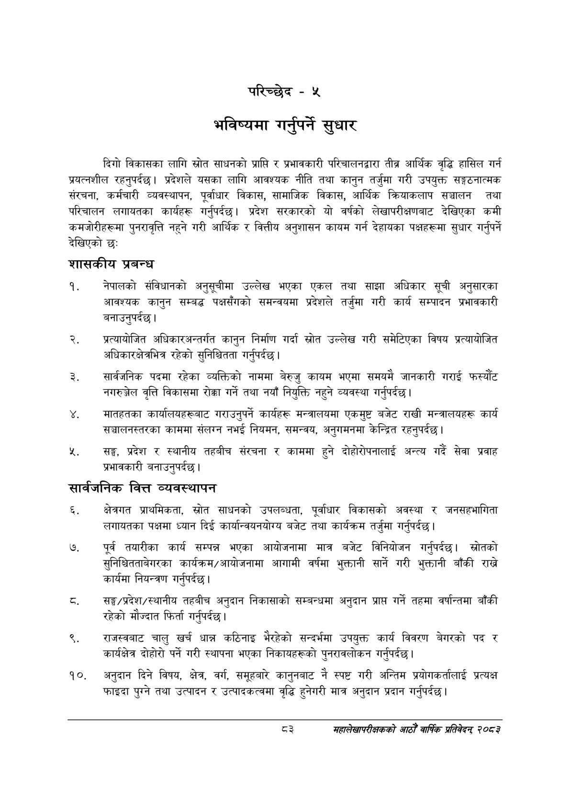

# Page 111 QA

## Rendered page


## Extracted text

```text
परिच्छेद -५
भविष्यमा गर्नुपर्ने सुधार
दिगो विकासका लागि स्रोत साधनको प्राप्ति र प्रभावकारी परिचालनद्वारा तीव्र आर्थिक वृद्धि हासिल गर्न प्रयत्नशील रहनुपर्दछ। प्रदेशले यसका लागि आवश्यक नीति तथा कानुन तर्जुमा गरी उपयुक्त सङ्गठनात्मक संरचना, कर्मचारी व्यवस्थापन, पूर्वाधार विकास, सामाजिक विकास, आर्थिक क्रियाकलाप सञ्चालन तथा परिचालन लगायतका कार्यहरू गर्नुपर्दछ। प्रदेश सरकारको यो वर्षको लेखापरीक्षणबाट देखिएका कमी कमजोरीहरूमा पुनरावृत्ति नहुने गरी आर्थिक र वित्तीय अनुशासन कायम गर्न देहायका पक्षहरूमा सुधार गर्नुपर्ने देखिएको छ:
शासकीय प्रबन्ध
नेपालको संविधानको अनुसूचीमा उल्लेख भएका एकल तथा साझा अधिकार सूची अनुसारका आवश्यक कानुन सम्बद्ध पक्षसँगको समन्वयमा प्रदेशले तर्जुमा गरी कार्य सम्पादन प्रभावकारी।
बनाउनुपर्दछ
प्रत्यायोजित अधिकारअन्तर्गत कानुन निर्माण गर्दा स्रोत उल्लेख गरी समेटिएका विषय प्रत्यायोजित अधिकारक्षेत्रभित्र रहेको सुनिश्चितता गर्नुपर्दछ |
सार्वजनिक पदमा रहेका व्यक्तिको नाममा बेरुजु कायम भएमा समयमै जानकारी गराई फस्यौंट नगरुञ्जेल वृत्ति विकासमा रोक्का गर्ने तथा नयाँ नियुक्ति नहुने व्यवस्था गर्नुपर्दछ |
मातहतका कार्यालयहरूबाट गराउनुपर्ने कार्यहरू मन्त्रालयमा एकमुष्ट बजेट राखी मन्त्रालयहरू कार्य सञ्चालनस्तरका काममा संलग्न नभई नियमन, समन्वय, अनुगमनमा केन्द्रित रहनुपर्दछ।
सङ्घ, प्रदेश र स्थानीय तहबीच संरचना र काममा हुने दोहोरोपनालाई अन्त्य गर्दै सेवा प्रवाह प्रभावकारी बनाउनुपर्दछ |
सार्वजनिक वित्त व्यवस्थापन
क्षेत्रगत प्राथमिकता, स्रोत साधनको उपलब्धता, पूर्वाधार विकासको अवस्था र जनसहभागिता लगायतका पक्षमा ध्यान दिई कार्यान्वयनयोग्य बजेट तथा कार्यक्रम तर्जुमा गर्नुपर्दछ |
पूर्व तयारीका कार्य सम्पन्न भएका आयोजनामा मात्र बजेट विनियोजन गर्नुपर्दछ। स्रोतको सुनिश्चितताबेगरका कार्यक्रम/आयोजनामा आगामी वर्षमा भुक्तानी सार्ने गरी भुक्तानी बाँकी राख्ने कार्यमा नियन्त्रण गर्नुपर्दछ |
सङ्घ/प्रदेश/स्थानीय तहबीच अनुदान निकासाको सम्बन्धमा अनुदान प्राप्त गर्ने तहमा वर्षान्तमा बाँकी रहेको मौज्दात फिर्ता गर्नुपर्दछ |
राजस्वबाट चालु खर्च धान्न कठिनाइ भैरहेको सन्दर्भमा उपयुक्त कार्य विवरण बेगरको पद र कार्यक्षेत्र दोहोरो पर्ने गरी स्थापना भएका निकायहरूको पुनरावलोकन गर्नुपर्दछ |
अनुदान दिने विषय, क्षेत्र, वर्ग, समूहबारे कानुनबाट नै स्पष्ट गरी अन्तिम प्रयोगकर्तालाई प्रत्यक्ष फाइदा पुग्ने तथा उत्पादन र उत्पादकत्वमा वृद्धि हुनेगरी मात्र अनुदान प्रदान गर्नुपर्दछ |
द३
सहालेखापरीक्षकको आठौँ वार्षिक प्रतिवेदन २०८२
```

## Flags
- None
