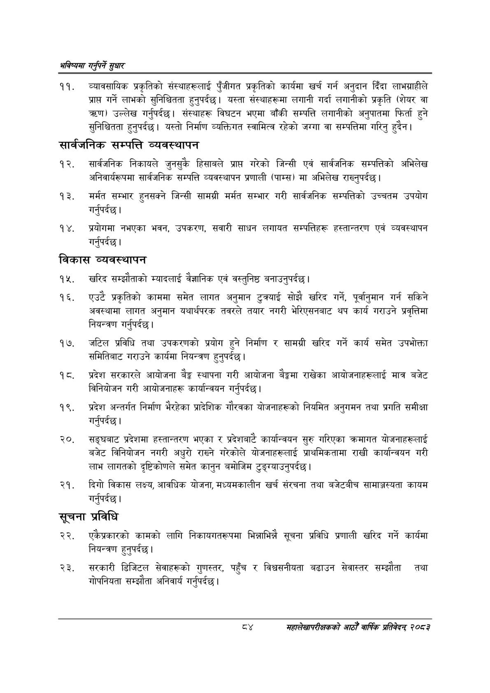

# Page 112 QA

## Rendered page


## Extracted text

```text
भविष्यमा गर्नुपर्ने सुक्षार
व्यावसायिक प्रकृतिको संस्थाहरूलाई पुँजीगत प्रकृतिको कार्यमा खर्च गर्न अनुदान दिँदा लाभग्राहीले प्राप्त गर्ने लाभको सुनिश्चितता हुनुपर्दछ। यस्ता संस्थाहरूमा लगानी गर्दा लगानीको प्रकृति (शेयर वा ) उल्लेख गर्नुपर्दछ। संस्थाहरू विघटन भएमा बाँकी सम्पत्ति लगानीको अनुपातमा फिर्ता हुने सुनिश्चितता हुनुपर्दछ। यस्तो निर्माण व्यक्तिगत स्वामित्व रहेको जग्गा वा सम्पत्तिमा गरिनु हुदैन।
सार्वजनिक सम्पत्ति व्यवस्थापन
सार्वजनिक निकायले जुनसुकै हिसाबले प्राप्त गरेको जिन्सी एवं सार्वजनिक सम्पत्तिको अभिलेख अनिवार्यरुपमा सार्वजनिक सम्पत्ति व्यवस्थापन प्रणाली (पाम्स) मा अभिलेख राख्नुपर्दछ |
मर्मत सम्भार हुनसक्ने जिन्सी सामग्री मर्मत सम्भार गरी सार्वजनिक सम्पत्तिको उच्चतम उपयोग गर्नुपर्दछ |
प्रयोगमा नभएका भवन, उपकरण, सवारी साधन लगायत सम्पत्तिहरू हस्तान्तरण एवं व्यवस्थापन गर्नपर्दछ।
विकास व्यवस्थापन
खरिद सम्झौताको म्यादलाई वैज्ञानिक एवं वस्तुनिष्ठ बनाउनुपर्दछ |
एउटै प्रकृतिको काममा समेत लागत अनुमान टुत्र्याई सोझै खरिद गर्ने, पूर्वानुमान गर्न सकिने अवस्थामा लागत अनुमान यथार्थपरक तवरले तयार नगरी भेरिएसनबाट थप कार्य गराउने प्रवृत्तिमा नियन्त्रण गर्नुपर्दछ |
जटिल प्रविधि तथा उपकरणको प्रयोग हुने निर्माण र सामग्री खरिद गर्ने कार्य समेत उपभोक्ता समितिबाट गराउने कार्यमा नियन्त्रण हुनुपर्दछ |
प्रदेश सरकारले आयोजना बैङ्क स्थापना गरी आयोजना बैङ्कमा राखेका आयोजनाहरूलाई मात्र बजेट विनियोजन गरी आयोजनाहरू कार्यान्वयन गर्नुपर्दछ।
१९, प्रदेश अन्तर्गत निर्माण भैरहेका प्रादेशिक गौरवका योजनाहरूको नियमित अनुगमन तथा प्रगति समीक्षा गर्नुपर्दछ |
सङ्घबाट प्रदेशमा हस्तान्तरण भएका र प्रदेशबाटै कार्यान्वयन सुरु गरिएका क्रमागत योजनाहरूलाई बजेट विनियोजन नगरी अधुरो राख्ने गरेकोले योजनाहरूलाई प्राथमिकतामा राखी कार्यान्वयन गरी लाभ लागतको दृष्टिकोणले समेत कानुन बमोजिम टुङ्ग्याउनुपर्दछ।
दिगो विकास लक्ष्य, आवधिक योजना, मध्यमकालीन खर्च संरचना तथा बजेटबीच सामाञ्जस्यता कायम गर्नुपर्दछ |
सूचना प्रविधि
एकैप्रकारको कामको लागि निकायगतरूपमा भिन्नाभिन्नै सूचना प्रविधि प्रणाली खरिद गर्ने कार्यमा नियन्त्रण हुनुपर्दछ |
सरकारी डिजिटल सेवाहरूको गुणस्तर, पहुँच र विश्वसनीयता बढाउन सेवास्तर सम्झौता तथा गोपनियता सम्झौता अनिवार्य गर्नुपर्दछ।
सहालेखापरीक्षकको वार्षिक प्रतिवेदन २०६३
```

## Flags
- None
