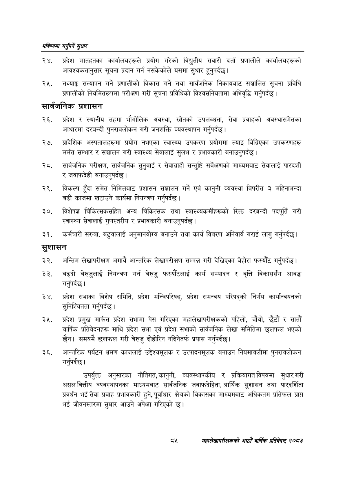

# Page 113 QA

## Rendered page


## Extracted text

```text
भविष्यमा गर्नुपर्ने सुक्षार
प्रदेश मातहतका कार्यालयहरूले प्रयोग गरेको विद्युतीय सवारी दर्ता प्रणालीले कार्यालयहरूको आवश्यकतानुसार सूचना प्रदान गर्न नसकेकोले यसमा सुधार हुनुपर्दछ |
तथ्याङ्क सत्यापन गर्ने प्रणालीको विकास गर्ने तथा सार्वजनिक निकायबाट सञ्चालित सूचना प्रविधि प्रणालीको नियमितरूपमा परीक्षण गरी सूचना प्रविधिको विश्वसनियतामा अभिवृद्धि गर्नुपर्दछ |
सार्वजनिक प्रशासन
प्रदेश र स्थानीय तहमा भौगोलिक अवस्था, स्रोतको उपलब्धता, सेवा प्रवाहको अवस्थासमेतका आधारमा दरबन्दी पुनरावलोकन गरी जनशक्ति व्यवस्थापन गर्नुपर्दछ।
प्रादेशिक अस्पतालहरूमा प्रयोग नभएका स्वास्थ्य उपकरण प्रयोगमा ल्याइ बिग्रिएका उपकरणहरू मर्मत सम्भार र सञ्चालन गरी स्वास्थ्य सेवालाई सुलभ र प्रभावकारी बनाउनुपर्दछ |
सार्वजनिक परीक्षण, सार्वजनिक सुनुवाई र सेवाग्राही सन्तुष्टि सर्वेक्षणको माध्यमबाट सेवालाई पारदर्शी र जवाफदेही बनाउनुपर्दछ |
विकल्प हुँदा समेत निमित्तबाट प्रशासन सञ्चालन गर्ने एवं कानुनी व्यवस्था विपरीत ३ महिनाभन्दा बढी काजमा खटाउने कार्यमा नियन्त्रण गर्नुपर्दछ |
विशेषज्ञ चिकित्सकसहित अन्य चिकित्सक तथा स्वास्थ्यकर्मीहरूको रिक्त दरबन्दी पदपूर्ति गरी स्वास्थ्य सेवालाई गुणस्तरीय र प्रभावकारी बनाउनुपर्दछ।
कर्मचारी सरुवा, बढुवालाई अनुमानयोग्य बनाउने तथा कार्य विवरण अनिवार्य गराई लागु गर्नुपर्दछ |
सुशासन
अन्तिम लेखापरीक्षण अगावै आन्तरिक लेखापरीक्षण सम्पन्न गरी देखिएका बेहोरा फस्यौंट गर्नुपर्दछ |
बढ्दो बेरुजुलाई नियन्त्रण गर्न बेरुजु फस्यौटलाई कार्य सम्पादन र वृत्ति विकाससँग आवद्ध गर्नुपर्दछ |
प्रदेश सभाका विशेष समिति, प्रदेश मन्त्रिपरिषद्‌, प्रदेश समन्वय परिषद्को निर्णय कार्यान्वयनको सुनिश्चितता गर्नुपर्दछ |
प्रदेश प्रमुख मार्फत प्रदेश सभामा पेस गरिएका महालेखापरीक्षकको पहिलो, चौथो, छैटौं र सातौं वार्षिक प्रतिवेदनहरू माथि प्रदेश सभा एवं प्रदेश सभाको सार्वजनिक लेखा समितिमा छलफल भएको छैन। समयमै छलफल गरी बेरुजु दोहोरिन नदिनेतर्फ प्रयास गर्नुपर्दछ |
आन्तरिक पर्यटन भ्रमण काजलाई उद्देश्यमूलक र उत्पादनमूलक बनाउन नियमावलीमा पुनरावलोकन गर्नुपर्दछ |
उपर्युक्त अनुसारका नीतिगत, कानुनी, व्यवस्थापकीय र प्रक्रियागत विषयमा सुधार गरी असलवित्तीय व्यवस्थापनका माध्यमबाट सार्वजनिक जवाफदेहिता, आर्थिक सुशासन तथा पारदर्शिता प्रवर्धन भई सेवा प्रवाह प्रभावकारी हुने, पूर्वाधार क्षेत्रको विकासका माध्यमबाट अधिकतम प्रतिफल प्राप्त भई जीवनस्तरमा सुधार आउने अपेक्षा गरिएको छ।
दश
सहालेखापरीक्षकको आठौँ वार्षिक प्रतिवेदन २०८२
```

## Flags
- None
