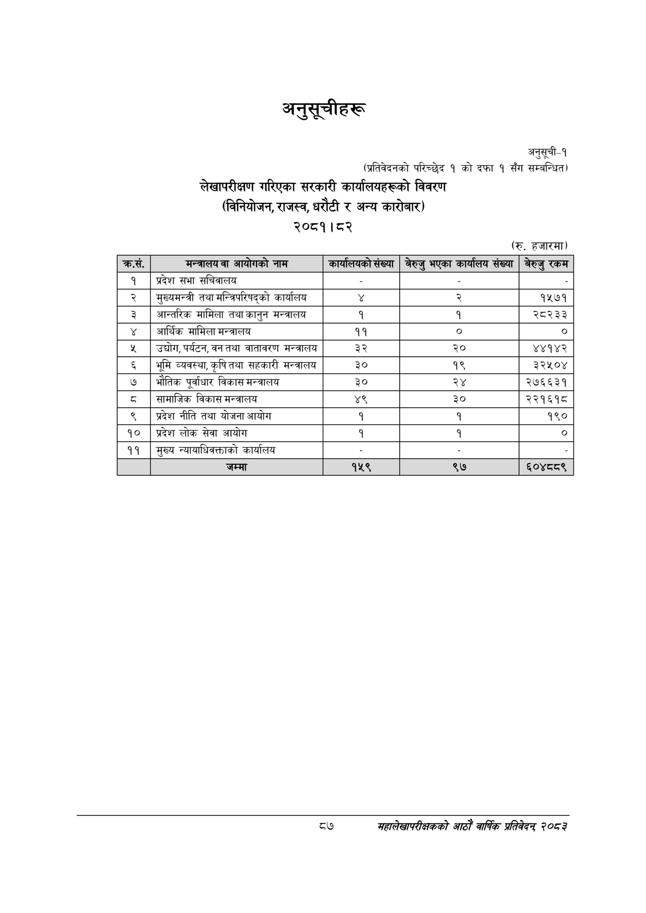

# Page 117 QA

## Rendered page


## Extracted text

```text
अनुसूचीहरू
अनुसूची-१ (प्रतिवेदनको परिच्छेद १ को दफा १ सँग सम्बन्धित)
लेखापरीक्षण गरिएका सरकारी कार्यालयहरूको विवरण (विनियोजन, राजस्व, धरौटी र अन्य कारोबार) २०८१।८२
(रु. हजारमा)
७
सहालेखापरीक्षकको वार्षिक प्रतिवेदन २०८२

|  |  |  |  |  |
| --- | --- | --- | --- | --- |
| क्रस. | का आवोगको नाम | कार्षाशषको ख्या | बेरुजु भएका परााए५ संख्या | बेरुजु रकम |
| १ | प्रदेश सभा सचिवालय |  |  |  |
| २ | मुल्यमन्त्री तथा मन्त्रिपरिषद्को कार्यालय |  | २ | १५७१ |
| ३ | आन्तरिक मामिला तथा कानुन भन्त्रालय | १ | १ | २८२३३ |
| ४ | आर्थिक मामिला भन्त्रालय | ११ |  | ० |
| ५ | उद्योग, पर्यटन, वन तथा वातावरण भअन्त्रालय | ३२ | २० | ४४१४२ |
| ६ | भूमि व्यवस्था,कृषितथा सहकारी मन्त्रालय | ३० | १९ | ३२५०४ |
| ७ | भौतिक पूर्वाधार विकास भन्त्रालय | ३० | २४ | २७६६३१ |
| ८ | सामाजिक विकास मन्त्रालय | ४९ | ३० | २२१६१८ |
| ९ | प्रदेश नीति तथा योजना आयोग | १ | १ | १९० |
| १० | प्रदेश लोक सेवा आयोग | १ | १ | ० |
| ११ | मुख्य न्यायाधिकत्ताको कार्यालय |  |  |  |
|  | जम्मा | १५९ | ९७ | ६०४८८९ |
```

## Flags
- table_page
- medium_quality_table
