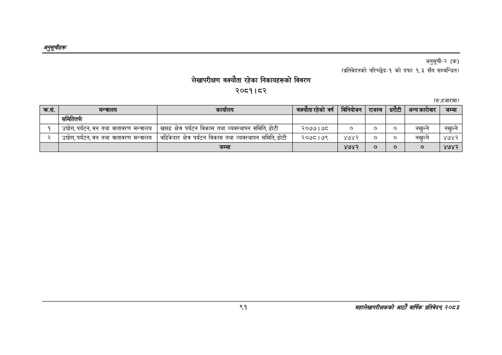

# Page 121 QA

## Rendered page


## Extracted text

```text
अनुतूचीहरू
लेखापरीक्षण बक्यौता रहेका निकायहरूको विवरण २०८१।८२
अनुसूची-२ (क)
(प्रतिवेदनको परिच्छेद-१ को दफा १.३ सँग सम्बन्धित)
(रु.हजारमा)
९१
सहालेखापरीक्षकको आठोँ वाषिकि प्रतिवेदन्‌ ७०५३

| क्रस. | मन्त्रालय | कार्यलय | बक्यँतारुहेको वर्क | विनियोजन | राजस्व |  | अन्यकारीबार | जम्मा |
| --- | --- | --- | --- | --- | --- | --- | --- | --- |
|  | समितितर्फ |  |  |  |  |  |  |  |
| १ | उद्योग,पर्यटन,वन तथा वातावरण मन्त्रालय | खम्तड क्षेत्र पर्यटन विकास तथा व्यवस्थापन समिति, डोटी | २०७७। ७८ | ० |  |  | नखुल्ने | नखुल्ने |
| २ | उद्चोग,पर्यटन, वन तथा वातावरण मन्त्रालय | बढडिकेदार क्षेत्र पर्यटन विकास तथा व्यवस्थापन समिति, डोटी | २०७८।७९ | ४७४२ |  |  | नखुल्ने | ४७४२ |
|  |  | जम्मा |  | ४७४२ | ० | ० | ० | ४७४२ |
```

## Flags
- table_page
- medium_quality_table
