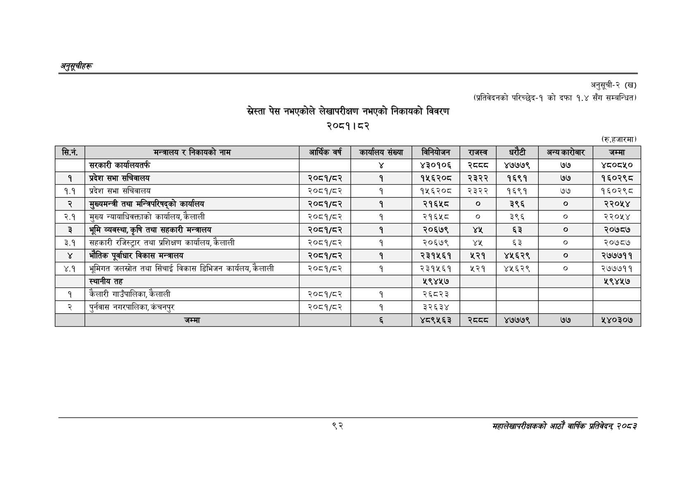

# Page 122 QA

## Rendered page


## Extracted text

```text
अनुतूचीहरू
पेस नभएकोले लेखापरीक्षण नभएको निकायको विवरण २०८१। ८२
अनुसूची-२ (ख)
(प्रतिवेदनको परिच्छेद-१ को दफा १.४ सँग सम्बन्धित)
(रु.हजारमा)
९२
महालेखापरीक्षकको आठाँ वार्षिक प्रतिवेदन २०६३

| सि.न. | मन्त्रालय र निकायको नाम | आश्किवर्ष | कार्यालय संख्या | विनियोजन | राजस्व | धरेटी | अन्य कारोबार | जम्मा |
| --- | --- | --- | --- | --- | --- | --- | --- | --- |
|  | सरकारी कार्यालयतर्फ |  |  | ३०९०§ | र८दट | ४७७७९ | ७७ | ४८०८५० |
| १ | प्रदेश सभा सचिवालय | २०८१/८२ | १ | १५६२०८ | २३२२ | १६९१ | ७७ | १६०२९८ |
| १.१ | प्रदेश सभा सचिवालय | २०८१/८२ | १ | १५६२०८ | २३२२ | १६९१ | ७७ | १६०२९८ |
| २ | मुख्यमन्त्री तथा भान्नपारेपएको कार्यालय | २०८१/८२ | १ | २१६४५८ | ० | ३९६ | ० | २२०५४ |
| २.१ | मुख्य न्यायाधिवक्ताको कार्यालय, कैलाली | २०८१/८२ | १ | २१६५८ | ० | ३९६ | ० | २२०५४ |
| ३ | भूमि व्यवस्था,कृषि तथा सहकारी मन्त्रालय | २०८१/८२ | १ | २०६७९ | ४५ | ६३ | ० | २०७८७ |
| ३.१ | सहकारी रजिस्ट्रार तथा प्रशिक्षण कार्यालय, कैलाली | २०८१/८२ | १ | २०६७९ | ११४ | ६३ |  | २०७८७ |
| ४ | भेतिक पूर्वाधार विकास मन्त्रालय | २०८१/८२ | १ | २३१५६१ | २२१ | ४५६२९ | ० | २७७७११ |
| ४.१ | भूमिगत जलस्रोत तथा सिंचाई विकास डिभिजन कार्यलय, कैलाली | २०८१/८२ | १ | २३१५६१ | ५२१ | ४५६२९ | ० | २७७७११ |
|  | स्थानीय तह |  |  | ५९४४५७ |  |  |  | ५९४४५७ |
| १ | कैलारी गाउँपालिका, कैलाली | २०८१/८२ | १ | २६८२३ |  |  |  |  |
| २ | पुर्नवास नगरपालिका, कंचनपुर | २०८१/८२ | १ | ३२६३४ |  |  |  |  |
|  | जम्मा |  |  | ४८९५६३ |  | ४७७७९ | ७७ | ५४०३०७ |
```

## Flags
- table_page
- medium_quality_table
