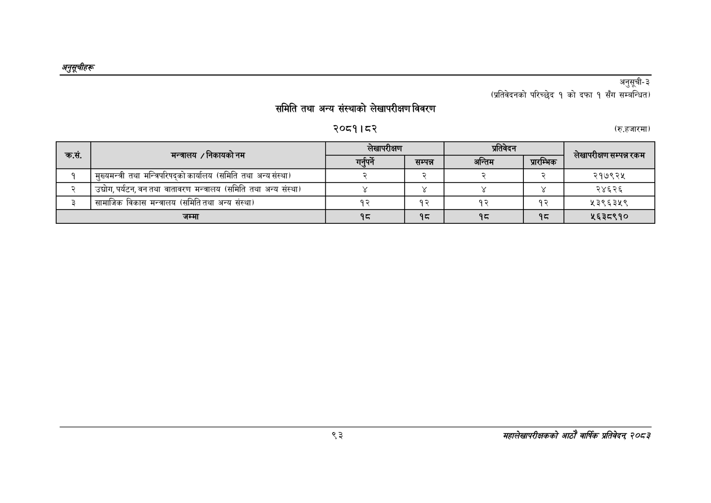

# Page 123 QA

## Rendered page


## Extracted text

```text
अनुतूचीहरू
समिति तथा अन्य संस्थाको लेखापरीक्षण विवरण
२०८१।८२
अनुसूची-३
सँग
सम्बन्धित)
(रु.हजारमा)
(प्रतिवेदनको
परिच्छेद
१
को
दफा
१
९३
सहालेखापरीक्षकको आठोँ वाषिकि प्रतिवेदन्‌ ७०५३

| कस | निकायको | लेखापरीक्षण: |  | तेवेदन |  |  |
| --- | --- | --- | --- | --- | --- | --- |
|  | / तभ |  | सम्पन्न | अन्त |  | सम्प्ारकम |
| १ | मुख्यमन्त्री तथा मन्त्रिपरिषद्को कार्यालय (समिति तथा अन्य संस्था) |  | २ |  |  | २१७९२५ |
| २ | उद्योग, पर्यटन, वन तथा वातावरण मन्त्रालय (समिति तथा अन्य संस्था) |  |  |  |  | २४६२६ |
| ३ | सामाजिक विकास मन्त्रालय (समिति तथा अन्य संस्था) | १२ | १२ | १२ | १२ | ५३९६३४५९ |
|  | जम्मा | १८ | १८ | १८ | १८ | ५६३८९१० |
```

## Flags
- table_page
- medium_quality_table
