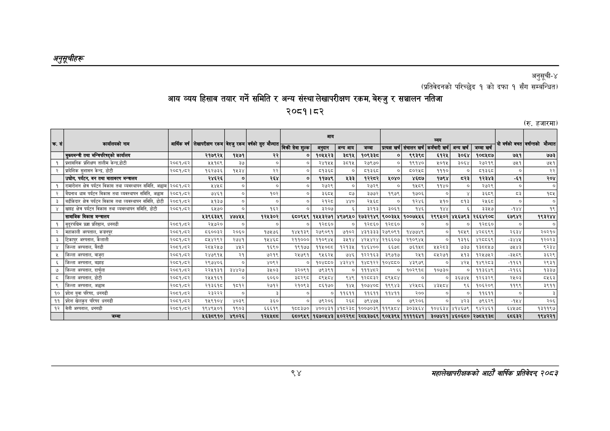

# Page 124 QA

## Rendered page


## Extracted text

```text
अनुतूचीहरू
संस्था लेखापरीक्षण २०८१।८२
अनुसूची-४
(प्रतिवेदनको परिच्छेद १ को दफा १ सँग सम्बन्धित)
आय व्यय हिसाव तयार गर्ने समिति र अन्य रकम, बेरुजु र सञ्चालन नतिजा
(रु. हजारमा)
९४
सहालेखापरीक्षकको आठोँ वाषिकि प्रतिवेदन्‌ ७०५३

|  | कार्यलयको |  |  |  | वर्षको मौन्यात |  | बाय |  |  |  |  | ब्यय |  |  |  |  |
| --- | --- | --- | --- | --- | --- | --- | --- | --- | --- | --- | --- | --- | --- | --- | --- | --- |
|  | नाम | बार्षिक वर्ष | लेखापरीकष सम | बेरुजु रकम | सुर | बिक वा शुल्क | अनुदान | अन्य आय | जम्मा | प्रत्यक खर्च | संचालन खर्ष | कर्मचारी खर्च | अन्य खर्च | जम्मा खर्च | पो गरको बचत |  |
|  | मुख्यमन्त्री तथा मन्त्रिपरिषद्को कार्यालय |  | २१७९२५ | १४७१ | २२ | ० | १०४४२३ | ३८१४ | १०९३३८ | ० | ९३९८ | ६१२५ | ३०६४ | १०८४८७ | ७५१ | ७७३ |
| १ | प्रशासनिक प्रशिक्षण तालीम | २०८१/८२ | ४४१८९ | ३७ | ० | ० | २४१५५ | ३८१५ | र२७९७० | ० | १९४० | ३०१५ | ३०६४ | २७२१९ | ७५१ | ७५१ |
| २ | प्रादेशिक सुशासन केन्द्र, डोटी | २००८१/६४२ | १६२७३६ | १५३४ | २२ | ० | ड१३६८ | ० | १३६८ | ० | ६०२५ | १११० | ० | ८१३६ | ० | २२ |
|  | , पर्यटन, बन तथा वातावरण मन्त्रालय |  | २४६२६ | ० | २६४ | ० | ११७४९ | १३३ |  | १०४० | ४६७ | १७९४ |  | १२३४३ | -६१ | २०४ |
| १ | रामारोशन क्षेत्र पर्यटन विकास तथा व्यवस्थापन समिति, | २०८१/८२ | ४४४८ | ० | ० | ० | २७२९ | ० | २७२९ | ० | १४६९ | ११४० | ० | २७२९ | ० | ० |
| २ | बैचनाथ धाम पर्यटन बिकास तथा व्यवस्थापन समिति, अछाम | २०८१/८२ | ७४६१ | ० | १०२ |  |  | ६७ | ३७७२ | १९७९ | १७०६ | ० | ४ | ३६८९ | ३ | १५५ |
| ३ | बढीकेदार क्षत्र पर्यटन विकास तथा व्यवस्थापन समिति, डोटी | २०८१/८२ | ४१३७ | ० | ० | ० |  | ४४० | र२५६८ | ० | १२४६ | ४११० | ५१३ | र२४६८ | ० | ० |
| ४ | खप्तड क्षेत्र पर्यटन विकास तथा व्यवस्थापन समिति, डोटी | २०८१/६२ | ५५७० |  | १६२ | ७ | ३२०७ |  | ३२१३ | ३०६१ | १४६ | १४४ |  | ३३५७ | १ | १९ |
|  | सामाजिक विकास मन्त्रालय |  | ४३९६३५९ | ४७४५४ | १२४३०२ | ६८०९४९ | १४४३२७१ | ४९७९४० | २७३२१४९ | ९००३५४ | १००७४४१६ | २९९५०२ | ४४६७९३ | २६६४२०४ | ६७९४२ | १९३२४४ |
| १ | सुदूरपश्चिम प्रज्ञा प्रतिष्ठान, धनगढी | २०८१/६२ | २४७२० | ० | ० | ० | १२६० | ० | २८६० | १२८६० | ० | ० | ० | २८६० | ० | ० |
| २ | महाकाली अस्पताल, कञ्चनपुर | २०६१/६२ | ८६००३२ | २०६० | १७५७६ | १४५१३९ | २७९०९१ | ७१०२ | ४३१३३३ | २७९०९१ | १४७७४९ | ० | १८५९ | ४२८६९९ | २६३४ | २०२१० |
| ३ | टिकापुर अस्पताल, कैलाली | २०८१/८२ | ८५४२९२ | २७४१ | १५४६८ | २११००० | २१०९४५ | ३५१४ | ४२५४२४ | २१६६०७ | २१०९४५ | ० | १३१६ | ४२८८६९ | -े४४५ | १२०२३ |
| ४ | जिल्ला अस्पताल, बैतडी | २०८१/६२ | २८५२५७ | ड्र | १६९० | १९१७७ | ११५०८८ | १२१३५ | १४६४०० | ६५७८ | ७६१५८ | २५२८३ | ७३७ | १३८८५४ | ७५४३ | ९२३४ |
| ५ | जिल्ला अस्पताल, बाजुरा | २००८१/६२ | र२४७९१४ | २१ | ७२१९ | २४७९१ | ९४६२४ | ७४६ | १२२१६३ | ३९७१७ | र४१ | ४२७१ | १३ | १२५७६२ | -३५८९ | ३६२९ |
| ६ | जिल्ला अस्पताल, बझाङ | २०८१/८२ | २९७४०६ | ० | ४०९२ | ० | १०४८८० | ४३२४२ | १४८१२२ | १०४८८० | ४३९७९ | ० | ४२५ | १४९२८३ | -११६१ | २९३१ |
| ७ | जिल्ला अस्पताल, दार्चुला | २००१/८४२ | २२४१३१ | ३४४२७ | ३५०३ | ३२०९१ | ७९३९१ | ० | १११४६२ | ० | १०२९१६ | १०७३० | ० | ११३६४९ | -२१६६ | १३३७ |
| ८ | जिल्ला अस्पताल, डोटी | २०६८१/६४२ | र२४४१६१ | ० | ६०६० | इट२९ड | ब९५८४ | ९४९ | प२८०३२ | ९४८४ | ० | ० | ३६७४५ | १२६३२९ | २४०३ | ८५६३ |
| ९ | जिल्ला अस्पताल, अछाम | २०६१/६२ | २१३६१८ | १८१२ | २७१२ | २१०९३ | ५६५१७० | १४४५ | १०७४०८ | १९९४३ | ४२५८६ | ३ | ९६ | १०६२०९ | ११९९ | ३९११ |
| १० | प्रदेश युवा परिषद, धनगढी | २०८१/८२ | २३२२२ | ० | ३ | ० | ० | ११६११ | ११६११ | ११४११ | २०० | ० | ० | ११६११ | ० | २ |
| ११ | प्रदेश खेलकुद परिषद धनगढी | २०६१/८२ | १५९१०४ | ४०३९ | ३५० | ० | ७९२०६ |  | ७९४७५ | ० | ७९२०६ | ० | १५१ | ७९६२९ | -१४५४ | २०६ |
| १२ | सेती अस्पताल, धनगढी | २०८१/८२ | १९४९४५०१ | १९०३ | ६६१९ | ९५५३६० | ४००४३१ | ४प८रइट | १००७०३९ | ११९४८४ | ३०३५६४ | १०४६३४ | ४१४६७९ | ९४२४६१ | ४५७८ | १३११९७ |
|  | जम्मा |  | ५६३८९१० | ४९०२६ | १२४५४८५ | ६८०९५९ | १६७०४४३ | ५०२२९८ | २८५३७६९ | ९०४३९५ | ११११६४१ | ३०७४२१ | ४६०६८० | २७८४१३८ | ६८६३२ | १९४२२१ |
```

## Flags
- table_page
- medium_quality_table
