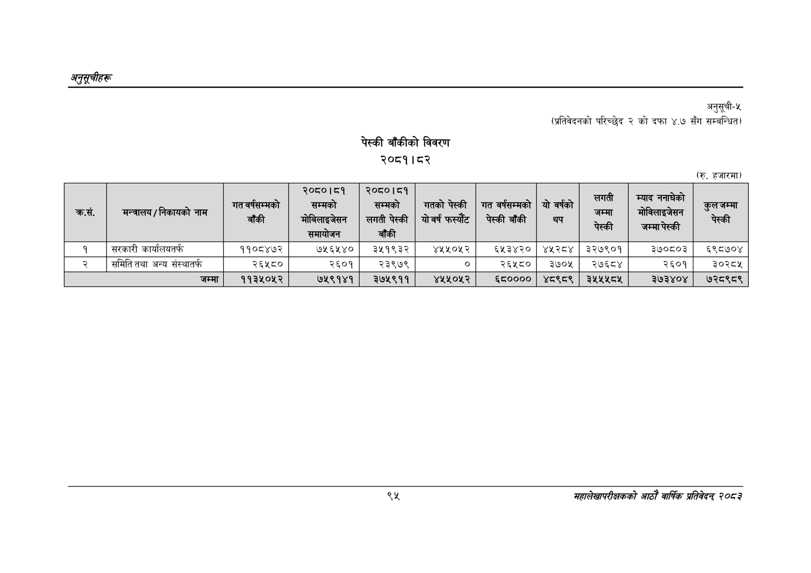

# Page 125 QA

## Rendered page


## Extracted text

```text
अनुतूचीहरू
पेस्की बाँकीको विवरण
२०८१।८२
अनुसूची-५
(प्रतिवेदनको परिच्छेद २ को दफा ४.७ सँग सम्बन्धित)
(रु. हजारमा)
सहालेखापरीक्षकको आठोँ वाषिकि प्रतिवेदन्‌ ७०५३

| कस - |  | गत वर्षसम्मको बाँकी | सम्मको कोनिलाइजेसन समायोजन | \| उ सम्मको लगती पेस्की बाँकी | गतको पेस्की योवर्षफस्यँट | गत वर्षसम्मको पेस्कीबाँधकीि | यो वर्षको थप | 'लगरटी जम्मा पेस्की | म्याद ननाघेको पा नलाइनो का जम्मापेस्की | कुल जम्मा सेस्की |
| --- | --- | --- | --- | --- | --- | --- | --- | --- | --- | --- |
| १ | सरकारी कार्यालयतर्फ | ११०८४७२ | ७५६५४० | ३५१९३२ | ४५५०५२ | ६५३४२० | ४४५२८४ | ३२७९०१ | ३७०८०३ | ६९८७०४ |
| २ | समिति तथा अन्य संस्थातर्फ | २६५८० | २६०१ | २३९७९ |  | २६५८० | ३७०५ | र२७६८४ | २६०१ | ३०२८४५ |
|  | जम्मा | ११३५०५२ | ७५९१४१ | २७५९११ | ४५५०५२ | ६८०००० | ४८९८९ | ३५४५४५८५ | ३२७३४०४ | ७२८९८९ |
```

## Flags
- table_page
- medium_quality_table
