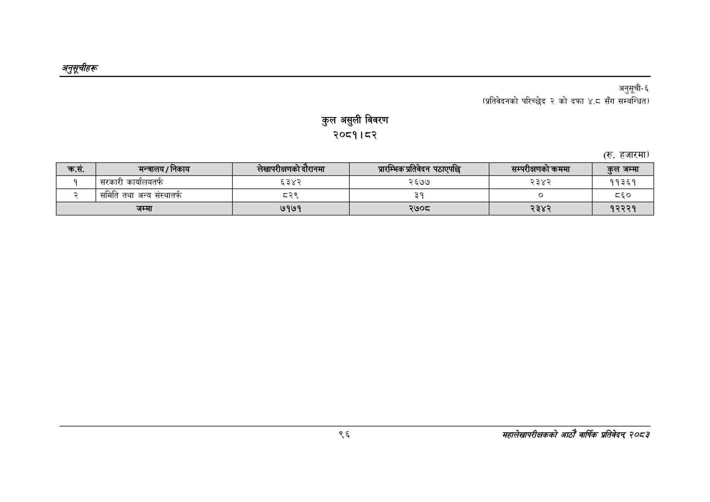

# Page 126 QA

## Rendered page


## Extracted text

```text
अनुतूचीहरू
कुल असुली विवरण २०८१।८२
अनुसूची६
(प्रतिवेदनको परिच्छेद २ को दफा ४.८ सँग सम्बन्धित)
(रू. हजारमा)
९६
सहालेखापरीक्षकको आठोँ वाषिकि प्रतिवेदन्‌ ७०५३

| क्रस. | मन्त्रालय / निकाय | सेखापरीकषणको दे रनमा | शार श्रतिवेदन पठाएपछि | सम्परीकषणको क्रममा | कुल जम्मा |
| --- | --- | --- | --- | --- | --- |
| १ | सरकारी कार्यालयतर्फ | ६३४२ | २६७७ | २३४२ | ११३६१ |
| २ | समिति तथा अन्य संस्थातर्फ | ८२९ | ३१ |  | ८६० |
|  | जम्मा | ७१७१ | २७०८ | २३४२ | १२२२१ |
```

## Flags
- table_page
- medium_quality_table
