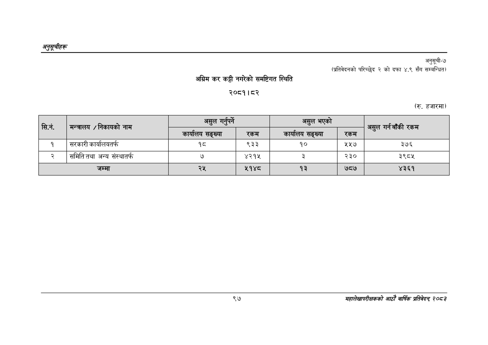

# Page 127 QA

## Rendered page


## Extracted text

```text
अनुतूचीहरू
अग्रिम कर कट्टी नगरेको समष्टिगत स्थिति
२०८१।८२
अनुसुूची-७
(प्रतिवेदनको परिच्छेद २ को दफा ४.९ सँग सम्बन्धित)
(रु. हजारमा)
९७
सहालेखापरीक्षकको आठोँ वाषिकि प्रतिवेदन्‌ ७०५३

| सि.न. | नेकायको |  |  |  |  |  |
| --- | --- | --- | --- | --- | --- | --- |
|  | मन्त्रालय / नाम | 'कार्यीलय सङ्ख्या | रकम | ५ कार्यालय सङ्ख्या | रकम | असुल को रकम |
| १ | सरकारी कार्यालयत | १८ | ९३३ | १० | ५५७ | ३७६ |
| २ | समितितथा अन्य संस्थात्फ | ७ | ४२१५ | ३ | २३० | ३९८४ |
|  | जम्मा | २५ | २१४८ | १३ | ७८७ | ४३६१ |
```

## Flags
- table_page
- medium_quality_table
