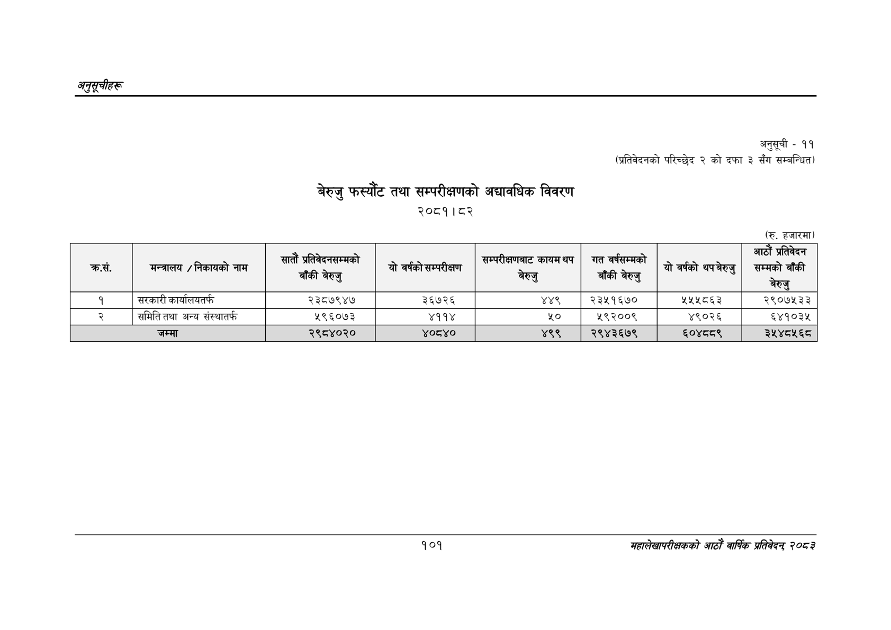

# Page 131 QA

## Rendered page


## Extracted text

```text
अनुतूचीहरू
बेरुजु फस्यौट तथा सम्परीक्षणको अद्यावधिक विवरण
२०८१।८२
अनुसूची -११
(प्रतिवेदनको परिच्छेद २ को दफा ३ सँग सम्बन्धित)
(रु. हजारमा)
१०१
सहालेखापरीक्षकको आठोँ वाषिकि प्रतिवेदन्‌ ७०५३

| क्रस. | मन्त्रालय / निकायको नाम | बाँकी बेरुजु | यो वर्षको सम्परीक्षण | काम्न बेरुजु | बाँकी बेरुजु | यो वर्षको थपबेरुजु | आउँ' प्रतिवेदन सम्मको बाँकी |
| --- | --- | --- | --- | --- | --- | --- | --- |
| १ | सरकारी कार्यालयतर्फ | २३८७९४७ | ३६७२६ | ४४९ | २३५१६७० | २५५८६३ | २९०७५३३ |
|  | समिति तथा अन्य संस्थातर्फ | २९६०७३ | ४११४ | ५० | २९२००९ | ४९०२६ | ६४१०३५ |
```

## Flags
- table_page
- medium_quality_table
