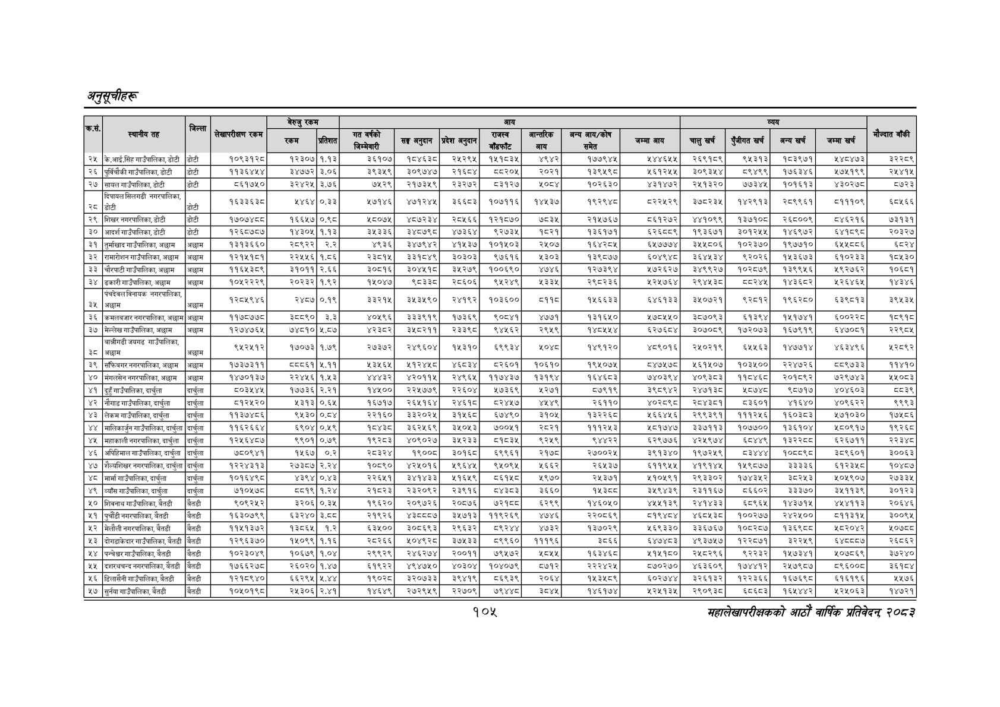

# Page 135 QA

## Rendered page


## Extracted text

```text
अनुतूचीहरू
१०४५
महालेखापरीक्षकको आठोँ वार्षिक प्रतिवेदन्‌ २०५३

| का, |  |  |  |  |  |  |  |  |  |  |  |  |  |  |  |  |  |
| --- | --- | --- | --- | --- | --- | --- | --- | --- | --- | --- | --- | --- | --- | --- | --- | --- | --- |
|  | ३५ | जिल्ला |  |  |  | सि | सङ्घ अनुदान | प्रदेश अनुदान | हु | आन्तरिक न | — हन | जम्मा आय | चालु खर्च | पुँजीगत खर्च | बन्य खर्च | जम्मा खर्च |  |
| [२५ | के.आई.सिंह गाउँपालिका, डोटी | डोटी | १०९३१२८ | १२३०७ | १.१३ | ३६१०७ | १८४६३८ | २५२९५ | १५१८३५ | ४९४२ | १७७९४५ | २४४६५५ | २६९१८९ | ९४५३१३ | १८३९७१ | १४८४७३ | जइ२२८९ |
| २६ | पुर्विचौकी गाउँपालिका, डोटी | डोटी | ११३६४५४ | ३४७७२ | ३.०६ | ३९३५९ | ३०९७४७ | २१६०४ | ५८२०५ | २०२१ | १३९४५९८ | ४६१२५५ | ३०९३४४ | ८९४९९ | १७६३४६ | २१७५१९९ | र२४४१५ |
| [२७ | सायल गाउँपालिका, डोटी | डोटी | ५६५१७५० | ३२४२५ | ३.७६ | ७५२९ | २१७३५९ | २३२७२ | ८०३१२७ | श्०्च्ड | १०२६३० | ४३१४७२ | २५१३२० | ७७३४५ | १०१६१३ | ४३०२७८ | ८७२३ |
|  | fi नगरपालिका, | जस | १६३३६३८ | ५४६४ | ०.३३ | २७१४६ | ४७१२४५ | ३६६८३ | १०७११६ | १४४५३७ | १९२९४८ | ८२२५२९ | ३७८२३५ | १४२९१३ | २८९९६१ | ५१११०९ | ६८४६६ |
| २९ | शिखर नगरपालिका,डोटी | डोटी |  | १६६५७ | ०.९८ | १८०७५ | ४८७२३४ | २८५६६ | १२१८७० | ७८३५ | २१५७६७ | ८६१२७२ | ४४१०९९ | ३७१० | २६८००९ | ८४६२१६ | ७३१३१ |
| ३० | आदर्शगाउँपालिका,डोटी | डोटी | १२६८७८७ | १४३०५ | १.१३ | ३५३३६ | ३४८७९८ | ४७३६४ | ९२७३५ | १८२१ | १३६१७१ | ६२६९ | १९३६७१ | इ३०१२५५ | १४६९७२ | इश्पक्ङ | र२०३२७ |
| ३१ | तुर्माखाद गाउँपालिका, अछाम | अख्ाम | १३१३६६० | र२८९२२ | २.२ | ४९३६ | ३४७९४२ | ४१४५३७ | १०१५०३ | २५०७ | १६४२८५ | ६५७७७४ | ३४५८०६ | १०२३७० | १९७७१० | ६५४५८८६ | इद२४ |
| ३२ | रामारोशन गाउँपालिका, अञ्चाम | अख्ाम | १२१५१८१ | २२५४६ | १.८६ | २३०५ | ३३१०४९ | ३०३०३ | ९७६१६ | १३०३ | १३९८७७ | ६०४९४८ड | ३६४४३४ | ९२०२६ | १४५३६७३ | ६१०२३३ | १५४५३० |
| ३३ | चौरपाटी गाउँपालिका, अछाम | अख्ाम | ११६५३८९ | ३१०११ | २.६६ | ३०८१६ | इ०४५१८ | ३५२७९ | १००६९० | ४७४६ | १२७३९४ | २७२६२७ | ३४९९२७ | १०२८७९ | १३९९४६ | २१९२७६२ | ०६८१ |
| ३४ | ढकारीगाउँपालिका,अछाम | अछाम | १०५२२२६ | २०२३२ | १.९२ | १५०४७ | दुइ | २८६०६ | ९५२४९ | १३३४ | २९८२३६ | २२५७६४ | २९४४३८० | वडर४५ | १४३६८२ | २२६४६५ | ४३४६ |
| ३५ | पंचदेवलविनायक नगरपालिका, \| बच्ाय |  | . १२८५९४६ | २४८७ | ०.१९ | ३३२१५ | ० | २४१९२ | १०३६०० | ०११८ | १४५६६३३ | ६४६१३३ | ३५०७२१ | ९२८१२ | १९६२८० | ६३९८१३ | ३९४५३५ |
| ३६ | कमलबजार नगरपालिका, अछाम | अछाम | ११७५७७५० | ३५८९० | ३.३ | ४०५९६ | इ३३३९१९ | १७३६९ | ९०६४१। | ४७७१ | १३१६५० | १७८४५५० | इ३८७०९३ | दइ१३९४ | ब५१७४१ | ६००२२८ | १९१६ |
| ३७ | अ्ल्लेखगाउँपालिका, अञ्चाम | अछाम | १२७४७६५ | ७४८१० | १.८७ | ४३८२ | ३५८२११ | र२३३९८ | ४५६२ | २९५९ | १४८५५४ | ६२७६८४ | ३०७०८९ | १७२०७३ | १६७९१९ | इ४७०८१ | र२२९८४५ |
|  |  |  | ९५२४१२ | १७०७३ | १.७९ | २७३७२ | २४९६०४ | १५३१० | ६९९३४ | १०४८ | १४९१२० | ४८९०१६ | २४५०२१९ | ५५६३ | १४७७१४ | ४६३४९६ | १२८९२ |
| ३९ | साँफिबगर नगरपालिका, अछाम | अछाम | १७३७३११ | ५५८६१ | ५.११ | २३५६५ | २१२४५० | ४६३४ | ५२६०१ | १०६१० | १९४५०७५ | ८५७८ | २६१५०७ | १०३५०० | २२४७२६ | ५८९७३३ | ११४१० |
| ४० | मंगलसेन नगरपालिका, अञ्चाम | अछाम | १४७०१३७ | र२२४५६ | १,४५३ | ४४४३२ | ४२०११५ | २४९६५ | ११७४३७ | १३१९४ | १६४६८३ | ७४०३९४ | ४०९३८३ | ११८४६८ | २०१८९२ | ७२९७४३ | १५०८३ |
| ४१ | डुुँगाउँपालिका,दार्बुता | दार्चुला | ५०३५४५ | १७७३६ | २.२१ | १४४५०० | २२४७७९ | २२६०४ | ४७३६९ | १२७१ | ५७९१९ | ३९८९४२ | २४७१३८ड | ८७४८ | ९८७१७ | ४०४६०३ | ५८३९ |
| ४२ | नौगाडगाउँपालिका, दार्चुला | दार्चुला | ५१२५२० | ५३१३ | ०.६४ | १६७१७ | २६५१६४ | र२४६१ठ | ड२४५७ | ४५४९ | २६११० | ४०२९ | र८४३८१ | ८३६०१ | ४१६४० | ४०९६२२ | ९९९३ |
| ४३ | सेकमगाउँपालिका,दार्चुला | दार्चुला | ११३७४८६ | ९५३० | ०.४ | २२१६० | ३३२०२५ | ३१४६८ | ६७४९० | ३१०५ | १३२२६८ | ४६६४५६ | २९९३९१ | १११२५६ | १६०३८३ | १७१०३० | १७५८६ |
| ४४ | मालिका गाउँपालिका, दार्चुला | दार्चुला | ११६२६६४ | ६९०४ | ०.८ | पढ | ३६२५६९ | इ४५०५३ | ७००५१ | २८२१ | १११२४३ | १८१७४७ | ३३७११३ | १०७७०० | १३६१०४ | १८०९१७ | १२६८ |
| ४५ | महाकाली नगरपालिका, दार्चुला | दार्चुला | १२५६४८७ | ९९०१ | ०.७९ | ९८३८३ | ४०९०२७ |  | ८१८३४५ | ९२५९ | ४४२२ | ६२९७७६ | ४२५९७४ | ६८४४९ | बइर२डट | ६२६७११ | र२इ३४८ |
| ४६ | अपिहिमाल गाउँपालिका, दार्चुला | दार्चुला | ७८०९४१ | १५६७ | ०.२ | २८३२४ | १९००८ | ३०१६ | ६९९६१ | २१७८ | २७००२५ | ३९१३४
```

## Flags
- table_page
- medium_quality_table
