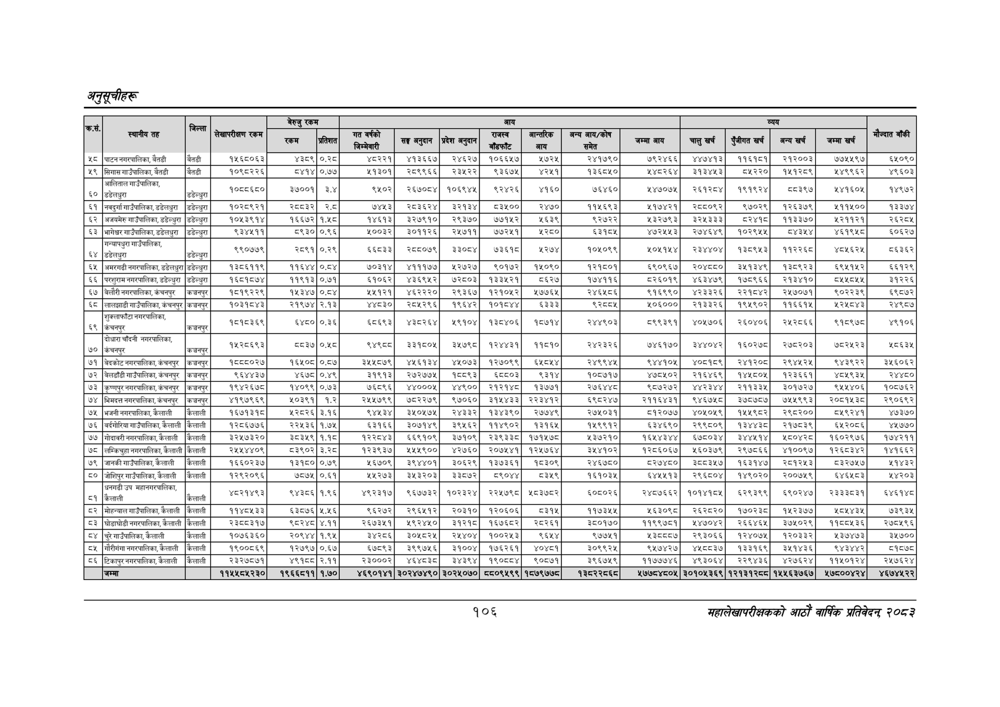

# Page 136 QA

## Rendered page


## Extracted text

```text
अनुतूचीहरू
१०६
सहालेखापरीक्षकको आठोँ वाषिकि प्रतिवेदन्‌ ७०५३

|  |  |  |  |  |  |  |  |  |  |  |  |  |  |  |  |  |  |
| --- | --- | --- | --- | --- | --- | --- | --- | --- | --- | --- | --- | --- | --- | --- | --- | --- | --- |
| का, | ३५ | जिल्ला | ले | रकम | प्रतिशत | सि | सङ्घ अनुदान | प्रदेश अनुदान | हु | आन्तरिक = | — ५ १ १ १ २ १३ ९२६ ३६ ३३ २६ ६३.८९००७२ जम्मा ५ १ १ १ २ १४ ९६५ ३६ २० २६ ९५.९१३३३८ आय ५ १ १ १ २ १५ १०२२ ३९ ४४ १७ ९५.६८०३५९ चालु ५ १ १ १ २ १६ १०५० ३५ २६ २७ ९३.६४८३३८ खर्च ५ १ १ १ २ १७ १०९२ ३९ ५६ १७ ९६.२२०६७३ पुँजीगत ५ १ १ १ २ १८ ११३२ ३५ २७ २७ ८४.०३३०५१ खर्च ५ १ १ १ २ १९ ११६८ ३५ २९ २७ ८०.०५५६५६ अन्य ५ १ १ १ २ २० १२०३ ३५ ३० २७ ६७.१६६१९१ खर्च ५ १ १ १ २ २१ १२४४ ३५ ३४ २७ ९१.४८८१७४ जम्मा ५ १ १ १ २ २२ १२८२ ३५ २३ २७ ९६.८६४२८८ खर्च ५ १ १ १ २ २३ १३३० २६ ६४ १६ ४२.३८०४६३ ४ १ १ १ ३ ० ११ ७० १३८९ १५ -१ ५ १ १ १ ३ १ ११ ७३ १५ १० ८८.०४९६१४ ५८ ५ १ १ १ ३ २ ३७ ७० १०५ १५ ६६.६५९२७१ पाटननगरपालिका,बैडी ५ १ १ १ ३ ३ १७६ ७० २४ १३ ९१.७२९२४० बैतडी ५ १ १ १ ३ ४ २४९ ७३ ५७ १० ८५.०५२५८९ १५६८०६३ ५ १ १ १ ३ ५ ३५८ ७३ ३३ १० ९१.२०८९८४ ४३८९ ५ १ १ १ ३ ६ ४०१ ७३ २७ १० ९१.१८८२४० ०.२८ ५ १ १ १ ३ ७ ४८० ७३ ४० ११ ६६.४२८६५० ४८२२१ ५ १ १ १ ३ ८ ५४७ ७३ ५० ११ ५९.४२४८४३ ४१३६६७ ५ १ १ १ ३ ९ ६२३ ७३ ४२ १० ८०.६४५४५४ २४६२७ ५ १ १ १ ३ १० ६८५ ७३ ५० १० ३५.६७१९२८ १०६६५२७ ५ १ १ १ ३ ११ ७७० ७३ ३२ १० ८३.२६१४२१ १७२५ ५ १ १ १ ३ १२ ८५१ ७३ ५० ११ ६८.६०८४४४ २४१७९० ५ १ १ १ ३ १३ ९५२ ७३ ४९ १० ८२.५७०५११ ७९२४६६ ५ १ १ १ ३ १४ १०२८ ७३ ५० ११ ८१.४९२२८७ ४४७४१३ ५ १ १ १ ३ १५ ११०४ ७३ ४९ ११ ७६.७४८२९९ ११६१८१ ५ १ १ १ ३ १६ ११८० ७३ ४९ ११ ९०.६४८४६० २१२००३ ५ १ १ १ ३ १७ १२६६ ७३ ५१ १० ३६.९९१५०५ २७५५९७ ५ १ १ १ ३ १८ १३५९ ७३ ४१ १० ३३.३४६७०३ ५४०५० ४ १ १ १ ४ ० ११ ८५ १३८८ ३० -१ ५ १ १ १ ४ १ ११ ९५ १५ १० ७६.३८८७८६ ५९ ५ १ १ १ ४ २ ३८ ९२ १०७ १४ ४५.२२३४१२ सिगासगाउँपालिका,बैती ५ १ १ १ ४ ३ १७७ ९२ २३ १३ ९४.८३३७७८ बैतडी ५ १ १ १ ४ ४ २४९ ९४ ५७ ११ ५७.१९५८७३ १०६८२२६ ५ १ १ १ ४ ५ ३५८ ९४ ३४ ११ ३७.९८५१८४ ५४१४ ५ १ १ १ ४ ६ ४०१ ९५ २८ ९ २६.७६५५२८ ०.७ ५ १ १ १ ४ ७ ४८० ९४ ४० ११ ४४.१२०१२१ ५१३०१ ५ १ १ १ ४ ८ ५४७ ९४ ५० ११ ८६.५५१५१४ २८९९६६ ५ १ १ १ ४ ९ ६२३ ९४ ४१ ११ ५.७०८४२७ ५ १ १ १ ४ १० ६९४ ९४ ४१ ११ ८६.७८०३०४ ९३६७५ ५ १ १ १ ४ ११ ७६९ ९४ ३२ ११ ५३.०६९७३३ ४२५१ ५ १ १ १ ४ १२ ८५१ ८५ ५० ३० ७७.६४३५०९ १३६८४५० ५ १ १ १ ४ १३ ९५२ ९४ ५१ ११ ४.३२६१८१ १४८२६४ ५ १ १ १ ४ १४ १०२९ ९४ ४९ ११ ६७.६९९२५७ ३१३४४३ ५ १ १ १ ४ १५ १११२ ९४ ४२ ११ ४०.७५९०१४ ८२२० ५ १ १ १ ४ १६ ११८० ९४ ५० ११ ७९.८०७७९३ १५१२८९ ५ १ १ १ ४ १७ १२६७ ९४ ४९ ११ २९.९७०७६० २४९९६२ ५ १ १ १ ४ १८ १३५८ ९४ ४१ ११ ०.०००००० ९६०३ ४ १ १ १ ५ ० १२ १०८ १३८७ ४२ -१ ५ १ १ १ ५ १ १२ १३२ १४ ११ ७३.१९३४८९ इ० ५ १ १ १ ५ २ ३८ १०८ ३८ ४२ २१.२२६६१६ पतिका ५ १ १ १ ५ ३ ८१ १०८ ५० ४२ ४२.०५४२५३ गउँपतिका ५ १ १ १ ५ ४ १७७ १३१ ३५ १५ ३०.३७२८९० ५ १ १ १ ५ ५ २४९ १२४ ५८ ११ २.६०९१३८ नबन ५ १ १ १ ५ ६ ३५१ १२४ ३९ ११ ३२.५०२१९७ २७००१ ५ १ १ १ ५ ७ ४१० १२४ १९ १० २६.१९०९२० ३०४ ५ १ १ १ ५ ८ ४८९ १२४ ३१ ११ ८२.५४७२०३ ९५०२ ५ १ १ १ ५ ९ ५४७ १२४ ५१ ११ ८०.४०५२७३ २६७०८४ ५ १ १ १ ५ १० ६१५ १२४ ४९ ११ ८३.७५३८९१ १०६९४५ ५ १ १ १ ५ ११ ६९४ १२४ ४१ ११ ४०.६६४८९४ ९२४२६ ५ १ १ १ ५ १२ ७६९ १२४ ३४ ११ ९५.४९७४३७ ४१६० ५ १ १ १ ५ १३ ८५९ १२४ ४२ ११ ९१.७७४१७० ७६४६० ५ १ १ १ ५ १४ ९५२ १२५ ५० १० ११.९२५३४४ १४७०७५ ५ १ १ १ ५ १५ १०२८ १२४ ५० ११ ७९.८१५९९४ २६१२८४ ५ १ १ १ ५ १६ ११०४ १२४ ५० ११ ८५.३०१०७९ १९१९२४ ५ १ १ १ ५ १७ ११८८ १२४ ४२ ११ ०.०००००० ८८३९७ ५ १ १ १ ५ १८ १२६७ १२४ ५० ११ ११.७७५१३१ ४४१६०४५ ५ १ १ १ ५ १९ १३५९ १२४ ४० ११ ७४.८२७१२६ १४९७२ ४ १ १ १ ६ ० १२ १५२ १३८८ १५ -१ ५ १ १ १ ६ १ १२ १५४ १३ १० ९३.४४४७४० ६१ ५ १ १ १ ६ २ ३२ १४४ ३८ ३० ७८.२९८३०९ नवदुर्गा ५ १ १ १ ६ ३ ७३ १४४ ४८ ३० ०.०००००० गाउँपालिका, ५ १ १ १ ६ ४ १२६ १४४ ४२ ३० ०.०००००० डडेलधुरा ५ १ १ १ ६ ५ १७६ १५२ ३६ १५ ०.०००००० डडेल्ब। ५ १ १ १ ६ ६ २४९ १५४ ५७ १० ०.०००००० १०२८९२१ ५ १ १ १ ६ ७ ३५० १५४ ४० १० ३.९८३०४९ स्वय३२ ५ १ १ १ ६ ८ ४१० १५४ १९ १० ९४.५४४४४९ २.८ ५ १ १ १ ६ ९ ४८९ १५४ ३२ १० ९१.५६२४८५ ७४५३ ५ १ १ १ ६ १० ५४७ १५४ ५१ १० ६१.१८८५५३ र२८३६२४ ५ १ १ १ ६ ११ ६२४ १५४ ४१ १० ६६.१६५६२७ इ२१३४ ५ १ १ १ ६ १२ ६९४ १५४ ४१ १० ०.०००००० ३५०० ५ १ १ १ ६ १३ ७७० १५४ ३३ १० ८६.०२६४३६ र२४७० ५ १ १ १ ६ १४ ८५१ १५४ ५० १० ७८.५४२९८४ ११५६९३ ५ १ १ १ ६ १५ ९५२ १५४ ४९ १० ३२.१९४७४० ११७४२१ ५ १ १ १ ६ १६ १०२८ १५४ ४९ १० ३५.३१४२५५ २८८०९२ ५ १ १ १ ६ १७ १११३ १५४ ४१ १० ९१.४३९८८० ९७०२९ ५ १ १ १ ६ १८ ११८० १५४ ५० १० ८६.५१६७५४ १२६
```

## Flags
- table_page
- medium_quality_table
