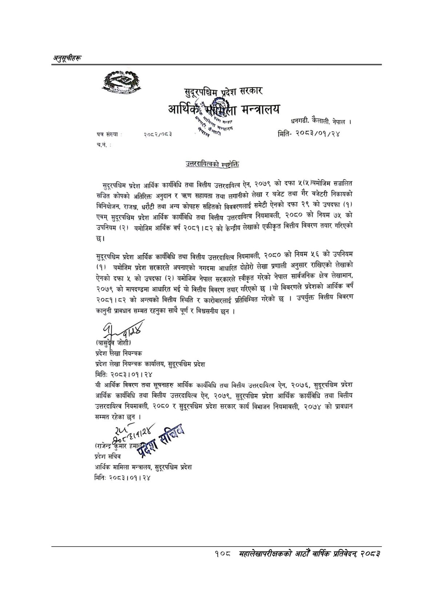

# Page 138 QA

## Rendered page


## Extracted text

```text
अनुतूचीहरू
५३
पत्र संल्या
२०८२/०८३
च.नं.
प्रदेश सरकार
{ मन्त्रालय
सुदूरपश्चिम वमा आर्थिक हने काका सम्झ: |
उत्तरदायित्वको स्पष्टोक्ति
सुदूरपश्चिम प्रदेश आर्थिक कार्यविधि तथा वित्तीय उत्तरदायित्व ऐन, २०७९ को दफा ५(५ वमोजिम सञ्चालित सञ्चित कोषको अतिरिक्त अनुदान र त्रण सहायता तथा लगानीको लेखा र वजेट तथा गैर बजेटरी निकायको विनियोजन, राजश्व, धरौटी तथा अन्य कोपहरु सहितको विववरणलाई समेटी ऐनको दफा २९ को उपदफा (१) एवम्‌ सुदूरपश्चिम प्रदेश आर्थिक कार्यविधि तथा वित्तीय उत्तरदायित्व नियमावली, २०८० को नियम ७५ को उपनियम (२) बमोजिम आर्थिक वर्ष २०८१।८२ को केन्द्रीय लेखाको एकीकृत वित्तीय विवरण तयार गरिएको छ।
सुदूरपश्चिम प्रदेश आर्थिक कार्यविधि तथा वित्तीय उत्तरदायित्व नियमावली, २०८० को नियम ५६ को उपनियम (१) बमोजिम प्रदेश सरकारले अपनाएको नगदमा आधारित दोहोरो लेखा प्रणाली अनुसार राखिएको लेखाको ऐनको दफा ५ को उपदफा (२) वमोजिम नेपाल सरकारले स्वीकृत गरेको नेपाल सार्वजनिक क्षेत्र लेखामान, २०७९ को मापदण्डमा आधारित भई यो वित्तीय विवरण तयार गरिएको छ। यो विवरणले प्रदेशको आर्थिक वर्ष २०८१।८२ को अन्त्यको वित्तीय स्थिति र कारोबारलाई प्रतिविम्वित गरेको छ। उपर्युक्त वित्तीय विवरण कानुनी प्रावधान सम्मत रहनुका साथै पूर्ण र विश्वसनीय छुन।
२: मिति: २०८३।०१। २४
प्रदेश लेखा नियन्त्रक प्रदेश लेखा नियन्त्रक कार्यालय, सुदूरपश्चिम प्रदेश
यी आर्थिक विवरण तथा सूचनाहरु आर्थिक कार्यविधि तथा वित्तीय उत्तरदायित्व ऐन, २०७६, सुदूरपश्चिम प्रदेश आर्थिक कार्यविधि तथा वित्तीय उत्तरदायित्व ऐन, २०७९, सुदूरपश्चिम प्रदेश आर्थिक कार्यविधि तथा वित्तीय उत्तरदायित्व नियमावली, २०८० र सुदूरपश्चिम प्रदेश सरकार कार्य विभाजन नियमावली, २०७४ को प्रावधान सम्मत रहेका छुन |
हा
२७
२
ही
क्र
ल्हु
हा
२७
२
ही
(राजेन्द्र
क्र
ल्हु
प्रदेश
सचिव
आर्थिक मामिला मन्त्रालय, सुदूरपश्चिम प्रदेश
मिति:
२०८३।०१। २४
धनगढी, कैलाली, नेपाल। मिति२०८३/०१/२४
१०८
सहालेखापरीक्षकको आठौँ वार्षिक प्रतिवेदन २०८२
```

## Flags
- None
