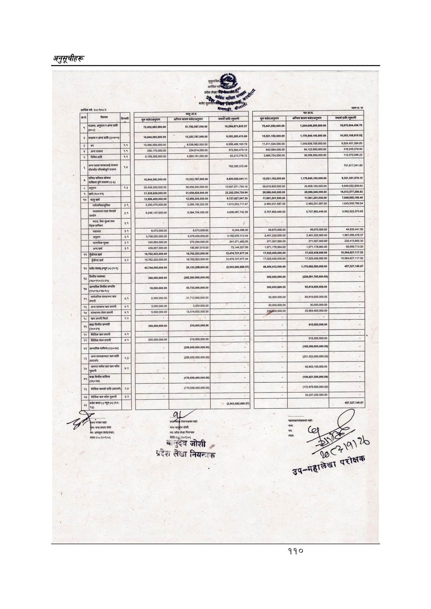

# Page 140 QA

## Rendered page


## Extracted text

```text
१
०३५
छ
०४
३०
३०
२१८२
३०७०१०८५५७।.
लल
६७)
(०३०
२
२
००'०००'००२'४५२
५८
०४०
७
कर.
|(०००००००४४/७८८)
हि
न
(७००००००/
७७०८)
एरा)
|(००:०००००८।२७/७६५)
(७४०००/००/
७७०८).
२२:८-०:/७
३०७
छ
०००००००१
€०८
५
७७
७७,८२२,
व्रि
००
०००'०००'५०८'१५२)
(०००००'००००००'९५२)
सकन
[५]
लल
तल्ला
०००००००००१२
०००००००००५८
[१]
२००७
५७
००
[५
न
तल्ला
्ल्ता
००००००७०%७
७८
००००००९८
०००००००५
०००००००००८
०००००००००६
[००००
००००००००४
०००००००७/७।४
७९.
०००००००००६
००००००७४:८५६
००००००००४
्ल्लिााा
तल्ला
४
५
हल्लाका
७५
कट)
लत्ता
(००
०००’००८
[रि
९००००/७८
७७७८
[न्णन्मन्ाथन
]०००००७७/५२०८।
०००००७६०/५८०८।
[०००००६०
२०८७
०००००
र७८७।.
ललल
या
[०००७०००/७८७
००६:८/७००७९
[०००९७८/:१८०।
००८०७००:६८
००६१९१९५५८१
०००००२५२
६८
०६५७४५८००७८
०००००८००८८
००००००००८८
०
१
०००००६२%
०००००८८०२
००००००२२१००२
००००००७५
७०८६
७०१९/५७७०९.
००००००९६
००००००८७७
००७०१०८९.
०००००६८०४
०००००८२०८
०
००७
७७४:८०८७.
००७१/७७७:८०८५
कट२२भ७०७५
००७५०१७/९००७.
०००००७०७८७
०७६:०७७७७।
००/
७८०७"
ललल
ताला
तल्ला
७
[००००
७२४५]
१९
०९०२९९१६०७९६.
७००००००:
७०७८
०००००००६६१६६५
९१
६
१६२६९०१
०००००००८
८.
०००००००८०५५५
००७००८६८७७०७
०००००
छ५०४९।.
०००००००४७७०७८
०००००१८८७५४६
०००००%७:०७०.
०००००७५०७४४७
०
०००००००८७२१७८
०००००६८२९
७]
०००००५८।
०७८
६४०६१९/
७२४६
०००००/००'९५९'६०'
०००००''
००'०००'०५०'९६'०४
र
०००००१८०८२४५
०००००
न
क२३
७०
२७७
४०
४०,००७
२
७०८८
२
२९
[पना
पल
९०७२०६
०२८०.
को
१
०३५
छ
०४
३०
३०
२१८२
०४४

| M         |                   | n          |
|-----------|-------------------|------------|
| .         | र L) न क२३ ७0 २७७ |            |
| l         | (hoot) s e s o)   |            |
| ०० &#124; | २००७ 5७ &#124;    | [1]        |
| H         | m                 |            |
| [५]       | सकन               | n Ei]      |
| व्रि      | m ७७ ७७,822, s    | u A &#124; |
| fl         | m 22:8-०:/७ 3०७   |            |
| H         | एरा) g o gy       |            |
| [%:]      | ol 04० ७ कर.      | m A        |
| [-:]      | ६७) (03० 2 2      |            |

| [ &#124;              | [ &#124;               | [ &#124;        |
|-----------------------|------------------------|-----------------|
| iwi2pn 29             | inbR2p ७०८8 kgl        | wshgmpme 4०,००७ |
| m 00000 cITONZL       | w 000001808245         | m P             |
| m                     | m                      | m               |
| 00'000'050'96¥'04     | &#124; ovooozssies's © | [scosveareses   |
| ०००००५८। 0७८          |                        | 7]              |
| ०००००७५०७४४७          | [&#124; ०००००%७:०७०.   | [zwoweizes      |
|                       |                        | m               |
| 00000 छ५०४9।.         | 0०७००८६८७७०७           | w               |
| 000000080555          | 00000008 BSY 8E.       | 91 V6LV 1626901 |
| [०००० ७२४५]           | 7                      |                 |
| [ovooosorosszs &#124; |                        |                 |
| &#124; ovooomresez    | [oowrmesrz             | sz              |
| 0००००७०७८७            | 00७50१७/9०0७.          | कट22भ७०७५       |
| 000008208             | ०००००६८०४              | ००७०१०८9.       |
| 0०००००७५ ७०८६         | &#124; ovooooevewoy    | [wacsosee       |
| 000008802             | 00000v62%UZ            | 0zey 1M         |
| 00000252 68y          | 00619195581            | ००८०७००:६८      |
| [0००७०००/७८७ &#124;   | &#124; wowwszn         | [veusionuvn     |
| 00000z र७८७।.         | [०००००६० २०८७          | [wusarwran      |
| [न्णन्मन्ाथन          | ९००००/७८ ७७७८          | [रि             |
| m                     | (00 000’008 ces'zac)   | - =             |
| m ४                   | w                      | _               |
| 0०००००००४             | ००००००७४:८५६           |                 |
| 0०००००००४             | [००००                  |                 |
| 00000005              | [ovowweion             | -               |
| ्ल्ता                 | तल्ला                  | [5 न            |
| 00000000058           | 00000000012            |                 |
| &#124; -              | तल्ला                  |                 |
| &#124; _              | (00000'000000'952)     |                 |
|       
```

## Flags
- table_page
- medium_quality_table
