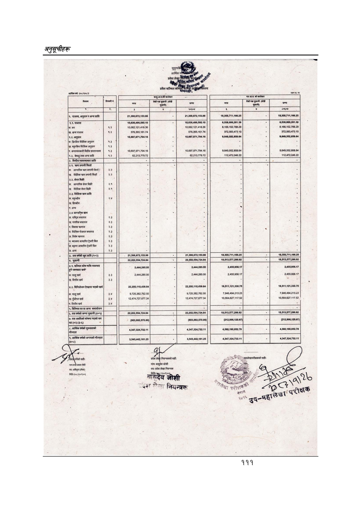

# Page 141 QA

## Rendered page


## Extracted text

```text
अनुतूचीहरू
आर्थिक
वर्ष;
२०८
४०८२
३
छन
लि
का
क
पल
पस:
मठसन
रउल्यम
राजस्व,
अनुदान
र
अन्य
प्राप्ति
न्ह्ह्त्त
न्ल्त्त्
१.४.
राजस्व
१०,६३८,४८६,५८०.१०
१०,६३८,४८६,५८०.१०
२
२
१०,०६२,१२१,४१८.३६
१०,०६२:१२१,४१८.३६
८,१६६,१०२७८८.२९
|ख.
अन्य
राजस्व
(५}
५७६,३६५,१६१.७४
५७६,३६५.१६१.७४
३७२५८३.४७३.१०
९.२,
अनुदान
१०,६०७,९७१,७९४:१६
१०,६०७,०७१,७९४.१६
वैदेशिक
अनुदान
१.३
छ
|ग.
अन्तरसरकारी
वितीय
हस्तान्तरण
१.३
१०,६०७,९७१,७०४.१६
१०,६०७.९७१.७९४.१६.
१.३,
बेरूजु
तथा
अन्य
प्राप्ति
१.२
६२२१३,७७९.७२
६२.२१३,७७९.७२
(२.१.
क्रण
लगानी
फिर्ता
|क.
आन्तरिक
क्रण
लगानी
फिर्ता
२.२
बैदेशिक
क्रण
लगानी
फिर्ता
|क.
आन्तरिक
शेयर
बिक्री
१
२१
|ख.
वैदेशिक
शेयर
बिक्री
२४
२.३.
वैदेशिक
त्रहण
प्राप्ति
|क.
बहुपक्षीय
२४
|ख.
द्विपक्षीय
अन्य
२.४
आन्तरिक
त्ण
क.
राष्ट्रिय
बचतपत्र
२३
|[ख.
नागरिक
बचतपत्र
३
विकास
क्रणपत्र
२३
घ.
वैदेशिक
रोजगार
बचतपत्र
२३
छौँ
[ङ.
विशेष
श्रणपत्र
२३
|च.
ब्याजमा
आधारित
ट्रेजरी
बिल
२३
[छ.
बट्टामा
आधारित
ट्रेजरी
बिल
२३
[उ
अन्य
हँ
२.३
यस
वर्षको
खुद
प्राप्त
(१०२)
२,३९८,०७२,१५३:३०
२१,३९८,६७२,१५३.९८
भुक्तानी
२२,२०२,५५४,७२४.८४
४.१.
सञ्चित
कोष
माथि
व्ययभार
[हुने
रकमबाट
खर्च”
|क.
चालु
खर्च
२,४४४,२८५.००
[ख.
वित्तीय
खर्च
३३
.२.
विनियोजन
ऐनद्वारा
भएको
खर्च
२२,२००११०४३९.८४.
२२.२००,११०४३०.८४
१८,५११,१२१,३३०७५.
१८,५११,१२१,३३०.७५
|क.
चालु
खर्च
३४
९,७२५,३६२,७६२-५०.
९.७२५,३८२.७६२.५०
७.९४६,४९४.२१३२३
७९४६४९४२१३२३
पुँजीगत
खर्च
३४
१२काकाराहा७३४
१२,४७४,७२७
६७७.३४
१०,५६४,६२७,११७.५२
।ग.
वित्तीय
खर्च
३४
साललाई
२थ२०२,५५४२२४८४]
७१]
२२,२०२,५५४,१२४.८४
(८०३,८८२,५७०.८६)
(८०३,८८२,५७०.८६)
४३४७३२४७३२११
३,५४३,४४२,१६१.२५
पः्चन्द
प्रसाद
जैशी
नामः पद प्रदेश लेखा नियन्त्रक
पद:
अधिकृत
(लेखा)
मितिः२०८२।०९०६
लरसिदैव
जोशी
१११

|  |  |  |  |  |  |  |  |  |
| --- | --- | --- | --- | --- | --- | --- | --- | --- |
|  |  |  |  |  |  |  |  |  |
|  |  |  |  |  |  |  |  |  |
|  |  |  | ला |  | जुन |  |  |  |
| — छ = | ०\| |  | ना |  | जा \| \| |  | डा \| | छ |
|  |  |  |  |  |  |  |  |  |
| छा. बैदेशिक रोजगार बचतपत्र [ लन | २३ |  |  |  | छ. छ: |  | छ |  |
| कै ललल छालाले (१०२). |  |  | २१३०८६७२१५३९८ |  | ३०७२१५३९८ |  | १८.३००.७११,१०८.२५. |  |
|  |  |  |  |  | बिमला |  |  |  |
| कचालु खर्च [. _— | क्र |  | २४४४२८५०० छ र हन | - न | २४४४२८५०० अब पल |  | छ २४५८९५८१७ अक \|? | उ |
| पाका |  |  |  |  |  |  |  |  |
|  |  |  |  |  |  |  | नमो |  |
|  |  |  |  |  | २२.५७०.००) |  |  |  |
|  |  |  |  |  | जतन |  |  |  |
| टुका अको न |  |  |  |  |  |  |  | २ |
```

## Flags
- table_page
- low_quality_table
