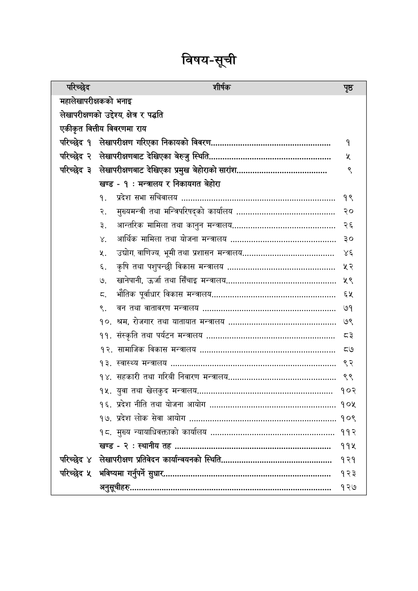

# Page 7 QA

## Rendered page


## Extracted text

```text
विषय-सूची

| परिच्छेद                                 | शीर्षक                                                                                      | पृष्ठ   |
|------------------------------------------|---------------------------------------------------------------------------------------------|---------|
| महालेखापरीक्षकको भनाइ                    |                                                                                             |         |
| लेखापरीक्षणको उद्देश्य, क्षेत्र र पद्धति |                                                                                             |         |
| परिच्छेद १                               | लेखापरीक्षण गरिएका निकायको विवरण.........................,,,,:777-74447477777 77०           | १       |
| परिच्छेद २                               | लेखापरीक्षणबाट देखिएका बेरुजु स्थिति.................                                       | Y       |
| परिच्छेद 3                               |                                                                                             |         |
|                                          | खण्ड - १ : मन्त्रालय र निकायगत बेहोरा                                                       |         |
|                                          | १. प्रदेश सभा सचिवालय .................... 4444 se e sae s s s senas                        | १९      |
|                                          | २. मुख्यमन्त्री तथा मन्त्रिपरिषद्को कार्यालय ...................,नन,77777717777777777       | २०      |
|                                          | ३. आन्तरिक मामिला तथा कानुन मन्त्रालय,                                                      | २६      |
|                                          | ४. आर्थिक मामिला तथा योजना मन्त्रालय .................,न1447444774477444गगगककन              | ३०      |
|                                          | ५. उद्योग, वाणिज्य, भूमी तथा प्रशासन मन्त्रालय............................,14-47711777      | ४६      |
|                                          | ६. कृषि तथा पशुपन्छी विकास मन्त्रालय oo                                                     | ५२      |
|                                          | ७. खानेपानी, उर्जा तथा सिँचाइ AR                                                            | ५९      |
|                                          | ८. भौतिक पूर्वाधार विकास HATT. ...                                                          | &Y      |
|                                          | ९. वन तथा वातावरण मन्त्रालय oooovevorerreeserreesesesseseesesessessessesnaesns              | ७१      |
|                                          | १०, श्रम, रोजगार तथा यातायात मन्त्रालय ................4.4474444-न22 1 ककन                  | ७९      |
|                                          | ११. संस्कृति तथा पर्यटन मन्त्रालय oo                                                        | o3      |
|                                          | १२. सामाजिक विकास मन्त्रालय                                                                 | ८७      |
|                                          | १३. स्वास्थ्य मन्त्रालय .................. 44, न st ssesesae st s s                         | ९२      |
|                                          | १४. सहकारी तथा गरिबी निवारण Bl                                                              | ९९      |
|                                          | १५. युवा तथा खेलकुद मन्त्रालय....................,. नन, ककन पनककननममममममममममान              |         |
|                                          | १६. प्रदेश नीति तथा योजना आयोग                                                              |         |
|                                          | १७. प्रदेश लोक सेवा आयोग ............                                                       |         |
|                                          | १८. मुख्य न्यायाधिवक्ताको कार्यालय                                                          |         |
|                                          | खण्ड - २ : स्थानीय तह eovererrereereseesesessessesssssesssssssssesasse
```

## Flags
- table_page
- medium_quality_table
