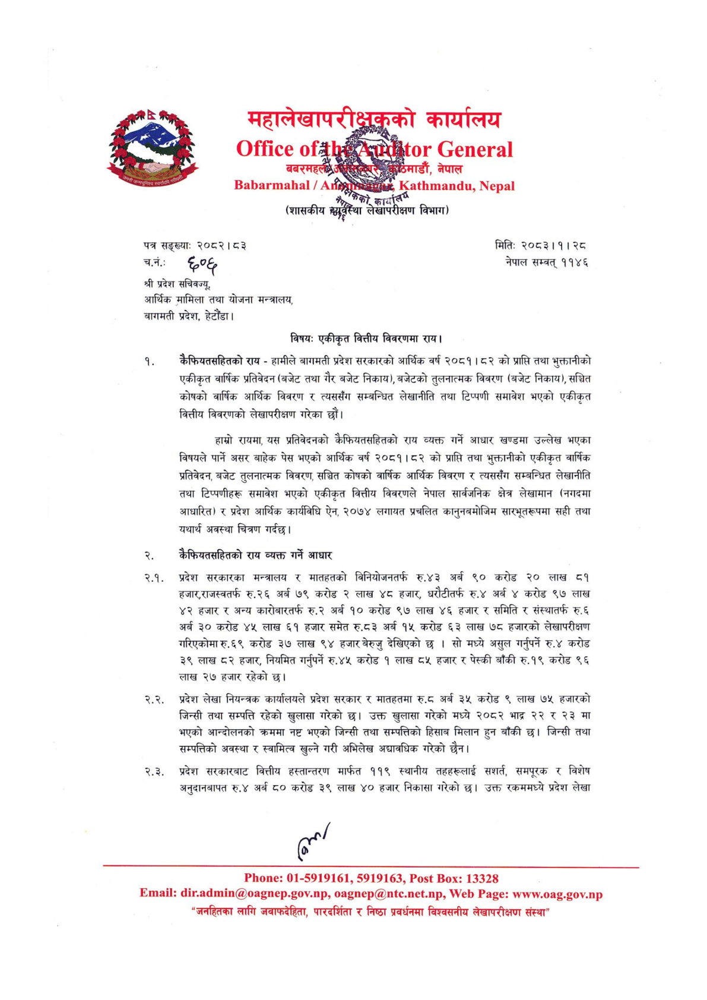

# Page 13 QA

## Rendered page


## Extracted text

```text
कैफियतसहितको राय -हामीले बागमती प्रदेश सरकारको आर्थिक वर्ष २०८१।८२ को प्राप्ति तथा भुक्तानीको एकीकृत वार्षिक प्रतिवेदन (बजेट तथा गैर बजेट निकाय), बजेटको तुलनात्मक विवरण (बजेट निकाय), सञ्चित कोषको वार्षिक आर्थिक विवरण र त्यससँग सम्बन्धित लेखानीति तथा टिप्पणी समावेश भएको एकीकृत वित्तीय विवरणको लेखापरीक्षण गरेका छौं।
महालेखापरी कार्यालय का र्णः [०१
३§
ठमाडौं,
नेपाल
३०]
(शासकीय कार्या न पप विभाग)
पत्र सङ्ख्या:
२०८२। ८३
चन छ््ग्क श्री प्रदेश सचिवज्यू, आर्थिक मामिला तथा योजना मन्त्रालय,
बागमती प्रदेश, हेटौंडा।
विषय: एकीकृत वित्तीय विवरणमा राय।
हाम्रो रायमा, यस प्रतिवेदनको कैफियतसहितको राय व्यक्त गर्ने आधार खण्डमा उल्लेख भएका विषयले पार्ने असर बाहेक पेस भएको आर्थिक वर्ष २०८१।८२ को प्राप्ति तथा भुक्तानीको एकीकृत वार्षिक प्रतिवेदन, बजेट तुलनात्मक विवरण, सञ्चित कोषको वार्षिक आर्थिक विवरण र त्यससँग सम्बन्धित लेखानीति तथा टिप्पणीहरू समावेश भएको एकीकृत वित्तीय विवरणले नेपाल सार्वजनिक क्षेत्र लेखामान (नगदमा आधारित) र प्रदेश आर्थिक कार्यविधि ऐन, २०७४ लगायत प्रचलित कानुनबमोजिम सारभूतरूपमा सही तथा यथार्थ अवस्था चित्रण गर्दछ।
छ क्ैफियतसहितको राय व्यक्त गर्ने आधार
२.१. प्रदेश सरकारका मन्त्रालय र मातहतको विनियोजनतर्फ रु.४३ अर्ब ९० करोड २० लाख ८१ हजार,राजस्वतर्फ रु.२६ अर्ब ७९ करोड २ लाख ४८ हजार, धरौटीतर्फ अर्ब ४ करोड ९७ लाख ४२ हजार र अन्य कारोबारतर्फ रु.२ अर्ब १० करोड ९७ लाख ४६ हजार र समिति र संस्थातर्फ रु.६ अर्ब ३० करोड ४५ लाख ६१ हजार समेत रु.८३ अर्ब १५ करोड ६३ लाख ७८ हजारको लेखापरीक्षण गरिएकोमा रु.६९ करोड ३७ लाख ९४ हजार बेरुजु देखिएको छ | सो मध्ये असुल गर्नुपर्ने रु.४ करोड ३९ लाख ८२ हजार, नियमित गर्नुपर्ने रु.४५ करोड १ लाख ८५ हजार र पेस्की बाँकी रु.१९ करोड ९६ लाख २७ हजार रहेको |
२.२. प्रदेश लेखा नियन्त्रक कार्यालयले प्रदेश सरकार र मातहतमा रु. अर्ब ३५ करोड ९ लाख ७५ हजारको जिन्सी तथा सम्पत्ति रहेको खुलासा गरेको छ। उक्त खुलासा गरेको मध्ये २०८२ भाद्र २२ र २३ मा भएको आन्दोलनको क्रममा नष्ट भएको जिन्सी तथा सम्पत्तिको हिसाव मिलान हुन बाँकी छ। जिन्सी तथा सम्पत्तिको अवस्था र स्वामित्व खुल्ने गरी अभिलेख अद्यावधिक गरेको छैन।
२.३. प्रदेश सरकारबाट वित्तीय हस्तान्तरण मार्फत ११९ स्थानीय तहहरूलाई सशर्त, समपूरक र विशेष अनुदानबापत रु.४ अर्ब ८० करोड ३९ लाख ४० हजार निकासा गरेको छ। उक्त रकममध्ये प्रदेश लेखा
पा
मितिः २०८३।१। २८ नेपाल सम्वत्‌ ११४६
: ०१-५९१९१६१, ५९१९१६३, : १३३२८ : .., .., : ... "जनहितका लागि जवाफदेहिता, पारदर्शिता र निष्ठा प्रवर्धनमा विश्वसनीय लेखापरीक्षण संस्था"
```

## Flags
- None
