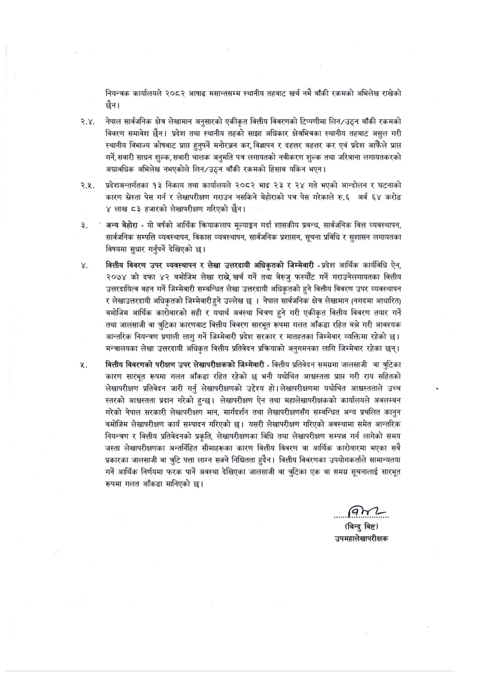

# Page 14 QA

## Rendered page


## Extracted text

```text
नियन्त्रक कार्यालयले २०८२ आषाढ मसान्तसम्म स्थानीय तहबाट खर्च नभै बाँकी रकमको अभिलेख राखेको छैन।
क नेपाल सार्वजनिक क्षेत्र लेखामान अनुसारको एकीकृत वित्तीय विवरणको टिप्पणीमा लिन/उठ्न बाँकी रकमको विवरण समावेश छैन। प्रदेश तथा स्थानीय तहको साझा अधिकार क्षेत्रभित्रका स्थानीय तहबाट असुल गरी स्थानीय विभाज्य कोषबाट प्राप्त हुनुपर्ने मनोरञ्जन कर, विज्ञापन र दहत्तर बहत्तर कर एवं प्रदेश आफैंले प्राप्त गर्ने, सवारी साधन शुल्क, सबारी चालक अनुमति पत्र लगायतको नवीकरण शुल्क तथा जरिबाना लगायतकरको अद्यावधिक अभिलेख नभएकोले लिन/उठ्न बाँकी रकमको हिसाब यकिन भएन।
० प्रदेशअन्तर्गतका १३ निकाय तथा कार्यालयले २०८२ भाद्र २३ र २४ गते भएको आन्दोलन र घटनाको कारण स्रेस्ता पेस गर्न र लेखापरीक्षण गराउन नसकिने बेहोराको पत्र पेस गरेकाले रु.६ अर्ब ६४ करोड लाख ८३ हजारको लेखापरीक्षण गरिएको छैन।
" अन्य बेहोरा -यो वर्षको आर्थिक क्रियाकलाप मूल्याङ्कन गर्दा शासकीय प्रबन्ध, सार्वजनिक वित्त व्यवस्थापन, सार्वजनिक सम्पत्ति व्यवस्थापन, विकास व्यवस्थापन, सार्वजनिक प्रशासन, सूचना प्रविधि र सुशासन लगायतका विषयमा सुधार गर्नुपर्ने देखिएको छ।
वित्तीय विवरण उपर व्यवस्थापन र लेखा उत्तरदायी अधिकृतको जिम्मेवारी -प्रदेश आर्थिक कार्यविधि ऐन, २०७४ को दफा ४२ बमोजिम लेखा राख, खर्च गर्ने तथा बेरुजु फस्यौट गर्ने गराउनेलगायतका वित्तीय उत्तरदायित्व वहन गर्ने जिम्मेवारी सम्बन्धित लेखा उत्तरदायी अधिकृतको हुने वित्तीय विवरण उपर व्यवस्थापन र लेखाउत्तरदायी अधिकृतको जिम्मेवारी हुने उल्लेख छ। नेपाल सार्वजनिक क्षेत्र लेखामान (नगदमा आधारित) बमोजिम आर्थिक कारीबारको सही र यथार्थ अवस्था चित्रण हुने गरी एकीकृत वित्तीय विवरण तयार गर्ने तथा जालसाजी वा त्रुटिका कारणबाट वित्तीय विवरण सारभूत रूपमा गलत आँकडा रहित बन्ने गरी आवश्यक आन्तरिक नियन्त्रण प्रणाली लागु गर्ने जिम्मेवारी प्रदेश सरकार र मातहतका जिम्मेवार व्यक्तिमा रहेको छ। मन्त्रालयका लेखा उत्तरदायी अधिकृत वित्तीय प्रतिवेदन प्रक्रियाको अनुगमनका लागि जिम्मेवार रहेका छन्‌।
वित्तीय विवरणको परीक्षण उपर लेखापरीक्षकको जिम्मेवारी -वित्तीय प्रतिवेदन समग्रमा जालसाजी वा त्रुटिका कारण सारभूत रूपमा गलत आँकडा रहित रहेको छ भनी यथोचित आश्चस्तता प्राप्त गरी राय सहितको लेखापरीक्षण प्रतिवेदन जारी गर्नु लेखापरीक्षणको उद्देश्य हो। लेखापरीक्षणमा यथोचित आध्चस्तताले उच्च स्तरको आश्वस्तता प्रदान गरेको हुन्छ। लेखापरीक्षण ऐन तथा महालेखापरीक्षकको कार्यालयले अवलम्बन गरेको नेपाल सरकारी लेखापरीक्षण मान, मार्गदर्शन तथा लेखापरीक्षणसँग सम्बन्धित अन्य प्रचलित कानुन बमोजिम लेखापरीक्षण कार्य सम्पादन गरिएको छ। यसरी लेखापरीक्षण गरिएको अवस्थामा समेत आन्तरिक नियन्त्रण र वित्तीय प्रतिवेदनको प्रकृति, लेखापरीक्षणका विधि तथा लेखापरीक्षण सम्पन्न गर्न लागेको समय जस्ता लेखापरीक्षणका अन्तर्निहित सीमाहरूका कारण वित्तीय विवरण वा आर्थिक कारोबारमा भएका सबै प्रकारका जालसाजी वा त्रुटि पत्ता लाग्न सक्ने निश्चितता हुदैन। वित्तीय विवरणका उपयोगकर्ताले सामान्यतया गर्ने आर्थिक निर्णयमा फरक पार्ने अवस्था देखिएका जालसाजी वा त्रुटिका एक वा समग्र सूचनालाई सारभूत रूपमा गलत आँकडा मानिएको |
(बिन्दु बिष्ट) उपमहालेखापरीक्षक
```

## Flags
- None
