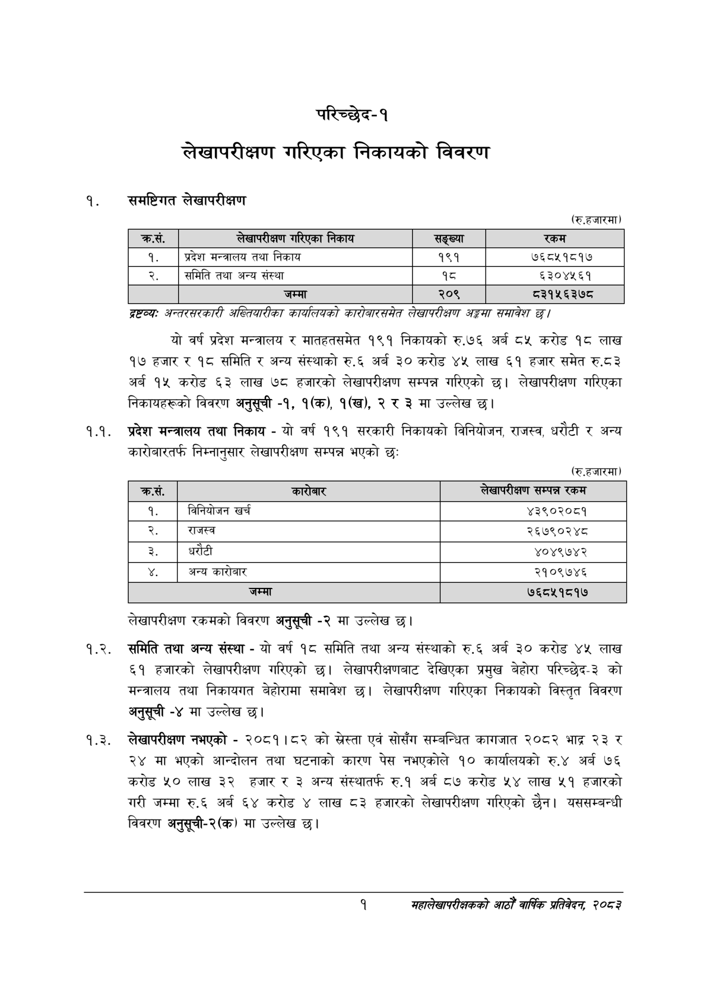

# Page 17 QA

## Rendered page


## Extracted text

```text
परिच्छेद-१
लेखापरीक्षण गरिएका निकायको विवरण
समष्टिगत लेखापरीक्षण
(रु.हजारमा)
।
।
।
द्रष्टव्यः अन्तरसरकारी अख्तियारीका कार्यलियको कारोबारसमेत लेखापरीक्षण अङ्कसा समावेश |
यो वर्ष प्रदेश मन्त्रालय र मातहतसमेत १९१ निकायको रु.७६ अर्ब ८५ करोड १८ लाख १७ हजार र १८ समिति र अन्य संस्थाको रु.६ अर्ब ३० करोड ४५ लाख ६१ हजार समेत रु.८३ अर्ब १५ करोड ६३ लाख ७८ हजारको लेखापरीक्षण सम्पन्न गरिएको छ। लेखापरीक्षण गरिएका निकायहरूको विवरण अनुसूची -१, १(क), १(ख), २ र ३ मा उल्लेख छ।
१.१. प्रदेश मन्त्रालय तथा निकाय -यो वर्ष १९१ सरकारी निकायको विनियोजन, राजस्व, धरौटी र अन्य कारोबारतर्फ निम्नानुसार लेखापरीक्षण सम्पन्न भएको छ:
(रु.हजारमा)
लेखापरीक्षण रकमको विवरण अनुसूची -२ मा उल्लेख छ।
१.२. समिति तथा अन्य संस्था -यो वर्ष १८ समिति तथा अन्य संस्थाको रु.६ अर्ब ३० करोड ४५ लाख ६१ हजारको लेखापरीक्षण गरिएको छ। लेखापरीक्षणबाट देखिएका प्रमुख बेहोरा परिच्छेद-३ को मन्त्रालय तथा निकायगत बेहोरामा समावेश छ। लेखापरीक्षण गरिएका निकायको विस्तृत विवरण अनुसूची -४ मा उल्लेख छ।
१.३. लेखापरीक्षण नभएको -२०८१।८२ को स्लेस्ता एवं सोसँग सम्बन्धित कागजात २०८२ भाद्र ३ र २४ मा भएको आन्दोलन तथा घटनाको कारण पेस नभएकोले १० कार्यालयको रु.४ अर्ब ७६ करोड लाख ३२ हजार र ३ अन्य संस्थातर्फ रु.१ अर्ब ८७ करोड ५४ लाख ४५१ हजारको गरी जम्मा रु.६ अर्ब ६४ करोड लाख ८३ हजारको लेखापरीक्षण गरिएको छैन। यससम्बन्धी विवरण अनुसूची-२(क) मा उल्लेख छ।
१
महालेखापरीक्षकको आठौँ वाषिकि प्रतिवेदन २०८२

| क्रस. | लेखापरीक्षण न २५क। निकाय | सङ्ख्या | रकम |
| --- | --- | --- | --- |
| १. | प्रदेश भन्त्रालष तथा निकाय | १९१ | ७६८५१८१७ |
| २. | समिति तथा अन्य संस्था | १८ | ६३०४५६१ |
|  | जम्मा | २०९ | ८३१५६३७८ |

| क्रस. | कारेबार | लेखापरीक्षण सम्पन्न रकम |
| --- | --- | --- |
| १. | विनिवोजन खर्च | ४३९०२०८१ |
| २. | राजस्व | २६७९०२४८ |
| ३. | धरौटी | ४०४९७४२ |
|  | अन्य कारोबार | २१०९७४६ |
|  | जम्मा | ७६८५१८१७ |
```

## Flags
- table_page
- medium_quality_table
