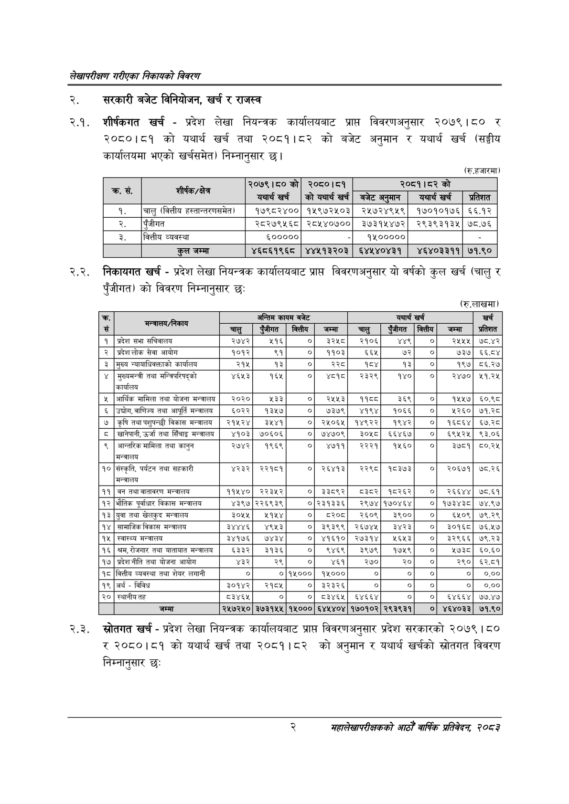

# Page 18 QA

## Rendered page


## Extracted text

```text
लेखापरीक्षण गरीएका निकायको विवरण
सरकारी बजेट विनियोजन, खर्च र राजस्व
शीर्षकगत खर्च -प्रदेश लेखा नियन्त्रक कार्यालयबाट प्राप्त विवरणअनुसार २०७९।८० र २०८०।८१ को यथार्थ खर्च तथा २०८१।८२ को बजेट अनुमान र यथार्थ खर्च (सङ्घीय कार्यालयमा भएको खर्चसमेत) निम्नानुसार छ।
२.२. निकायगत खर्च -प्रदेश लेखा नियन्त्रक कार्यालयबाट प्राप्त विवरणअनुसार यो वर्षको कुल खर्च (चालु र पुँजीगत) को विवरण निम्नानुसार छः
(रु.हजारमा)
(रु.लाखमा
२.३. स्रोतगत खर्च -प्रदेश लेखा नियन्त्रक कार्यालयबाट प्राप्त विवरणअनुसार प्रदेश सरकारको २०७९ | ८० र २०८०।८१ को यथार्थ खर्च तथा २०८१।८२ को अनुमान र यथार्थ खर्चको स्रोतगत विवरण निम्नानुसार छः
२
महालेखापरीक्षकको आठौँ वाषिकि प्रतिवेदन २०८२

|  |  | २०७९।८०को | ०५०१५९ |  | २०८१।५२को |  |
| --- | --- | --- | --- | --- | --- | --- |
| कस |  | यथार्थ खर्च | को यथार्थ खर्च | बजेट अरमान | यथार्थ खर्च | प्रतिशत |
| १. | चालु (वित्तीय हल्तान्तरणसमेत) | १७९८२४०० | १५९७२५०३ | २५७२४९५९ | १७०१०१७६ | ६६.१२ |
| २. | पुँजीगत | २८२७९५६८ | २८१४०७०० | ३७३१५४७२ | २९३९३१३५ | ७८.७६ |
| ३. | वित्तीय व्यवस्था | ६००००० |  | १४००००० |  |  |
|  | कुल जम्मा | ४६८६१९६८ | ४४५१३२०३ | ६४५४०४३१ | ४६४०३३११ | ७१.९० |

| क्र | ला |  | अन्तिम | कायम बजेट |  |  | यथार्थ | खर्च |  | खर्च |
| --- | --- | --- | --- | --- | --- | --- | --- | --- | --- | --- |
| से |  | चालु | पुँजीगत | कित्तीय | जम्मा | चालु | पुँजीगत | क्त्तिय | जम्मा | प्रतिशत |
| १ | प्रदेश सभा सचिवालय | २७४२ | २१६ |  | ३२५८ | २१०६ | ४४५ | ० | २१५५ | ७८.४२ |
| २ | प्रदेश लोक सेवा आयोग | १०१२ | <९ | ० | ११०३ | ६६५ | ७२ | ० | ७३७ | ६६.८४ |
| ३ | मुख्य न्वावाधिवक्ताको कार्यालय | २१५ | १३ | ० | ३३५ | पद | १३ | ० | १९७ | ८६.२७ |
| ४ | मुख्यमन्त्री तथा भन्जिचरिषद्‌को कार्यालय | ४६५३ | १६४५ | ० | ४८१८ | २३२९ | १४० | ० | २४७० | ५१.२५ |
| ५ | आर्थिक मामिला तथा योजना मन्तराय | २०२० | ४३३ | ० | २५५३ | ११८८ | ३६९ | ० | १५५७ | ६०.९८ |
| ६ | उच्चोग,वाणिज्य तथा आपूर्ति मन्त्रालय | ६०२२ | १३५७ | ० | ७३७९ | ४१९४ | १०६६ | ० | १२६० | ७१.२८ |
| ७ | कृषि तथा पशुपन्छी विकास मन्त्रालय | २१५२४ | ३५४१ | ० | २४५०६५ | १४९२२ | १९४२ | ० | १६८६४ | ६७.२८ |
| ८ | खानेपानी, उर्जा तथा सिँचाइ मन्वालय | ४१०३ | ७०६०६ | ० | ७४७०९ | ३०५८ | ६६४६७ | ० | ६९५२५ | ९३.०६ |
| ९ | अआन्तरिक मामिला तथा कानुन मन्त्रालय | २७४२ | १९६९ | ० | ४७११ | २२२१ | १४६० | ० | ३७८१ | ८०.२५ |
| १० | संस्कृति, पर्यटन तथा सहकारी मन्त्रालय | ४२३२ | २२१८१ | ० | २६४१३ | २२९८ | १८३७३ | ० | २०६७१ | ७८.२६ |
| ११ | बन तथा वातावरण मन्त्रालय | ११५४० | २२३५२ | ० | ३३८९२ | व३८र | १८२६२ | ७ | २६६४४ | ७८.६१ |
| १२ | भौतिक पूर्वाधार विकास मन्त्रालय | ४३९७ | २२६९३९ |  | ०२३१३३६ | २९७४ | १७०४६४ | ० | १७३४३८ | ७४.९७ |
| १३ | युवा तथा खेलकुद मन्त्रालय | ३०५५ | ११५४ | ० | डर२०ड | २६०९ | ३९०० | ० | ६१०९ | ७९.२९ |
| १४ | सामाजिक विकास मन्त्रालय | ३४४४६ | ४९५३ | ० | ३९३९९ | २६७४५ | ३४२३ | ० | ३०१६८ | ७६.५७ |
| १५ | स्वास्थ्य मन्त्रालय | ३४१७६ | ७४३४ | ० | ४१६१० | २७३१४ | १६५३ | ० | ३२९६६ | ७९.२३ |
| १६ | श्रम,रोजगार तथा यातायात मन्तराला | ६३३२ | ३१३६ | ० | ९४६९ | ३९७९ | १७५९ | ० | १७३८ | ६०.६० |
| १७ | प्रदेश नीति तथा योजना आयोग | ४३२ | २९ | ० | ४६१ | २७० | २० | ० | २९० | ६२.८१ |
| १८ | वित्तीय व्यवस्था तथा शेयर लगानी | ० | ० | १५००० | १५००० | ० | ० | ० |  | ००० |
| १९ | अर्थ - विविध | ३०१४२ | २१८५ | ० | ३२३२६ | ० | ० | ० | ० | ०.०० |
| २० | स्थानीयतह | ८३४६४५ | ० | ० | ८३४६५ | ६४६६४ | ० | ० | ६४६६४ | ७७.४७ |
|  | जम्मा | २५७२५० | ३७३१५५ | १५००० | ६४४५४०४ | १७०१०२ | २९३९३१ | ० | ४६४०३३ | ७१.९० |
```

## Flags
- table_page
- medium_quality_table
